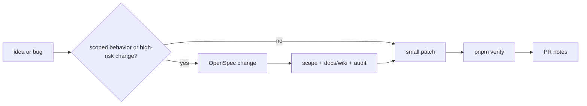

# Contributing

Start by reading [docs/conventions.md](docs/conventions.md). It defines the repository documentation domains, development conventions, git workflow, pull requests, code review, testing, OpenSpec process, API documentation style, and secret handling rules.

This project follows the [Contributor Covenant Code of Conduct](CODE_OF_CONDUCT.md). By participating you agree to uphold its standards.

## Workflow

Use OpenSpec for scoped behavior, product, API, migration, release, architecture, database, security, permissions, deployment, or data repair changes. Small documentation corrections and mechanical fixes can be submitted directly when they do not change shipped behavior.



| Step   | Contributor task                                                                                         |
| ------ | -------------------------------------------------------------------------------------------------------- |
| Scope  | Decide whether OpenSpec is required and identify affected systems, docs, wiki, and high-risk categories. |
| Patch  | Keep changes focused and update docs/tests with behavior.                                                |
| Verify | Run the full gate when feasible.                                                                         |
| PR     | Include validation notes, documentation impact, and risk areas.                                          |

## Local Validation

Run the full release gate before asking for release or PR validation when feasible:

```bash
pnpm verify
```

If `pnpm verify` cannot be run, document the reason and the smaller commands that were run.

## Secret Handling

- Never commit real `.env` files, tokens, cookies, private keys, database URLs, production hostnames with credentials, user data, or raw secret scan output.
- Use placeholders such as `<secret>`, `<local-password>`, `example`, or `${ENV_VAR}` in docs and tests.
- Run `pnpm secrets:scan` before sharing a branch that touches config, deployment, auth, storage, mail, or CI files.
- If a secret is exposed, remove it from the change and rotate the credential. Do not paste the secret into an issue or PR.

## PR Notes

Include:

- OpenSpec change ID, or a note that no OpenSpec change is needed.
- Commands run, especially `pnpm verify` or the subset that was possible.
- Documentation impact for `docs/` and `wiki/`, or why long-lived documentation was not affected.
- Database or migration impact, including a link or summary of the OpenSpec `Database Change Audit` for database-related changes.
- Deployment impact for release changes.
- Secret handling confirmation for config, CI, deployment, auth, mail, storage, and database changes.

## Database Boundary

The runtime database is PostgreSQL only. Do not add SQLite, dialect fallback, local database compatibility paths, or tests that make SQLite a release path.
