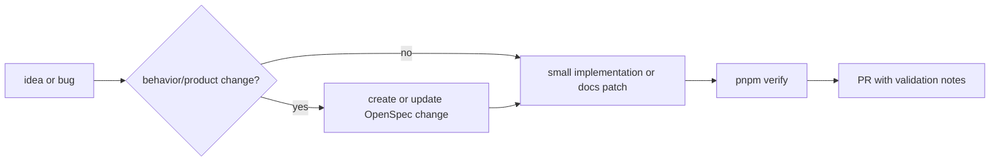

# Contributing

## Workflow



Use OpenSpec for scoped behavior, product, API, migration, release, or architecture changes. Small documentation corrections and mechanical fixes can be submitted directly when they do not change shipped behavior.

## Local Validation

Run the full release gate before asking for release or PR validation when feasible:

```bash
pnpm verify
```

`pnpm verify` runs lint, typecheck, tests, build, OpenSpec strict validation, and secret scanning. If it cannot be run, document the reason and the smaller commands that were run.

## Secret Handling

- Never commit real `.env` files, tokens, cookies, private keys, database URLs, production hostnames with credentials, user data, or secret scan output containing raw values.
- Use placeholders such as `<secret>`, `<local-password>`, `example`, or `${ENV_VAR}` in docs and tests.
- Run `pnpm secrets:scan` before sharing a branch that touches config, deployment, auth, storage, mail, or CI files.
- If a secret is exposed, remove it from the change and rotate the credential. Do not paste the secret into an issue or PR.

## PR Validation

PR descriptions should include:

- OpenSpec change ID or an explicit note that no OpenSpec change is needed.
- Commands run, especially `pnpm verify` or the subset that was possible.
- Database or migration impact, including whether migration is explicit-only.
- Deployment impact, including image tag/digest considerations for release changes.
- Secret handling confirmation for config, CI, deployment, auth, mail, OSS, and database changes.

## Database Boundary

The runtime database is PostgreSQL only. Do not add SQLite, dialect fallback, local database compatibility paths, or tests that make SQLite a release path.
