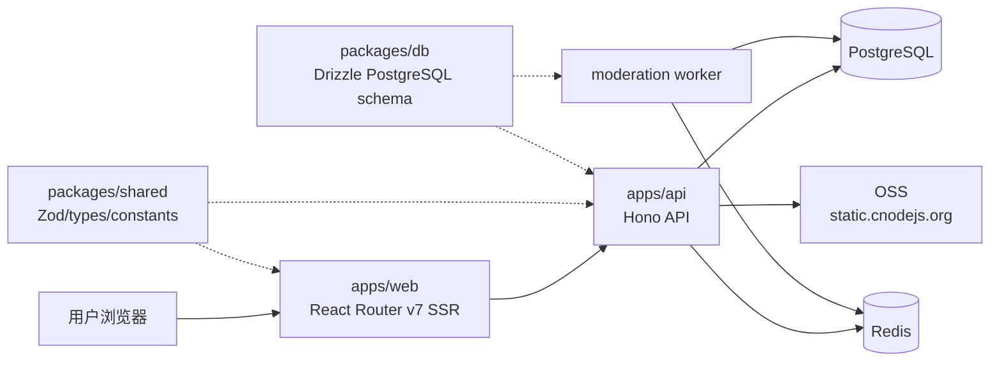
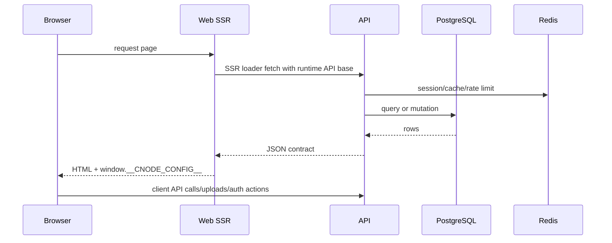
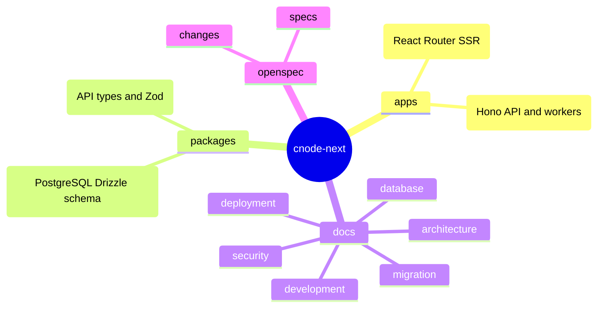

# cnode-next

CNode 社区的 PostgreSQL-only 重写版本。当前仓库实现新 Web、API、共享契约、数据库 schema、迁移脚本和生产部署治理；legacy `../nodeclub/` 只作为业务逻辑参考，不属于本仓库。

## System Map



## Data Flow



## Release Flow

```mermaid
flowchart TD
  Change[OpenSpec change] --> Verify[pnpm verify]
  Verify --> Gate{all checks pass?}
  Gate -- no --> Stop[do not build or deploy]
  Gate -- yes --> Images[build GHCR images<br/>sha-&lt;commit&gt; or digest]
  Images --> Runbook[docs/deployment.md runbook]
  Runbook --> Migrate[explicit migrate profile only]
  Migrate --> Up[pull + up --no-build]
  Up --> Health[/health]
  Health --> Smoke[smoke tests]
  Smoke --> Audit[deployment audit record]
```

## Capabilities

| Area | Current implementation |
| ---- | ---------------------- |
| Frontend | React Router v7 SSR, Tailwind CSS v4, shadcn/ui |
| API | Hono on Node.js, cookie auth, GitHub OAuth, legacy-compatible access token paths |
| Data | PostgreSQL-only Drizzle schema, Mongo-to-PostgreSQL migration and reconcile scripts |
| Runtime | Docker Compose production services for API, Web, worker, PostgreSQL and Redis |
| Delivery | GHCR container images gated by `pnpm verify`, production uses SHA tag or digest |
| Security | Gitleaks scans, secret-safe docs, root security reporting entry |

## Quick Start

```bash
pnpm install
cp .env.example .env.local
pnpm db:push:pg
pnpm dev
```

Local endpoints:

| Service | URL |
| ------- | --- |
| Web | `http://localhost:5173` |
| API | `http://localhost:3001` |

## Repository Map



## Documentation Index

| Need | Start here |
| ---- | ---------- |
| Architecture and runtime boundaries | [docs/architecture.md](docs/architecture.md) |
| Local development and verification | [docs/development.md](docs/development.md) |
| Production deployment runbook | [docs/deployment.md](docs/deployment.md) |
| PostgreSQL schema and migration rules | [docs/database.md](docs/database.md) |
| Mongo-to-PostgreSQL cutover | [docs/migration-runbook.md](docs/migration-runbook.md) |
| API reference | [docs/api-reference.md](docs/api-reference.md) |
| Security practices | [docs/security.md](docs/security.md), [SECURITY.md](SECURITY.md) |
| Contribution workflow | [CONTRIBUTING.md](CONTRIBUTING.md) |
| License status | [LICENSE](LICENSE) |

## Legacy References

`../nodeclub/` (Express + MongoDB, production legacy site) and `egg-cnode/` (unfinished Egg.js migration) are reference code only. They are not linted, tested, built, licensed, or shipped as part of this repository.
