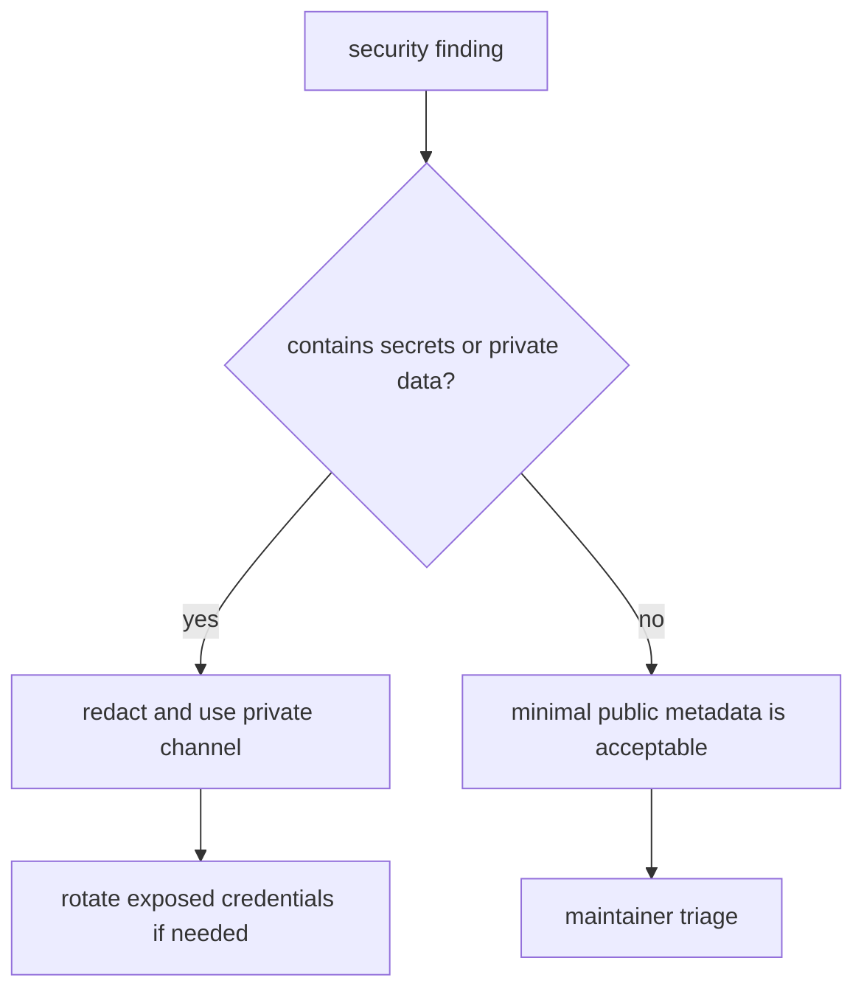

# Security Policy

## Reporting

Do not report vulnerabilities by pasting secrets, tokens, private keys, cookies, database URLs, user private data, or exploit details into public issues.

If no private security advisory channel is available, open a minimal public issue that states a security contact is needed and includes no sensitive details. Share details only through a private maintainer-approved channel.

## Safe Report Contents



Useful non-sensitive details include affected route, impact summary, reproduction shape, expected behavior, observed behavior, and package versions. Redact tokens, cookies, authorization headers, email addresses, IP addresses, database names, and user content unless a maintainer explicitly asks for a private sample.

## Repository Controls

Run secret scanning before sharing branches that touch configuration or deployment files:

```bash
pnpm secrets:scan
```

If a real secret was committed or shared, rotate it even if the commit is later removed.
