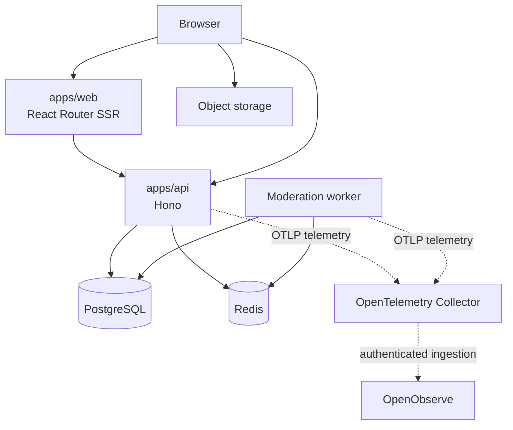
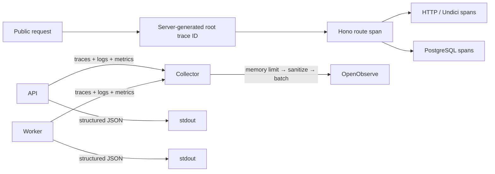

# Architecture

cnode-next separates presentation, HTTP behavior, durable data, and shared contracts in a pnpm workspace.

## Runtime Boundaries

| Component         | Owns                                                          |
| ----------------- | ------------------------------------------------------------- |
| `apps/web`        | SSR pages, browser interactions, runtime public configuration |
| `apps/api`        | HTTP routes, authentication, administration, workers          |
| `packages/db`     | Drizzle PostgreSQL schema, migrations, database helpers       |
| `packages/shared` | Zod schemas, types, constants, pure helpers                   |
| PostgreSQL        | Durable application data; the only runtime database           |
| Redis             | Sessions, cache, rate limits, and worker coordination         |

SSR loaders call the internal API base. Browser requests use runtime public configuration so image builds do not bake in a public API URL. The API signs uploads; browsers upload directly to object storage.

## Observability

The API and moderation worker use one explicit bootstrap so environment loading and OpenTelemetry registration finish before Hono, Undici, PostgreSQL, or their clients load. Traces, logs, and metrics share stable resource attributes. The API uses `service.name=cnode-api`; the worker uses `service.name=cnode-moderation-worker`. Resources also include package version, commit revision, and deployment environment. Request IDs, trace IDs, user IDs, and other per-request values are not resources or metric attributes.

The public API does not trust inbound `traceparent`; each request starts a server-owned 128-bit trace ID so callers cannot control trace identity or force sampling. Child spans inherit the local parent decision. Root traces use a parent-based trace-ID ratio sampler configured by `CNODE_OTEL_TRACE_SAMPLE_RATIO`.

Hono separately creates a UUID Request ID before any middleware can return. Every response includes `X-Request-ID`; sampled request spans and every completion access log include `cnode.request.id`. Request ID identifies one API request, while trace ID identifies its sampled call chain. Access logs include the active trace ID, span ID, and sampled state when available; an unsampled trace ID is not guaranteed to be searchable. The API ignores inbound `X-Request-ID` and does not promise an `X-Trace-ID` response header.

Applications send all three signals only to the internal Collector and keep structured JSON logs on stdout. Every API request, including `/health`, produces one completion access log. HTTP metrics aggregate all requests independently of trace sampling; worker metrics use tick outcomes and the processed count already returned by queue draining. Both roles export CPU, memory, event-loop, and GC runtime metrics.

Logs accept only fixed scalar fields. Application and Collector sanitizers exclude authentication/session values, user identity or content, mail address/subject/body, exception messages/stacks, connection credentials, SQL text, query parameters, request/response bodies, IP, and User-Agent. Metric attributes are limited to route templates and finite HTTP/worker outcomes. Export queues, retries, and shutdown waits are bounded; each signal can be disabled or fail independently without changing business results.

This baseline does not include Web telemetry, Redis telemetry, PostgreSQL metrics, Docker or host telemetry, Collector/OpenObserve self-monitoring, dashboards, alerts, or tail sampling.

## Boundaries

- Keep shared wire contracts in `packages/shared`; do not create parallel Web/API shapes.
- Keep database access and schema ownership in `packages/db`.
- Redis is coordination state, not the durable source of truth.
- Cross-cutting behavior and architecture changes use OpenSpec.
- Legacy `../nodeclub/` and `egg-cnode/` are read-only references, not shipped code.

Sources: `apps/web/app/lib/api-client.ts`, `apps/api/src/bootstrap.ts`, `apps/api/src/telemetry/`, `apps/api/src/middleware/telemetry.ts`, `packages/db/src/`, `packages/shared/src/`, `docs/deployment/otel-collector.yaml`.
