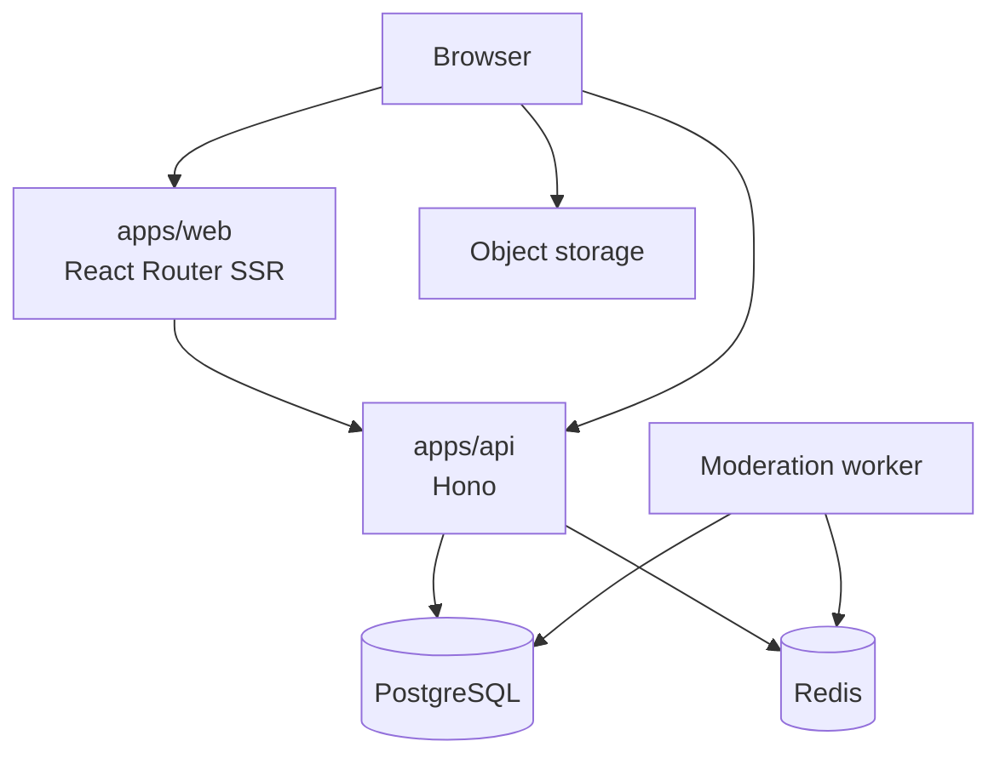

# Architecture

cnode-next separates presentation, HTTP behavior, durable data, and shared contracts in a pnpm workspace.

## Runtime Boundaries

| Component | Owns |
| --- | --- |
| `apps/web` | SSR pages, browser interactions, runtime public configuration |
| `apps/api` | HTTP routes, authentication, administration, workers |
| `packages/db` | Drizzle PostgreSQL schema, migrations, database helpers |
| `packages/shared` | Zod schemas, types, constants, pure helpers |
| PostgreSQL | Durable application data; the only runtime database |
| Redis | Sessions, cache, rate limits, and worker coordination |

SSR loaders call the internal API base. Browser requests use runtime public configuration so image builds do not bake in a public API URL. The API signs uploads; browsers upload directly to object storage.

## Boundaries

- Keep shared wire contracts in `packages/shared`; do not create parallel Web/API shapes.
- Keep database access and schema ownership in `packages/db`.
- Redis is coordination state, not the durable source of truth.
- Cross-cutting behavior and architecture changes use OpenSpec.
- Legacy `../nodeclub/` and `egg-cnode/` are read-only references, not shipped code.

Sources: `apps/web/app/lib/api-client.ts`, `apps/api/src/`, `packages/db/src/`, `packages/shared/src/`.
