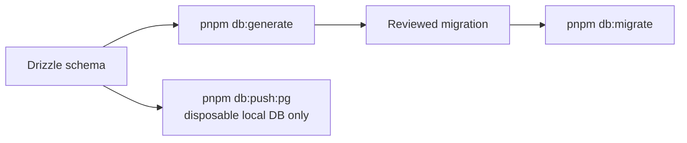

# Database Architecture

PostgreSQL is the only runtime database. Schema definitions live in `packages/db/src/schema/`; reviewed migrations live in `packages/db/migrations/pg/`.

## Change Flow

- Generate and review migrations for shared or production databases.
- Use direct schema push only for disposable local development databases.
- Apply production migrations explicitly; application startup must not migrate implicitly.
- Before destructive or irreversible changes, verify a restorable backup and a rollback or roll-forward plan.
- Evaluate lock, full-scan, constraint, index, compatibility, and existing-row impact in the OpenSpec database audit.
- Use PostgreSQL booleans, timestamps, constraints, and generated identifiers directly. Do not add SQLite, PGlite, in-memory SQL, or dialect fallback as a release path.

Mongo-to-PostgreSQL migration knowledge is recorded in [../biz/migration-background.md](../biz/migration-background.md). Deployment execution is documented in [../deployment/deployment.md](../deployment/deployment.md).
