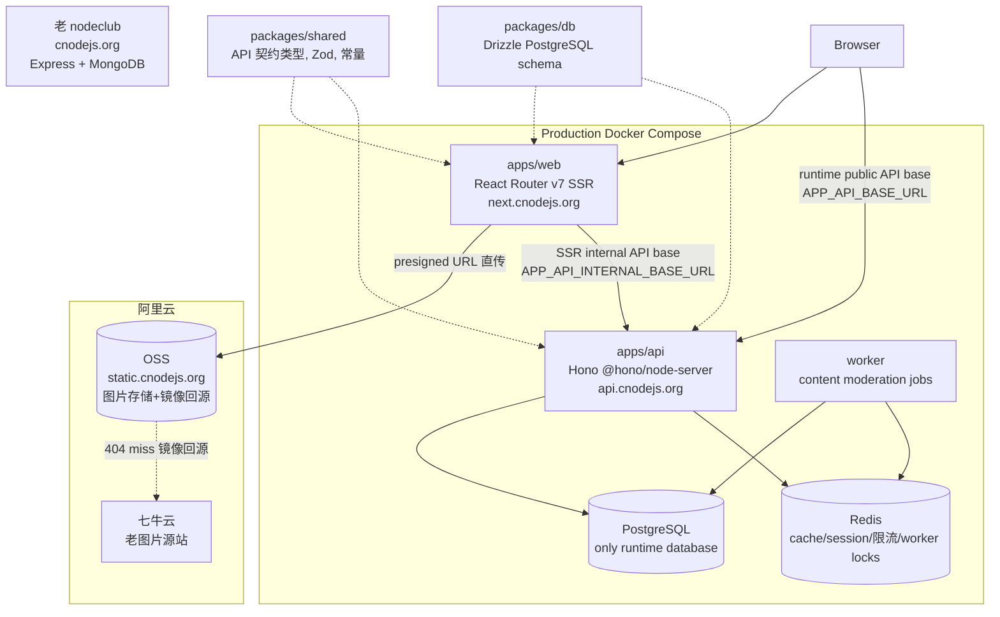
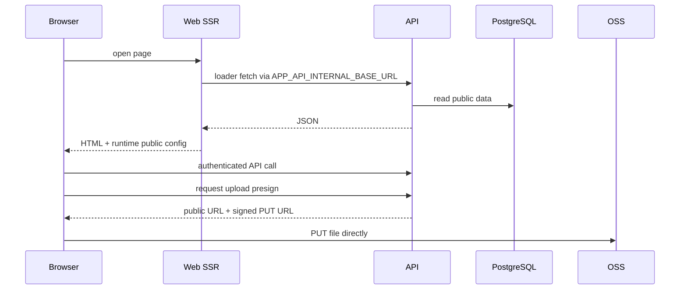

# Architecture

本文档描述 cnode-next 的整体架构、前后端分工、数据流和域名规划。

## 总览



## Request And Upload Flow



## Release Boundary

```mermaid
flowchart LR
  CI[GitHub Actions] --> Verify[pnpm verify]
  Verify --> Images[GHCR sha tags or digests]
  Images --> Server[Production server]
  Server --> Pull[docker compose pull]
  Pull --> Up[up --no-build]
  Up --> Health[/health and smoke]
  Health --> Audit[deployment audit record]
```

## Monorepo 结构

cnode-next 使用 pnpm workspace 管理 monorepo,不引入 turborepo。包含 2 个应用和 2 个共享包:

- `apps/web`: React Router v7 前端，当前生产路径通过 Docker Compose 运行 SSR 服务；保留 Cloudflare Workers 配置作为未来部署选项
- `apps/api`: Hono API server,通过 docker-compose 部署在海外自有服务器
- `packages/db`: Drizzle ORM PostgreSQL schema 和 client
- `packages/shared`: API 契约类型, Zod schemas, 常量, 纯函数

前后端通过共享 `packages/db` 和 `packages/shared` 实现类型安全:改 schema 或 API 契约一次,前后端同时类型检查。

## 域名规划

```
cnodejs.org          → 老 nodeclub (Express + MongoDB),保持运行
next.cnodejs.org     → 新前端 (React Router v7 SSR, CF Workers)
api.cnodejs.org      → 新后端 API (Hono, 海外服务器)
static.cnodejs.org   → 图片存储 (阿里云 OSS, 镜像回源七牛)
static2.cnodejs.org  → 站点静态资源 CDN (logo/CSS/JS/public assets)
```

新应用先在 `next.cnodejs.org` 上线,与老 nodeclub 并行运行。验证无误后,将 `cnodejs.org` DNS 切到新前端,老 nodeclub 下线。

## 认证流程

认证 Cookie 跨子域 `.cnodejs.org`,使 SSR loader 和 client-side fetch 都能携带认证。

- 本地账号: bcryptjs (cost=10),兼容 nodeclub 老 hash
- GitHub OAuth: 两段式流程 (新用户选择注册新账号或关联老账号)
- API accessToken: 每个用户维护 accessToken,API 请求通过 accesstoken 参数认证

## 缓存策略

后端在海外，SSR loader 回源延迟需要通过短 TTL 缓存或后续边缘部署缓解。当前生产路径以 Redis、HTTP 缓存头和后续可选边缘缓存为主：

1. API 使用 Redis 处理 session、限流、热点缓存和 worker 锁。
2. Web SSR 使用运行时 API base URL，不把 API 域名固化到镜像构建产物。
3. 若后续启用 Cloudflare Workers/KV，应单独通过 OpenSpec 提案定义缓存一致性和失效策略。

可缓存 (匿名看到的公共数据): 话题列表、话题详情 + 回复列表、用户主页、RSS

不可缓存 (用户私有数据,走 SPA 不需要 SSR): 消息页、设置页、发帖/编辑页
