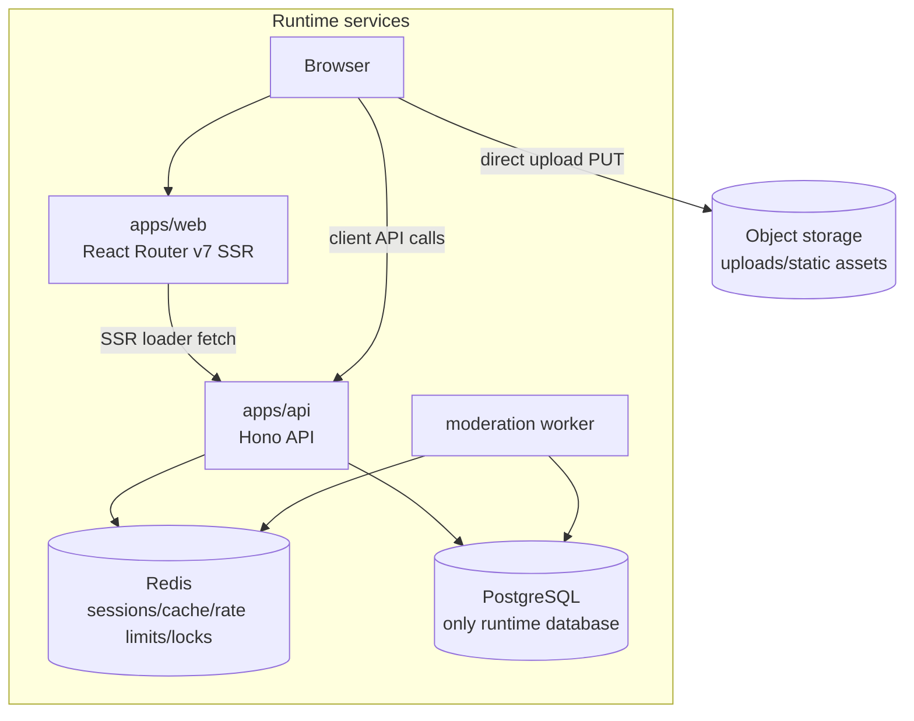
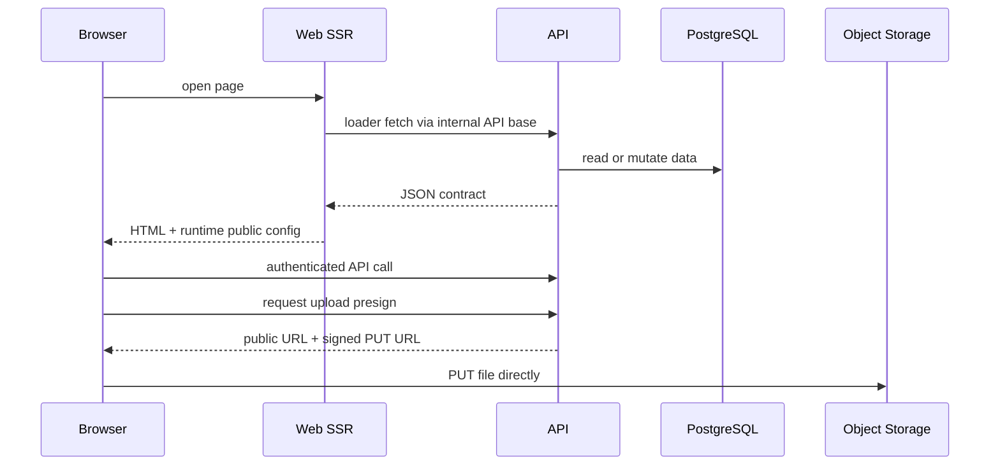
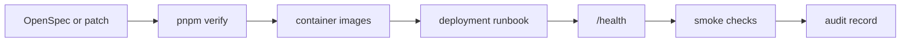

# Architecture

This document describes the current cnode-next runtime boundaries and request flow.

## System Map

cnode-next is a pnpm workspace with a React Router SSR Web app, Hono API, PostgreSQL schema package, shared contracts, Redis-backed runtime services, and an optional moderation worker.

| Component         | Responsibility                                         |
| ----------------- | ------------------------------------------------------ |
| `apps/web`        | SSR pages, client interactions, runtime public config. |
| `apps/api`        | HTTP API, auth, moderation/admin routes, workers.      |
| `packages/db`     | Drizzle PostgreSQL schema and database helpers.        |
| `packages/shared` | API types, Zod schemas, constants, pure helpers.       |
| Redis             | Session/cache/rate-limit state and worker locks.       |
| PostgreSQL        | The only supported runtime database.                   |

## Request And Upload Flow

SSR loaders use the internal API base. Browser-side calls use runtime public config, so image builds do not bake in the public API URL.

| Flow       | Boundary                                                     |
| ---------- | ------------------------------------------------------------ |
| SSR data   | Web server to API.                                           |
| Client API | Browser to API with cookie or access token where applicable. |
| Uploads    | API signs; browser uploads directly to object storage.       |

## Release Boundary

Release work is gated by verification, image publication, the deployment runbook, health checks, smoke checks, and an audit record.

| Stage   | Task                                                                     |
| ------- | ------------------------------------------------------------------------ |
| Verify  | Run lint, typecheck, tests, build, OpenSpec validation, and secret scan. |
| Images  | Use published image tags or digests.                                     |
| Runbook | Follow [deployment/README.md](../deployment/README.md).                  |
| Audit   | Record what changed and what was checked.                                |

## Repository Map

| Path              | Role                                                              |
| ----------------- | ----------------------------------------------------------------- |
| `apps/web`        | React Router SSR application.                                     |
| `apps/api`        | Hono API and worker entrypoints.                                  |
| `packages/db`     | PostgreSQL schema and migrations.                                 |
| `packages/shared` | Shared TypeScript contracts.                                      |
| `docs`            | Stable task documentation.                                        |
| `wiki`            | Sourced historical and business-logic notes.                      |
| `api`             | OpenAPI specification (single source of truth for API contracts). |
| `openspec`        | Behavior change proposals and specs.                              |
| `deployment`      | Production runbook and deployment assets.                         |

## Runtime Rules

- PostgreSQL is the only runtime database.
- Redis stores runtime coordination state, not durable source-of-truth content.
- Cross-cutting behavior changes should be proposed through OpenSpec.
- Historical legacy behavior notes belong in [wiki/legacy-behavior.md](../wiki/legacy-behavior.md).
