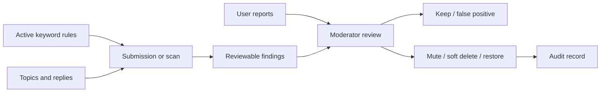

# Community Moderation

CNode combines submission checks, historical scans, user reports, and auditable moderator actions. This document describes durable governance behavior rather than route or table shape.

## Moderation Flow

- Active keyword rules apply to topic and reply submissions. Rule updates invalidate the runtime rule cache.
- Historical and incremental scans process topics and replies in bounded batches and deduplicate equivalent findings.
- Findings are review records, not copies of the source content. Confirming a finding uses normal soft-delete semantics; permanent deletion remains a separate admin-only action.
- A job-level bulk action remains permission checked, explicitly dangerous, and audited.
- Reports remain pending until a moderator confirms or dismisses them.
- Audit views preserve operator, target, action, result, time, and sanitized detail for accountability.
- Scheduled scanning is disabled unless explicitly enabled in deployment configuration.

## Sources

- `apps/api/src/lib/moderation.ts`, `moderation-scan.ts`, `db.ts`
- `apps/api/src/routes/admin.ts`
- `packages/db/src/schema/moderation_scan.ts`, `sensitive_word.ts`
- `openspec/specs/content-moderation/`, `anti-spam/`, `content-lifecycle/`

## To Confirm

- Public wording for community moderation rules.
- Escalation policy from keep to mute or delete.
- Whether unresolved reports need a time-based escalation policy.
