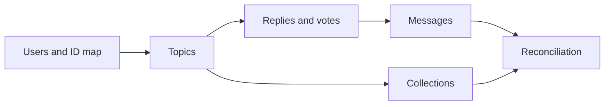

# Mongo To PostgreSQL Migration

The one-time migration preserves relational meaning while assigning PostgreSQL integer IDs. It is explicit tooling, not an application startup step or daily deployment procedure.

## Order And Identity

- Source ObjectIds are deterministically mapped to target integer IDs before dependent rows migrate.
- Login names and email addresses are deduplicated with explicit legacy suffixes when required.
- Missing required parents cause the dependent record to be skipped and counted; optional references may become null.
- Legacy `content_is_html` is not migrated because current rendering uses Markdown plus the `mdrender` contract.
- Target rehearsal reset is destructive. Rehearsal and production runs must use explicitly selected, separate databases.

## Safety And Reconciliation

- The migration report records source counts, target counts, skip categories, and bounded samples without storing credentials.
- Reconciliation compares users, topics, replies, messages, votes, and collections; a mismatch blocks cutover.
- Sequences are reset after explicit ID insertion.
- A production run requires a reviewed plan, verified backup, controlled report path, and a rollback or roll-forward decision.

## Sources

- `scripts/migrate-mongo-to-pg.ts`
- `scripts/reconcile-migration.ts`
- `packages/db/src/schema/`
- `../nodeclub/models/` (reference only)
- `openspec/specs/staged-mongo-pg-cutover/` and `explicit-migration-rehearsal-profile/`

Field-level transforms remain authoritative in the migration scripts and are intentionally not duplicated here.
