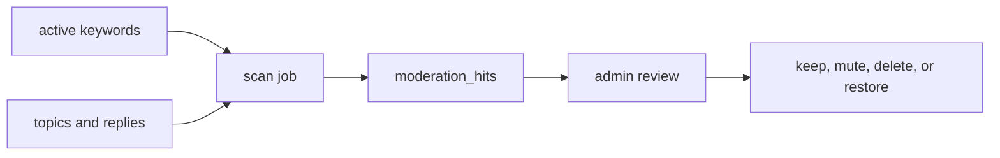

# Content Moderation

This document summarizes current moderation tasks and database-backed moderation concepts. Policy background and community-rule research should be recorded in `wiki/` with sources.

## Moderation Areas

| Area | Current task |
| ---- | ------------ |
| Keyword rules | Store and update sensitive-word rules through admin workflows. |
| Submission checks | Block or flag topic/reply content that matches active rules. |
| Scan jobs | Scan existing content and store findings for review. |
| Reports | Capture user reports for moderator review. |
| Audit | Record moderator actions and important state changes. |

## Scan Flow

Moderation scans run as explicit or scheduled jobs and write reviewable hits.

| Step | Result |
| ---- | ------ |
| Rules | Current sensitive-word set is selected. |
| Scan | Existing topic and reply content is checked. |
| Hits | Findings are deduplicated and stored. |
| Review | Moderators decide action and leave auditable state. |

## Admin Review Operations

Moderation hits are review records, not the content itself. Admin review can filter hits by scan job through `moderation_hits.scan_job_id` so a task such as `#11` can show the findings it created.

| Operation | Effect |
| --------- | ------ |
| View job hits | Shows hits whose `scan_job_id` matches the selected scan job. |
| Confirm hit | Deletes the original topic or reply using the existing soft-delete lifecycle and marks the hit confirmed. |
| Ignore hit | Leaves the original content visible and removes the hit from the pending queue. |
| False positive | Leaves the original content visible and records the hit as a false positive. |
| Confirm all pending hits for a job | Admin-only dangerous operation that confirms every pending hit for the selected scan job. |

Job-level bulk confirmation deletes the original topic or reply, but it still uses the normal soft-delete behavior. It does not physically delete rows from PostgreSQL.

Permanent topic deletion is a separate admin-only operation in topic management. It is not part of moderation scan confirmation.

## Admin Operational Review

The admin audit page is an operational review surface, not just a raw log table. It groups audit events by operational category, highlights high-risk actions, and keeps raw event data available for accountability.

| Audit area | Purpose |
| ---------- | ------- |
| Summary cards | Show high-risk actions, content deletions, role changes, account-security actions, and failures in the current filter scope. |
| Filters | Narrow events by date range, category, risk, operator, target type, result, and keyword. |
| Event stream | Present each action with a human-readable label, risk badge, operator, target, result, and time. |
| Details | Preserve raw `action`, operator, target fields, and sanitized `detail` for traceability. |

User governance actions in admin lists are grouped by risk: content blocking and mute actions live under user governance, role grants under role permissions, password reset under account security, and bulk deletion under dangerous operations.

## Implementation References

- Schema: `packages/db/src/schema/moderation_scan.ts`.
- Runtime checks: `apps/api/src/lib/moderation-scan.ts`.
- Admin routes: `apps/api/src/routes/admin.ts`.
- Admin UI: `apps/web/app/routes/admin/audit.tsx`, `apps/web/app/routes/admin/users.tsx`.
- Product specs: `openspec/specs/content-moderation/spec.md`, `openspec/specs/anti-spam/spec.md`, `openspec/specs/content-lifecycle/spec.md`.

## Writing Policy Notes

Do not add unsupported community-rule claims to this doc. Put sourced policy background in the wiki and mark unverified assumptions as `To confirm`.
