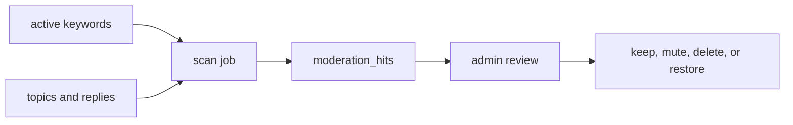

# Content Moderation

This document summarizes current moderation tasks and database-backed moderation concepts. Policy background and community-rule research should be recorded in `wiki/` with sources.

## Moderation Areas

| Area | Current task |
| ---- | ------------ |
| Keyword rules | Store and update sensitive-word rules through admin workflows. |
| Submission checks | Block or flag topic/reply content that matches active rules. |
| Scan jobs | Scan existing content and store findings for review. |
| Reports | Capture user reports for moderator review. |
| Audit | Record moderator actions and important state changes. |

## Scan Flow

Moderation scans run as explicit or scheduled jobs and write reviewable hits.

| Step | Result |
| ---- | ------ |
| Rules | Current sensitive-word set is selected. |
| Scan | Existing topic and reply content is checked. |
| Hits | Findings are deduplicated and stored. |
| Review | Moderators decide action and leave auditable state. |

## Implementation References

- Schema: `packages/db/src/schema/moderation_scan.ts`.
- Runtime checks: `apps/api/src/lib/moderation-scan.ts`.
- Admin routes: `apps/api/src/routes/admin.ts`.
- Product specs: `openspec/specs/content-moderation/spec.md`, `openspec/specs/anti-spam/spec.md`, `openspec/specs/content-lifecycle/spec.md`.

## Writing Policy Notes

Do not add unsupported community-rule claims to this doc. Put sourced policy background in the wiki and mark unverified assumptions as `To confirm`.
