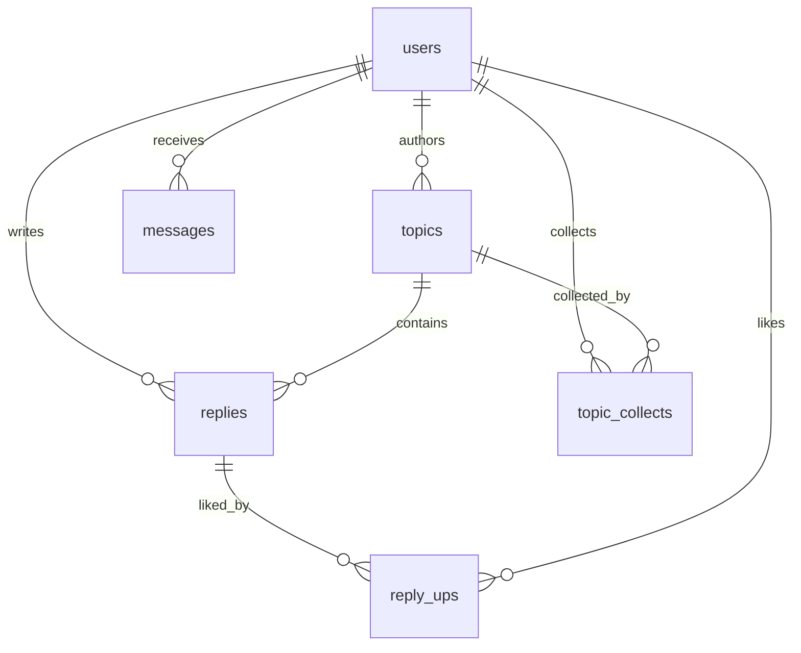
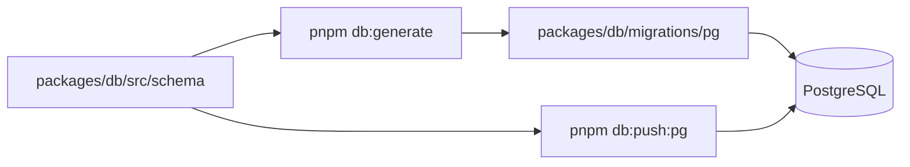

# Database

This document describes the current PostgreSQL schema boundary and migration workflow. cnode-next does not support SQLite or any other runtime database fallback.

## Runtime Boundary

PostgreSQL is used for development, tests, migration validation, CI, and production.

| Rule | Requirement |
| ---- | ----------- |
| Runtime database | PostgreSQL only. |
| Schema source | `packages/db/src/schema/`. |
| Migration files | `packages/db/migrations/pg/`. |
| Compatibility | Do not add dialect fallback or local database compatibility paths. |

## Tables

| Table | Purpose |
| ----- | ------- |
| `users` | Accounts, auth fields, profile fields, counters. |
| `topics` | Topics and lifecycle status. |
| `replies` | Topic replies. |
| `reply_ups` | Reply likes as a join table. |
| `messages` | Reply, reply2, and mention notifications. |
| `topic_collects` | Topic collections with user/topic uniqueness. |
| `moderation_scan_jobs` | Historical or scheduled moderation scan jobs. |
| `moderation_hits` | Moderation findings and handling state. |

## Schema Workflow

Schema changes start in Drizzle definitions, then generate or push PostgreSQL migrations.

| Command | Use |
| ------- | --- |
| `pnpm db:generate` | Generate PostgreSQL migration files. |
| `pnpm db:push:pg` | Create or update a PostgreSQL schema. |
| `pnpm migrate:mongo-to-pg` | Run explicit data migration tooling. |
| `pnpm migrate:reconcile` | Compare migrated target counts with source expectations. |

## PostgreSQL Constraints

- Use PostgreSQL boolean values, not `0`/`1` compatibility writes.
- Use PostgreSQL timestamp columns for time fields.
- Use serial or generated integer IDs where schema requires auto-increment IDs.
- Tests and validation should connect to PostgreSQL or use pure logic checks.
