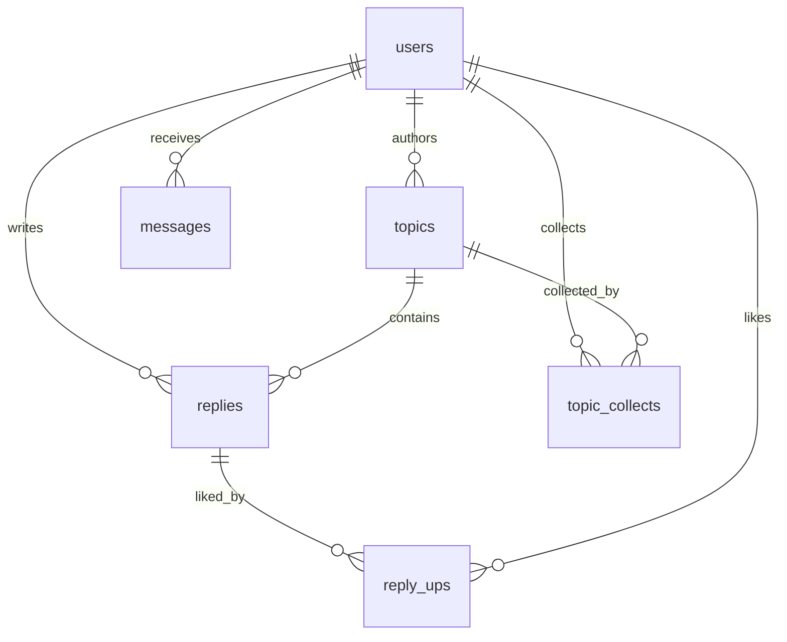
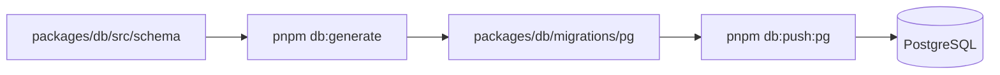

# Database

本文档描述数据库 schema 和 PostgreSQL migration 流程。项目不允许使用其他本地数据库作为运行时、测试或验收路径。

## ORM: Drizzle

使用 Drizzle ORM 和 PostgreSQL schema。开发、测试、迁移验证、CI 和生产都使用 PostgreSQL。



- 本地开发: PostgreSQL
- 生产: PostgreSQL (docker-compose 部署)
- 运行时不提供数据库 dialect fallback

## Schema

详细 schema 定义见 `packages/db/src/schema/` 和 `openspec/changes/rewrite-to-cnode-next/design.md` 的数据模型章节。

### 表结构概览

| 表             | 说明                                                       |
| -------------- | ---------------------------------------------------------- |
| users          | 用户                                                       |
| topics         | 话题 (status: draft/published/muted/deleted)               |
| replies        | 回复                                                       |
| reply_ups      | 回复点赞 (reply_id + user_id 联表, 从 Mongo 的 ups[] 拆出) |
| messages       | 消息通知 (type: reply/reply2/at)                           |
| topic_collects | 话题收藏 (user_id + topic_id 唯一)                         |

## Migration



```bash
pnpm db:generate    # 生成 migration 文件
pnpm db:push        # 推送到 PostgreSQL
pnpm db:push:pg     # 等价 PostgreSQL 建表命令
```

Migration 文件放在 `packages/db/migrations/pg/` 下。

## PostgreSQL 约束

- BOOLEAN 使用 PostgreSQL boolean,代码不得写入 `0`/`1` 作为兼容路径。
- 时间列使用 PostgreSQL timestamp。
- 自增主键使用 serial / generated integer。
- 验证脚本和 CI 必须连接 PostgreSQL 或使用纯逻辑验证，不得引入本地数据库 fallback。
