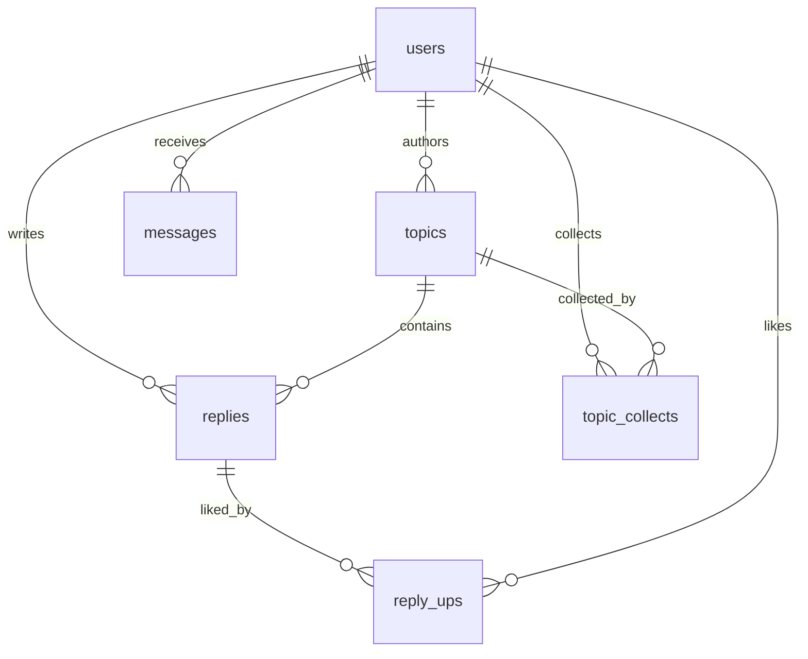
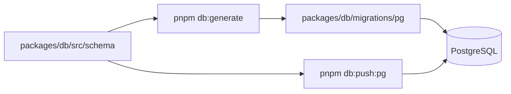

# Database

This document describes the current PostgreSQL schema boundary and migration workflow. cnode-next does not support SQLite or any other runtime database fallback.

## Runtime Boundary

PostgreSQL is used for development, tests, migration validation, CI, and production.

| Rule | Requirement |
| ---- | ----------- |
| Runtime database | PostgreSQL only. |
| Schema source | `packages/db/src/schema/`. |
| Migration files | `packages/db/migrations/pg/`. |
| Compatibility | Do not add dialect fallback or local database compatibility paths. |

## Tables

| Table | Purpose |
| ----- | ------- |
| `users` | Accounts, auth fields, profile fields, counters. |
| `topics` | Topics and lifecycle status. |
| `replies` | Topic replies. |
| `reply_ups` | Reply likes as a join table. |
| `messages` | Reply, reply2, and mention notifications. |
| `topic_collects` | Topic collections with user/topic uniqueness. |
| `moderation_scan_jobs` | Historical or scheduled moderation scan jobs. |
| `moderation_hits` | Moderation findings and handling state. |

## Schema Workflow

Schema changes start in Drizzle definitions, then generate or push PostgreSQL migrations.

| Command | Use |
| ------- | --- |
| `pnpm db:generate` | Generate PostgreSQL migration files. |
| `pnpm db:push:pg` | Create or update a PostgreSQL schema. |
| `pnpm migrate:mongo-to-pg` | Run explicit data migration tooling. |
| `pnpm migrate:reconcile` | Compare migrated target counts with source expectations. |
| `pnpm repair:topic-replies --dry-run` | Count topics whose reply aggregates differ from active PostgreSQL replies. |

## Topic Reply Aggregate Repair

The repair recalculates only `topics.reply_count`, `topics.last_reply_id`, and `topics.last_reply_at` from PostgreSQL replies where `deleted=false`. It does not read or print reply content, modify user score/reply counters, or print connection settings.

1. Stop or drain reply writes for the repair window and export `topics.id`, `reply_count`, `last_reply_id`, and `last_reply_at` to an access-controlled backup location with the approved PostgreSQL tooling. Do not export topic or reply content for this repair.
2. Run `pnpm repair:topic-replies --dry-run`; review only the reported mismatch count.
3. Run `pnpm repair:topic-replies --apply` against the intended PostgreSQL environment.
4. Run `pnpm repair:topic-replies --dry-run` again. The mismatch count must be `0`; repeating `--apply` must report `0` repaired topics.
5. If validation fails, keep writes stopped, load the aggregate-only backup into a temporary table, restore the three columns in one transaction by joining on topic ID, and rerun the dry-run before restoring traffic.

The command defaults to dry-run when no mode is supplied. Keep credentials in ignored environment configuration; never put database URLs or passwords in command history, logs, documentation, or incident notes.

## PostgreSQL Constraints

- Use PostgreSQL boolean values, not `0`/`1` compatibility writes.
- Use PostgreSQL timestamp columns for time fields.
- Use serial or generated integer IDs where schema requires auto-increment IDs.
- Tests and validation should connect to PostgreSQL or use pure logic checks.
