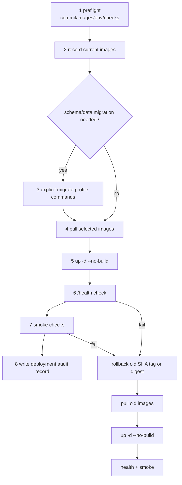

# Deployment

本文档描述生产环境的部署方式。

## Production Runbook

标准生产部署只使用已经通过 release gate 的 GHCR 镜像。生产服务器不得构建应用镜像，不得隐式执行 migration，不得打印或提交远程 `.env`、token、私钥、数据库 URL、用户数据或其他 secret。



### 1. Preflight

在发布机或 CI 产物页面确认：

- `pnpm verify` 已通过，包含 lint、typecheck、test、build、OpenSpec strict validate 和 secret scan。
- API/Web 镜像使用 `ghcr.io/cnodejs/cnode-api:sha-<commit>`、`ghcr.io/cnodejs/cnode-web:sha-<commit>` 或 digest。
- 选定 commit、API image、Web image、操作者、变更链接已经写入部署审计草稿。
- 生产 `.env` 已在服务器本地准备，但不要用 `cat`、日志、截图或 issue/PR 粘贴真实内容。
- `docker-compose.prod.yml` 中普通服务 `api`、`web`、`worker` 不包含 `build:`，migration 服务只在 `migrate` profile 下运行。

### 2. Record Rollback Point

部署前记录当前成功版本：

```bash
docker compose -f docker-compose.prod.yml images api web worker
```

把旧 API/Web SHA tag 或 digest 填入 `docs/deployments/production-audit-template.md` 的复制记录中，作为回滚点。

### 3. Explicit Migration Only

Migration 只能通过显式 profile 或一次性命令运行。普通 `up` 不得隐式迁移 schema 或数据。

```bash
docker compose -f docker-compose.prod.yml --profile migrate run --rm migrate-schema
docker compose -f docker-compose.prod.yml --profile migrate run --rm migrate-data
docker compose -f docker-compose.prod.yml --profile migrate run --rm reconcile
```

仅 schema 变更可只执行 `migrate-schema`；Mongo-to-PostgreSQL 切换必须执行 `migrate-data` 和 `reconcile`。任一命令失败时停止部署，不执行 `up`。

### 4. Pull Selected Images

```bash
export CNODE_API_IMAGE=ghcr.io/cnodejs/cnode-api:sha-<commit>
export CNODE_WEB_IMAGE=ghcr.io/cnodejs/cnode-web:sha-<commit>
docker compose -f docker-compose.prod.yml pull api web worker
```

也可以使用 digest，例如 `ghcr.io/cnodejs/cnode-api@sha256:<digest>`。不要把真实 secret 放在 shell 历史或审计记录中。

### 5. Start Without Build

```bash
docker compose -f docker-compose.prod.yml up -d --no-build postgres redis api web worker
```

禁止在生产服务器执行应用服务 `docker compose build`。如果缺少镜像，应修复发布流水线或镜像权限，而不是在生产机临时构建。

### 6. Health

```bash
curl -fsS https://api.cnodejs.org/health
docker compose -f docker-compose.prod.yml ps api web worker
```

`/health` 应返回 2xx 和版本/build metadata，不应包含环境变量、secret、数据库地址、token 或堆栈。若当前镜像尚未提供 `/health`，以 compose healthcheck 和公开 API smoke 作为临时替代，并在审计记录中标明缺口。

### 7. Smoke

最小 smoke：

```bash
curl -fsS 'https://api.cnodejs.org/api/v1/topics?limit=1&tab=all'
curl -fsS 'https://next.cnodejs.org/'
```

人工验证首页、话题详情、登录态读取、发帖或回复测试账号、消息中心、上传预签名路径。不要在审计记录里粘贴用户隐私数据、access token、cookie 或完整响应体。

### 8. Audit Record

复制 `docs/deployments/production-audit-template.md` 为一次性部署记录，填写时间、操作者、commit、API image、Web image、migration 结果、health 结果、smoke 结果、回滚点和未决风险。记录中只能出现镜像、commit、命令结果摘要和无敏感样本。

### Rollback

回滚必须恢复上一次成功的 SHA tag 或 digest，再重新执行 pull、`up --no-build`、health 和 smoke：

```bash
export CNODE_API_IMAGE=ghcr.io/cnodejs/cnode-api:sha-<previous-commit>
export CNODE_WEB_IMAGE=ghcr.io/cnodejs/cnode-web:sha-<previous-commit>
docker compose -f docker-compose.prod.yml pull api web worker
docker compose -f docker-compose.prod.yml up -d --no-build postgres redis api web worker
curl -fsS https://api.cnodejs.org/health
curl -fsS 'https://api.cnodejs.org/api/v1/topics?limit=1&tab=all'
curl -fsS 'https://next.cnodejs.org/'
```

如果 migration 已经修改生产数据，按迁移审计记录决定是否执行数据修复或恢复备份；不要用应用镜像回滚替代数据库回滚决策。

## Container Image Release

GitHub Actions 负责在 GitHub runner 上构建并推送生产镜像到 GHCR：

| 镜像 | Dockerfile |
| ---- | ---------- |
| `ghcr.io/cnodejs/cnode-api:sha-<commit>` | `apps/api/Dockerfile` |
| `ghcr.io/cnodejs/cnode-web:sha-<commit>` | `apps/web/Dockerfile` |

workflow 先运行 `pnpm verify`，通过后构建并推送 SHA tag 镜像。`latest` 只作为便利标签；生产部署必须使用 SHA tag 或 digest，不得依赖唯一 `latest`。workflow 不保存服务器 SSH 凭据，不连接生产服务器，也不执行远程 `docker compose` 部署命令。

## Docker Compose Runtime

后端通过 docker-compose 编排,所有服务在海外服务器上运行:

```bash
# 服务器上
export CNODE_API_IMAGE=ghcr.io/cnodejs/cnode-api:sha-<commit>
export CNODE_WEB_IMAGE=ghcr.io/cnodejs/cnode-web:sha-<commit>
docker compose -f docker-compose.prod.yml pull api web worker
docker compose -f docker-compose.prod.yml up -d --no-build postgres redis api web worker
```

### 服务编排

| 服务     | 镜像                             | 职责                                 |
| -------- | -------------------------------- | ------------------------------------ |
| api      | `$CNODE_API_IMAGE` | Hono API server                      |
| web      | `$CNODE_WEB_IMAGE` | React Router SSR frontend            |
| worker   | `$CNODE_API_IMAGE` | 内容巡检扫描任务和定时调度           |
| postgres | postgres:18-bookworm             | PostgreSQL 数据库                    |
| redis    | redis:7-bookworm                 | 缓存/session/限流/worker 锁          |

所有服务在 `cnode-internal` 内网通信。对外入口可由既有反向代理接入 API/Web，本变更不要求新增 Cloudflare Workers 部署。

生产 `docker-compose.prod.yml` 不包含应用服务 `build:` 配置。`api`、`worker`、`migrate-schema`、`migrate-data` 和 `reconcile` 通过 `CNODE_API_IMAGE` 指向 API SHA tag 或 digest，`web` 通过 `CNODE_WEB_IMAGE` 指向 Web SHA tag 或 digest。标准生产部署必须使用 `pull` 和 `up --no-build`，避免在同机运行的 legacy nodeclub、PostgreSQL 和 Redis 旁边执行 Docker build。

部署前记录当前镜像，作为失败回滚点：

```bash
docker compose -f docker-compose.prod.yml images api web worker
```

若新版本 health 或 smoke 失败，将 `CNODE_API_IMAGE` / `CNODE_WEB_IMAGE` 恢复为上一次成功部署的 SHA tag 或 digest，再执行 `pull` 和 `up -d --no-build`。

### 内容巡检 Worker

`worker` 使用同一个 API 镜像，通过 `pnpm --filter @cnode/api worker:moderation` 启动。扫描任务按主键游标分批读取话题和回复，每批结束后写入巡检命中并休眠，避免一次性全库扫描影响线上请求。

相关环境变量：

```bash
MODERATION_SCHEDULE_ENABLED=0       # 1 开启定时增量扫描
MODERATION_SCHEDULE_INTERVAL_MS=3600000
MODERATION_SCAN_BATCH_SIZE=200
MODERATION_SCAN_THROTTLE_MS=500
MODERATION_SCAN_MAX_BATCHES_PER_RUN=100
```

生产出现资源压力时，可先停止 `worker` 服务或调大 `MODERATION_SCAN_THROTTLE_MS`；`api` 和 `web` 不依赖 worker 常驻可用。

### 环境变量

所有敏感配置通过 `.env` 文件注入，不提交真实值。详见 `.env.example`。

Web API 地址分为服务端内网地址和浏览器公开地址：

```bash
APP_WEB_BASE_URL=https://next.cnodejs.org        # 邮件链接、OAuth 返回和用户可点击入口使用的 Web 域名
APP_API_INTERNAL_BASE_URL=http://api:3001      # React Router SSR loader 在 web 容器内访问 API
APP_API_BASE_URL=https://api.cnodejs.org       # 注入到 HTML，供浏览器侧 apiFetch 和上传客户端使用
```

`APP_API_INTERNAL_BASE_URL` 由生产 compose 设置为 `http://api:3001`。`APP_API_BASE_URL` 来自服务器 `.env`，Web 根文档会把它注入到 `window.__CNODE_CONFIG__.apiBaseUrl`。`APP_WEB_BASE_URL` 用于账号激活、密码找回邮件链接和 OAuth 返回地址，必须指向 Web 站点而不是 API 域名。Web 镜像不使用 `VITE_APP_API_BASE_URL` 等构建时 API 地址，因此同一个 Web SHA tag 镜像可在不同服务器环境复用。

生产人机验证使用 Cloudflare Turnstile：

```bash
TURNSTILE_SITE_KEY=        # 可公开给前端
TURNSTILE_SECRET_KEY=      # 仅 API 服务端使用，不得注入前端
```

### 镜像构建

`apps/api/Dockerfile` 和 `apps/web/Dockerfile` 只在 GitHub Actions 或显式本地构建时使用。生产服务器不通过 compose build 构建镜像。

服务器执行 migration 或 reconcile 时同样使用已拉取的 API 镜像，且必须显式指定 `--profile migrate`：

```bash
docker compose -f docker-compose.prod.yml --profile migrate run --rm migrate-schema
docker compose -f docker-compose.prod.yml --profile migrate run --rm migrate-data
docker compose -f docker-compose.prod.yml --profile migrate run --rm reconcile
```

## 前端

当前阶段先保障本地/预发布运行与迁移数据验证。`apps/web` 保留 `wrangler.jsonc` 与 `@cloudflare/vite-plugin` 配置，但 Cloudflare Workers 部署暂不纳入当前阶段。

本地验证：

```bash
pnpm dev
```

## DNS 切换

切换前需要完成：

1. 配置生产 `.env`：cookie domain、SMTP、OSS、GitHub OAuth、Turnstile、PostgreSQL、Redis。
2. 执行最终 Mongo-to-PostgreSQL 全量迁移和对账。
3. 验证新 API/Web 与老 `cnodejs.org` 并行运行正常。
4. 按实际入口方案切换 DNS/反向代理。
5. 老 nodeclub 下线。

Cloudflare Workers 发布仍不纳入当前生产路径；release gate 已由 GitHub Actions 和 `pnpm verify` 承担。

## 文件上传与静态域名

历史站点使用两个静态域名：

| 域名 | 职责 |
| ---- | ---- |
| `static.cnodejs.org` | 用户上传图片公开访问域名，旧站七牛 `qn_access.origin` 指向这里 |
| `static2.cnodejs.org` | 站点静态资源 CDN，例如 logo、CSS/JS/public assets |

新站上传继续使用 `static.cnodejs.org` 作为公开 URL。`POST /api/v1/upload/presign` 使用 `.env` 中的 OSS AK/SK/bucket 生成 OSS signed PUT URL，并返回：

- `url`: 最终插入 Markdown 的公开图片地址，形如 `https://static.cnodejs.org/cnode-next/uploads/...`
- `upload_url`: 浏览器直传 OSS 的 signed PUT URL
- `headers`: 上传时必须携带的请求头

相关环境变量：

```bash
OSS_ACCESS_KEY_ID=
OSS_ACCESS_KEY_SECRET=
OSS_BUCKET=
OSS_REGION=oss-cn-hongkong
OSS_ENDPOINT=
OSS_STATIC_HOST=https://static.cnodejs.org
OSS_UPLOAD_PREFIX=cnode-next/uploads
OSS_UPLOAD_EXPIRES=600
```

`static2.cnodejs.org` 不用于用户上传。
新上传对象默认写入 `cnode-next/uploads/` 前缀，文件名使用 UUID，不包含日期路径，避免与历史七牛/OSS 文件 key 冲突。
