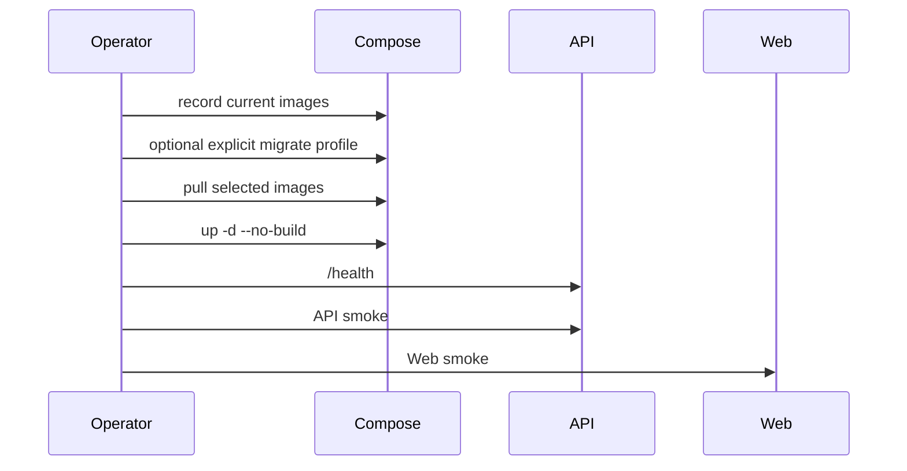

# Production Deployment Audit Record

Copy this template for each production deployment. Do not paste secrets, `.env` contents, tokens, cookies, private keys, database URLs, user private data, or full API responses.

## Summary

| Field | Value |
| ----- | ----- |
| Deployment time | `YYYY-MM-DD HH:mm UTC` |
| Operator | `name or handle` |
| OpenSpec change / PR | `link or id` |
| Commit | `sha` |
| API image | `ghcr.io/cnodejs/cnode-api:sha-...` or digest |
| Web image | `ghcr.io/cnodejs/cnode-web:sha-...` or digest |
| Previous API image | `sha tag or digest` |
| Previous Web image | `sha tag or digest` |

## Flow

## Checklist

- [ ] `pnpm verify` passed before image publication.
- [ ] API/Web images are SHA tags or digests, not only `latest`.
- [ ] Current production images were recorded before deployment.
- [ ] Migration was not needed, or was run explicitly with `--profile migrate`.
- [ ] `docker compose -f docker-compose.prod.yml pull api web worker` completed.
- [ ] `docker compose -f docker-compose.prod.yml up -d --no-build postgres redis api web worker` completed.
- [ ] `/health` returned 2xx and no sensitive data.
- [ ] API smoke passed.
- [ ] Web smoke passed.
- [ ] Rollback images and commands are known.

## Results

| Check | Result | Notes |
| ----- | ------ | ----- |
| Preflight | `pass/fail` |  |
| Migration schema | `not-needed/pass/fail` |  |
| Migration data | `not-needed/pass/fail` |  |
| Reconcile | `not-needed/pass/fail` |  |
| Pull | `pass/fail` |  |
| Up no-build | `pass/fail` |  |
| Health | `pass/fail` |  |
| Smoke | `pass/fail` |  |
| Rollback | `not-needed/executed` |  |

## Smoke Evidence

Record only short, redacted summaries. Do not include cookies, access tokens, private messages, email addresses, IP addresses, or full response bodies.

- API topics list:
- Web homepage:
- Auth/session sample:
- Topic/reply sample:
- Message center sample:
- Upload presign sample:

## Risks And Follow-Up

- Open risks:
- Follow-up owner:
- Follow-up due date:
