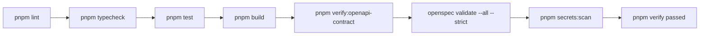

# Release Readiness Report - 2026-07-28

This report records the pre-deployment readiness state for OpenSpec change `reach-production-grade-release-readiness`. Do not paste secrets, `.env` contents, tokens, cookies, database URLs, or full private responses into this file.

## Release Identity

| Field | Value |
| ----- | ----- |
| Change | `reach-production-grade-release-readiness` |
| Source baseline commit | `66bde5b84109f97a006628d3f94c5604208d6eab` |
| Final release commit | `TBD after commit` |
| API image | `TBD: ghcr.io/cnodejs/cnode-api:sha-<commit>` or digest |
| Web image | `TBD: ghcr.io/cnodejs/cnode-web:sha-<commit>` or digest |
| Deployment runbook | `docs/deployment.md` |
| Audit template | `docs/deployments/production-audit-template.md` |

## Verification Summary

| Check | Result |
| ----- | ------ |
| `pnpm lint` | Pass |
| `pnpm typecheck` | Pass |
| `pnpm test` | Pass |
| `pnpm build` | Pass |
| `pnpm verify:openapi-contract` | Pass, 43 OAS paths and 43 Web contracts |
| `openspec validate --all --strict` | Pass, 42 items |
| `pnpm secrets:scan` | Pass, no leaks found |
| `pnpm verify` | Pass |
| Local `curl /health` | Pass, returned `ok`, `service`, `version`, `commit`, `buildTime` |
| Production compose config render | Pass with placeholder required variables and explicit images |
| SQLite active-path search | Pass for `apps/`, `packages/`, `scripts/`, `docs/`, `.github/`, root package scripts, and workspace config |

## Documentation Review

| Area | Result |
| ---- | ------ |
| README graph-first entry | Pass |
| AGENTS execution facts | Pass |
| Core docs Mermaid coverage | Pass |
| Deployment runbook | Pass |
| API reference and OAS | Pass |
| Web/OAS contract integration | Pass |
| CONTRIBUTING | Pass |
| LICENSE status | Pass, no project license selected yet |
| SECURITY reporting entry | Pass |

## Known Residual Risks

- Final release commit and image SHA tags cannot be filled until the changes are committed and GHCR images are published.
- Production deployment still requires an explicit operator action on the server and must not print real `.env` values.
- `pnpm-lock.yaml` still contains `drizzle-orm` optional peer dependency names for SQLite packages; these are package metadata from Drizzle, not active runtime dependencies or configured install paths.
- React Router build prints future v8 warnings; the project remains on React Router v7.

## Deployment Preconditions

- Update production `.env` with final `CNODE_API_IMAGE` and `CNODE_WEB_IMAGE` pointing to SHA tags or digests.
- Record current production images before `pull` or `up`.
- Run migrations only through the explicit migrate profile when needed.
- Validate `https://api.cnodejs.org/health` and applicable smoke checks after deployment.
- Copy `docs/deployments/production-audit-template.md` into the operational audit record location and fill redacted results.
