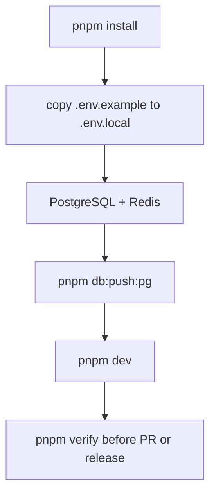
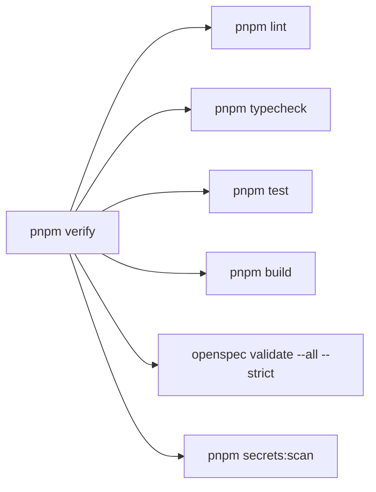

# Development

本文档描述 cnode-next 当前开发与迁移验证环境。

## 前置条件



- Node.js >= 24.0.0
- pnpm >= 11.0.0
- PostgreSQL 与 Redis

项目采用 PostgreSQL-only：开发、测试、迁移验证、功能烟测、CI 和生产都以 PostgreSQL 为唯一数据库运行时。

## 环境文件

复制模板并填写本地值：

```bash
cp .env.example .env.local
```

`.env.local` 用于本地敏感配置，已被 `.gitignore` 忽略，不要提交。

API 启动时会先加载根目录 `.env`，再加载根目录 `.env.local` 覆盖本地值。Web 如需覆盖 API 地址，可使用 `apps/web/.env.local`。

## PostgreSQL/Redis 连接

研发需要提供可访问的 PostgreSQL/Redis 连接地址。这个地址可以来自本地 docker-compose，也可以来自 SSH 隧道映射后的本地端口；对应用来说只是 `DB_HOST` / `DB_PORT` 的区别。

如果需要完整隔离环境，自行启动 PostgreSQL/Redis：

```bash
docker compose -f docker-compose.prod.yml up -d postgres redis
```

`.env.local` 示例：

```bash
DB_HOST=127.0.0.1
DB_PORT=5432
DB_NAME=cnode_rehearsal
DB_USER=cnode
DB_PASSWORD=<local-password>
REDIS_HOST=127.0.0.1
REDIS_PORT=6379
```

如果使用 SSH 隧道连接远程 rehearsal PostgreSQL，不要开放数据库公网端口，只需要把隧道映射到本地端口，再把 `.env.local` 中的 `DB_PORT` 改成映射端口：

```bash
ssh -fN -L 127.0.0.1:15432:<remote-postgres-host-or-container-ip>:5432 <ssh-host>
```

```bash
DB_HOST=127.0.0.1
DB_PORT=15432
```

`apps/web/.env.local` 示例：

```bash
APP_API_BASE_URL=http://localhost:3001
```

建表并启动：

```bash
pnpm install
pnpm db:push:pg
pnpm dev
```

验证：

```bash
curl -fsS 'http://localhost:3001/api/v1/topics?limit=1&tab=all'
curl -fsS 'http://localhost:5173/'
```

## 常用命令



```bash
pnpm verify                  # 发布前完整验证门禁
pnpm db:push:pg              # 创建/更新 PostgreSQL 表
pnpm db:seed                 # 灌入测试数据
pnpm migrate:mongo-to-pg     # 从 Mongo 迁移到 PostgreSQL
pnpm migrate:reconcile       # 迁移后对账
pnpm dev                     # 启动 Web + API
```

提交前和发布前必须运行 `pnpm verify`。该命令覆盖 lint、typecheck、test、build、OpenSpec strict validate 和 secret scan；任一步失败都不得发布。

API 变更还必须运行 `pnpm exec tsx scripts/verify-openapi-contract.ts`，并确认 `docs/api/openapi.yaml`、`docs/api-reference.md` 和 `apps/web/api-contract.manifest.json` 已同步。若 smoke 或契约验证暂未覆盖某个变更点，release readiness 记录必须明确列出覆盖差距。

## 烟测路径

- 首页：`http://localhost:5173/`
- 话题详情：`http://localhost:5173/topic/<id>`
- 用户页：`http://localhost:5173/user/<loginname>`
- API 列表：`http://localhost:3001/api/v1/topics?limit=1&tab=all`

## Future Work

以下能力不属于当前变更范围，后续单独提案实现：

- GitHub Actions CI required checks
- Codespaces/devcontainer
- Branch protection
- Release environment protection
