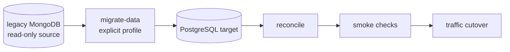
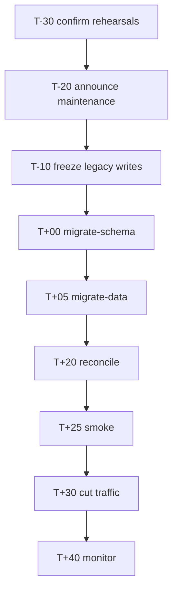

# Mongo to PostgreSQL Migration Runbook

This runbook defines the active Mongo-to-PostgreSQL mapping, reconciliation, smoke, and cutover tasks. Migration background belongs in [wiki/migration-background.md](../wiki/migration-background.md).

## Boundary

The source MongoDB data is read-only during migration. The target PostgreSQL database must be isolated for rehearsal and must not be overwritten unintentionally.



| Boundary | Requirement |
| -------- | ----------- |
| Source | Use read-only access whenever available. |
| Target | Use isolated rehearsal or production target intentionally. |
| Network | Prefer private network or SSH tunnel; do not expose databases publicly. |
| Commands | Run migration and reconcile as explicit tasks only. |

## Data Mapping

| Source shape | Target shape | Notes |
| ------------ | ------------ | ----- |
| Mongo ObjectId | PostgreSQL integer ID | New rows use PostgreSQL-generated IDs. |
| Mongo Date | PostgreSQL timestamp | Preserve source timestamps where migration code supports it. |
| Mongo Boolean | PostgreSQL boolean | Do not write numeric boolean compatibility values. |
| Mongo integer Number | PostgreSQL integer | Keep count semantics explicit in migration code. |
| `replies.ups[]` | `reply_ups` rows | One row per `(reply_id, user_id)` pair. |

Account compatibility notes and legacy behavior analysis live in [wiki/legacy-behavior.md](../wiki/legacy-behavior.md). Do not document real user records, tokens, emails, source database names, or production connection strings.

## Compose Commands

Start infrastructure, run schema, migrate data, reconcile, then start API services.

```bash
docker compose -f deployment/docker-compose.prod.yml up -d postgres redis
docker compose -f deployment/docker-compose.prod.yml --profile migrate run --rm migrate-schema
docker compose -f deployment/docker-compose.prod.yml --profile migrate run --rm migrate-data
docker compose -f deployment/docker-compose.prod.yml --profile migrate run --rm reconcile
docker compose -f deployment/docker-compose.prod.yml up -d api
```

Connectivity checks:

```bash
docker compose -f deployment/docker-compose.prod.yml exec postgres pg_isready -U "$POSTGRES_USER" -d "$POSTGRES_DB"
docker compose -f deployment/docker-compose.prod.yml exec redis redis-cli ping
```

## Rehearsal Setup

- Use a rehearsal PostgreSQL database, not production.
- Use placeholder values in docs and PRs; keep real connection details in ignored environment files only.
- If using a tunnel, map the remote source to local ports and keep the database private.
- If the source cannot provide a read-only account without production changes, use command review, target isolation, and optional snapshot-based migration to reduce risk.

Example placeholders:

```bash
MONGO_URI=mongodb://<mongo-host>:<mongo-port>/<legacy-db-name>
MONGO_DB=<legacy-db-name>
POSTGRES_HOST=postgres
POSTGRES_PORT=5432
POSTGRES_DB=cnode_rehearsal
POSTGRES_USER=cnode
POSTGRES_PASSWORD=<rehearsal-password>
```

## Reconciliation Gate

`pnpm migrate:reconcile` or the compose `reconcile` task must pass before cutover. It checks:

- Users.
- Topics.
- Replies.
- Messages.
- Reply likes from `reply_ups`.

If reconciliation fails, keep traffic on the current source, investigate, and rerun the necessary migration step.

## Smoke Checks

- Auth: test account login and `/api/v1/auth/me`.
- Topic read: home list, topic detail, author information.
- Topic write: create topic with a test account.
- Reply: create reply and check last reply update.
- Message: reply, reply2, and mention notifications.

## Cutover Timeline

Use this as a minute-level checklist template. Adjust the exact window through the release plan.



| Time | Task |
| ---- | ---- |
| T-30 | Confirm recent rehearsals and migration duration. |
| T-20 | Announce maintenance window. |
| T-10 | Freeze writes on the current source. |
| T+00 | Run schema migration. |
| T+05 | Run final data migration. |
| T+20 | Run reconciliation; stop if it fails. |
| T+25 | Run smoke checks. |
| T+30 | Cut traffic after gates pass. |
| T+40 | Monitor auth, read, write, reply, and messages. |
