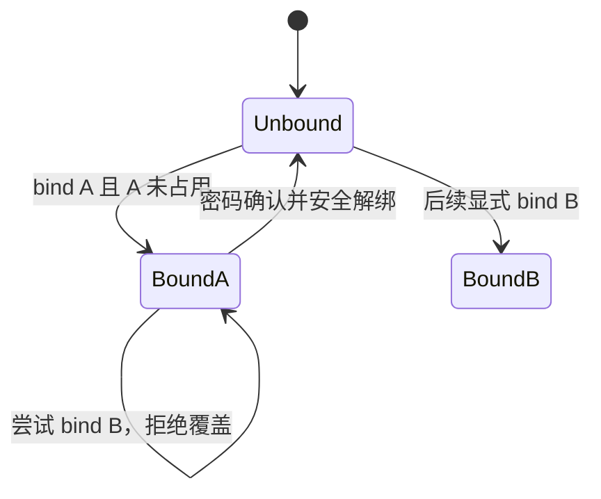
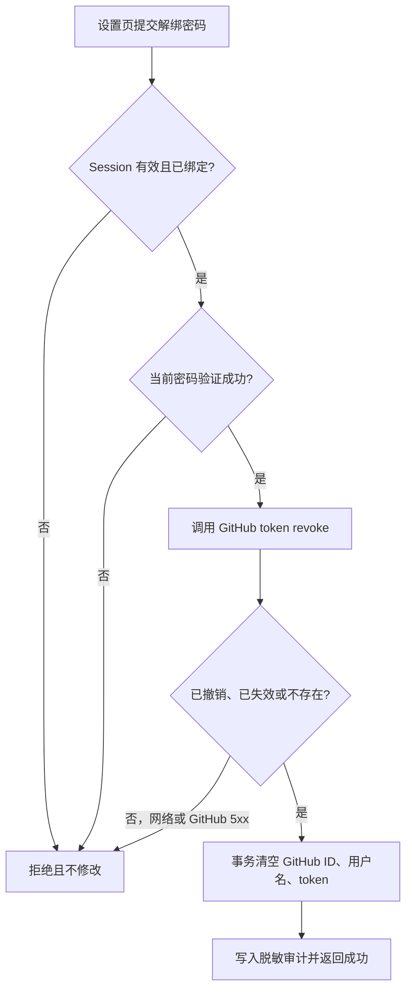

## Context

`fix-admin-account-integrity` 已为 `/setting` 增加 GitHub 绑定入口，并用 OAuth `intent=login|bind` 区分登录与绑定，但其设计明确不包含解绑或换绑。当前 `apps/api/src/routes/auth.ts` 的 bind callback 会直接写入 GitHub 字段，`apps/api/src/lib/db.ts` 的 `updateGithubInfo()` 没有防覆盖语义，`packages/db/src/schema/user.ts` 的 nullable `github_id` 也没有唯一约束。`apps/web/app/routes/setting.tsx` 仅以“GitHub / 已绑定用户名”两行文本展示状态，和未绑定按钮缺少统一的信息层级。

legacy `nodeclub/controllers/github.js` 与 `nodeclub/web_router.js` 只提供 OAuth 登录、注册和关联老账号，没有用户自助解绑行为可兼容。本设计因此为 cnode-next 定义完整的 GitHub 身份关联生命周期，同时保持现有本地密码、Session 和内容数据不变。

## Goals / Non-Goals

**Goals:**

- 同一 GitHub 身份只能关联一个 CNode 用户。
- 已绑定用户不能通过新的 bind intent 隐式覆盖为另一个 GitHub 身份。
- 用户证明掌握当前 CNode 密码后可以安全解绑，并撤销服务端保存的 GitHub OAuth token。
- 设置页以统一身份列表行展示邮箱和 GitHub 的值、状态与操作，覆盖桌面和移动端。
- 绑定与解绑失败均不泄露 token，不留下部分更新状态，并可通过审计日志定位结果。

**Non-Goals:**

- 不实现 TOTP、短信或其他 2FA。
- 不提供直接“更换 GitHub”操作；换绑由安全解绑后重新绑定组成。
- 不修改 bcrypt hash、legacy 密码验证、Session 生命周期或本地登录契约。
- 不根据 `pass IS NOT NULL` 推断用户知道密码，也不新增需要对历史随机密码做不可靠回填的标志。
- 不在解绑时修改头像、邮箱、用户名、内容、积分或 API accessToken。

## Decisions

### D1: 绑定采用三态状态机，禁止隐式覆盖

bind callback 获得 GitHub profile 后同时读取当前用户的 GitHub ID 和目标 GitHub ID 的占用者：当前用户未绑定且目标未占用时写入；已绑定同一 ID 时按幂等成功更新 username、token 和现有流程约定的 avatar；已绑定不同 ID 或目标属于其他用户时拒绝，且不修改当前绑定。数据库 unique violation 统一映射为“该 GitHub 账号已绑定到其他用户”，覆盖并发检查与写入之间的竞争窗口。

bind B 被拒绝时，callback 不保存本次交换得到的 token，并以 best-effort 撤销该 token；撤销失败只记录脱敏错误，不影响“拒绝覆盖”的本地结果。

被拒绝方案：允许 callback 直接覆盖 GitHub 字段。该方案会让持有当前 Session 的人无需证明本地账号控制权即可改变外部登录身份，也无法审计“绑定”与“换绑”。

### D2: 数据库以 nullable unique 约束作为最终身份边界

为 `users.github_id` 创建唯一索引。PostgreSQL 允许多个 `NULL`，因此未绑定用户不冲突；所有非空 GitHub ID 必须唯一。上线 migration 前执行重复值预检，发现重复时中止迁移并人工处理，不自动选择保留账号。

被拒绝方案：只在 API 查询目标 ID 是否占用。并发 callback 可同时通过应用层检查，仍可能产生重复绑定。

### D3: 解绑要求当前密码，不引入“本地密码可用”历史标志

新增 `POST /api/v1/auth/github/unbind`，请求体仅含 `password`。接口要求当前 Session、已绑定 GitHub 且 bcrypt 验证当前 `users.pass` 成功；密码为空、hash 为空或验证失败时不改变绑定。无法提供当前密码的 GitHub 注册用户使用现有 `/search_pass` 与 `/reset_pass` 建立自己知道的密码后再解绑。

被拒绝方案一：只凭当前 Session 解绑。Session 被窃取时会永久移除一个登录方式。被拒绝方案二：新增 `local_password_enabled` 并回填历史数据。GitHub 注册流程可能保存用户未知的随机密码 hash，现有数据不能可靠证明用户知道密码。

### D4: 远端撤销成功后再清空本地关联

API 使用 OAuth App client credentials 和已保存 token 调用 GitHub 的 token revoke endpoint。成功响应，以及 token 已失效或不存在的响应，都允许继续本地解绑；网络错误、超时、限流或 GitHub 5xx 返回可重试失败并保留本地 token。远端已撤销但本地事务失败时，用户可重试，后续“token 不存在”按成功处理。

本地清理在一个数据库事务中将 `github_id`、`github_username`、`github_access_token` 设为 `NULL`。当前 Session 和 avatar 保留，避免解绑操作同时造成登出或个人资料突变。

被拒绝方案：无论 GitHub 调用结果都先清空本地 token。网络失败时服务端会失去后续撤销授权所需的 token，形成不可恢复的残留授权。

### D5: 解绑表单遵循现有共享 schema 和 shadcn Form 约定

`packages/shared` 增加解绑请求 Zod schema，Web 用 `react-hook-form`、`zodResolver` 和 shadcn `Form` 在确认 Dialog 中收集当前密码。成功时关闭 Dialog、清空表单并刷新 loader 数据；失败时保留输入并使用 toast 反馈。Dialog 明确说明解绑后不能再用 GitHub 登录，并始终提供“忘记密码，先重置密码”入口。

被拒绝方案：浏览器原生 `confirm()` 后直接解绑。它无法完成密码再认证，也不符合现有表单错误和可访问性约定。

### D6: 账号身份使用统一、响应式列表行

“账号身份”Card 内的邮箱与 GitHub 都使用同一列表行结构：左侧图标，中间为身份名称与值，状态使用 Badge，右侧为操作。GitHub 已绑定展示 username、`已绑定` Badge 和解绑操作；未绑定展示说明、`未绑定` 状态和绑定操作。桌面端操作右对齐，窄屏允许内容和操作换行，但不退化为割裂的标签与状态文本。

被拒绝方案：只在现有“已绑定 username”下追加解绑按钮。该方案仍保留邮箱、已绑定和未绑定三种不同布局，不能解决用户指出的 UI 不统一问题。

### D7: 审计只记录身份结果，不记录凭据

绑定成功、幂等绑定、绑定冲突、解绑成功和解绑失败写入既有 audit log，detail 仅包含 GitHub ID/username、失败分类和请求主体用户 ID；禁止记录 GitHub access token、OAuth code、密码、client secret 或完整 GitHub 响应体。密码失败接口使用现有认证限流策略，避免成为在线猜测入口。

被拒绝方案：记录 GitHub API 原始请求/响应帮助排错。原始载荷可能包含 token 或认证 header，不符合凭据最小暴露原则。

## Risks / Trade-offs

- [Risk] GitHub 暂时不可用会阻止解绑 → 保留本地 token 和关联，返回可重试错误，并记录脱敏失败分类。
- [Risk] unique migration 在未知重复数据上失败 → 部署前执行只读重复值检查，migration 检测到重复即中止，不自动合并用户。
- [Risk] GitHub-only 用户不知道随机生成的本地密码 → Dialog 明示先通过已验证邮箱重置密码，复用已经验证可用的恢复链路。
- [Risk] OAuth bind 并发冲突暴露数据库错误 → 捕获 unique violation 并返回稳定业务错误，不把 SQL 错误暴露给 Web。
- [Risk] 远端撤销成功、本地事务失败形成暂时不一致 → token 不存在视为可重试成功，下一次解绑可完成本地清理。

## Migration Plan

1. 部署前只读检查 `github_id IS NOT NULL` 的重复分组；若有重复则停止发布并人工处理。
2. 应用 nullable unique migration，并验证多个 `NULL` 可共存、非空重复写入被拒绝。
3. 部署 API 的绑定状态机、token revoke、解绑接口、限流和审计；先用测试 GitHub 身份验证成功、冲突与远端失败路径。
4. 部署设置页统一身份 UI 和解绑 Dialog，执行桌面与移动端验收。
5. 回滚时先回滚 Web 和 API；保留 unique 约束，因为它修复数据完整性且不破坏合法旧数据。若必须回滚 migration，只删除该索引，不改用户行。

## Open Questions

无。实现按本设计固定为密码再认证、远端 token 撤销成功后本地清理、保留 Session 和头像。
