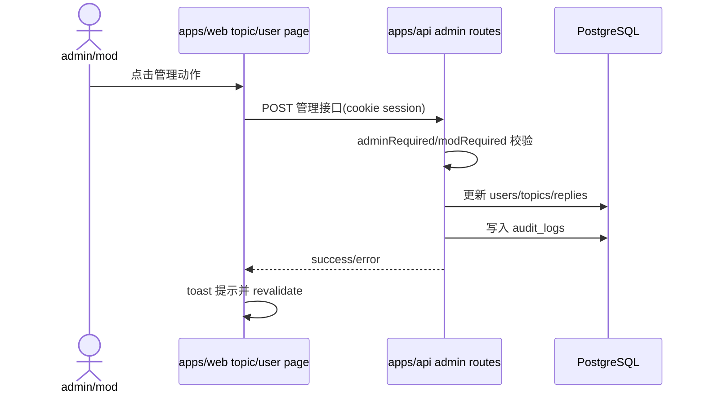

## Context

legacy `nodeclub` 的运营动作分布在用户、话题和回复上下文中，例如 `nodeclub/controllers/user.js`、`nodeclub/controllers/topic.js`、`nodeclub/controllers/reply.js` 和后台相关路由。cnode-next 已有 `apps/api/src/routes/admin.ts` 中的部分后台管理接口，也已有 `adminRequired`、`modRequired`、审计日志和话题/回复软删除能力，但前台用户页、帖子详情页和回复项缺少就地管理入口，导致管理员处理违规内容时需要跳到后台列表。

当前约束：不新增角色模型，不改变数据库 schema，不引入独立审核工作流；只把现有管理动作暴露到更接近 legacy 操作习惯的位置，并保证后端权限和审计仍是唯一可信来源。

## Goals / Non-Goals

**Goals:**

- admin 能在用户页面 block/unblock 用户，操作后立即反映用户状态。
- admin/mod 能在帖子详情页删除帖子、置顶/取消置顶、高亮/取消高亮。
- admin/mod 能在回复项上删除单条回复，删除后该回复不再出现在详情回复列表。
- 所有动作必须调用后端管理 API 进行权限校验，并写入审计日志。
- Web 操作必须给出成功/失败反馈并刷新当前页面数据。

**Non-Goals:**

- 不把回复命中或回复删除自动升级为删除整帖；删除帖子和删除回复必须是不同目标类型的明确动作。
- 不新增批量治理面板；后台列表的批量操作不在本变更范围内扩展。
- 不改变 legacy ObjectId 到 PostgreSQL BIGINT 的迁移策略。
- 不实现封禁时自动清理用户历史内容；删除用户所有发言继续使用已有后台动作。

## Decisions

### Decision 1: 复用现有后端管理接口并补齐缺口

用户 block/unblock 继续使用或补齐 `/api/v1/user/:name/block`、`/api/v1/user/:name/unblock` 类管理接口；话题置顶、高亮、删除和回复删除继续通过 admin 路由落到 `topics`、`replies`、`users` 表更新。所有接口必须使用 `adminRequired` 或 `modRequired`，不能信任前端隐藏按钮。

被拒绝的方案：在 Web 层直接调用普通用户 API 或只依赖客户端角色隐藏按钮。该方案会绕过审计或扩大权限风险。

### Decision 2: 前台页面只展示当前用户有权执行的动作

Web loader 必须取得当前登录用户及其 `is_admin`、`is_mod` 权限状态。用户页只在 admin 访问时显示 block/unblock；帖子详情页在 admin/mod 访问时显示内容管理菜单；普通用户继续只看到原有编辑、回复、点赞等入口。

被拒绝的方案：所有用户都展示禁用按钮。论坛前台内容阅读场景下，普通用户看到管理控件会增加噪音，也容易误解权限。

### Decision 3: 删除动作使用软删除并保持目标粒度

删除帖子时设置 topic 的删除状态并确保公共列表和详情不再展示；删除回复时只设置该 reply 的删除状态，并维护作者积分、作者回复数和话题回复数，行为对齐 `nodeclub/controllers/reply.js` 的回复删除语义。

被拒绝的方案：回复删除时同时删除所属话题。该方案会扩大治理动作影响面，且与用户明确要求“检查到回复则可以删除回复”不一致。

### Decision 4: 高亮沿用 topic.good，置顶沿用 topic.top

帖子详情页的“高亮”对应现有 `good` 字段，“置顶”对应现有 `top` 字段；不新增新的 highlight 字段。公开列表和详情页继续使用 `good`/`top` 状态展示。

被拒绝的方案：新增独立 highlight 状态。当前 schema 和 legacy 语义已有 `good`，新增字段会扩大迁移和展示范围。

## Risks / Trade-offs

- 权限边界误放大 → 每个 API 动作必须显式选择 `adminRequired` 或 `modRequired`，并补验证脚本覆盖非授权失败。
- 删除目标误解 → UI 文案必须区分“删除帖子”和“删除回复”，不能使用模糊的“确认删除”。
- 前台状态刷新不及时 → 操作成功后使用 React Router revalidation 或跳转刷新数据。
- 软删除状态不一致 → 话题删除同时维护 `deleted=true` 和 `status='deleted'`，回复删除维护 `deleted=true` 和相关计数。

## Migration Plan

1. 先补 API 验证和统一软删除写入语义。
2. 再在用户页、帖子页、回复项加管理入口。
3. 运行验证脚本、Web typecheck 和 API typecheck。
4. 部署后 smoke：管理员访问用户页可 block/unblock，帖子页可删除/置顶/高亮，回复项可删除。
5. 回滚时恢复上一版 API/Web 镜像；数据库中已产生的软删除和审计记录不回滚。

## Open Questions

- `mod` 是否允许高亮/取消高亮，还是高亮只允许 admin？当前用户要求 admin/mod 都可在帖子执行删除、置顶、高亮，本设计按 admin/mod 均允许处理。
