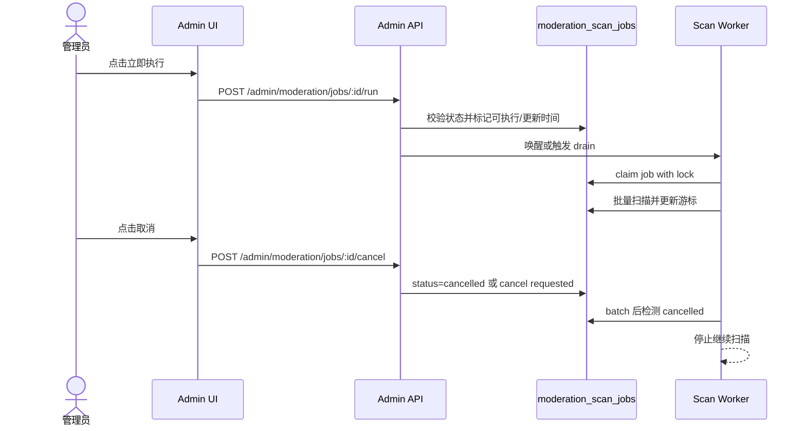

## Context

cnode-next 已有 `moderation_scan_jobs` 持久化任务、worker 轮询、Redis lock、暂停/恢复和后台任务列表。生产问题显示：任务创建后如果 worker 正在睡眠或旧 worker 未 drain，pending/running 任务会在后台堆积，管理员只能等待下一轮轮询，无法立即推进，也无法取消误建任务。

当前约束：不重写巡检队列，不引入外部队列系统；继续使用 PostgreSQL 任务表、Redis lock 和现有 worker。立即执行必须避免并发重复处理；取消必须是可恢复的终态，不删除历史任务记录。

## Goals / Non-Goals

**Goals:**

- admin 能在后台对巡检任务执行“立即执行”，触发 worker 尽快处理指定任务或继续 drain 队列。
- admin 能取消 pending、paused 或 running 任务。
- running 任务被取消时，worker 在当前 batch 结束后停止，并将任务标记为 `cancelled`。
- 任务列表展示 cancelled 状态，并保留审计记录或取消元信息。
- 验证立即执行、取消 pending、取消 running、锁竞争和任务不会继续产生命中。

**Non-Goals:**

- 不实现任务优先级排序、抢占式中断或多 worker 分片扫描。
- 不删除已生成的 `moderation_hits`；取消只影响后续扫描。
- 不改变敏感词匹配算法、命中确认或批量处理逻辑。

## Decisions

### Decision 1: 立即执行通过唤醒/短路 worker drain，不绕过 worker 处理逻辑

立即执行 API 不应在 HTTP 请求内执行全量扫描，而是设置任务为可 claim 并触发 worker 尽快执行。实现方式可以是写 Redis wake key、发布轻量信号、或在 API 中调用有限的 drain helper；但扫描批处理、锁和游标更新仍必须走 `processScanBatch()` 和 worker lock。

被拒绝的方案：在 admin HTTP 请求中直接循环扫描。该方案会阻塞请求、绕过 worker lock，并可能导致重复处理。

### Decision 2: 取消是持久终态 `cancelled`

取消任务后状态变为 `cancelled`，不再被 `claimNextScanJob()` 选中。pending/paused 可立即取消；running 先记录取消请求，worker 在当前 batch 后检测到取消状态并停止。若实现中直接把 running 置为 `cancelled`，worker 必须在下一次状态写入前重新读取任务状态，避免把 cancelled 覆盖回 running/done。

被拒绝的方案：删除任务行。删除会丢失操作记录，也会让管理员无法解释队列变化。

### Decision 3: 取消和立即执行均写审计

所有前台管理动作必须记录操作人、动作、目标任务 ID 和结果。任务行可增加 `cancelled_at`/`cancelled_by` 字段，或仅依赖 audit log；若不新增字段，任务列表至少要展示 `cancelled` 状态和更新时间。

被拒绝的方案：只改变状态不审计。巡检任务会删除或隐藏内容，队列控制必须可追踪。

## Risks / Trade-offs

- 立即执行导致并发扫描 → 继续依赖 Redis worker lock 和 DB claim 条件，验证同一 job 不会被双处理。
- running 取消被 worker 覆盖为 done → 每批写入前后重新读取任务状态或使用条件更新。
- 取消后仍有已生成命中 → UI/文案明确取消不删除已生成命中，只阻止继续扫描。
- worker 睡眠无法唤醒 → API 需要提供可验证的触发方式，或 worker sleep 改为较短 tick/可中断等待。

## Migration Plan

1. 扩展任务状态类型和查询，支持 `cancelled`。
2. 增加 admin run-now 和 cancel API，并写审计。
3. 更新 worker claim、process loop 和 sleep/tick 逻辑，支持立即执行和取消检测。
4. 更新后台任务列表按钮和状态展示。
5. 运行运行时验证脚本、`pnpm typecheck`、生产 smoke。
6. 回滚时恢复上一版 API/Web/Worker；已标记 cancelled 的任务不自动恢复。

## Open Questions

- 是否新增 `cancelled_at` / `cancelled_by` 字段，还是只依赖 audit log？推荐新增字段以便任务列表直接展示取消信息。
