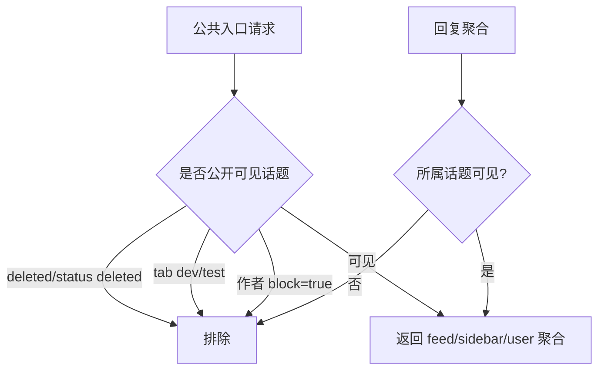

## Context

legacy `nodeclub/api/v1/topic.js` 在 `tab=all` 时使用 `{ tab: { $nin: ['job', 'dev'] }, deleted: false }`，并且回复列表通过 `nodeclub/proxy/reply.js` 只取 `deleted: false` 的回复。cnode-next 已经在部分接口过滤 `deleted`，但公开入口规则分散在 `topic.ts`、`community.ts`、`user.ts`、`collect.ts` 和 Web loader 中，容易出现 dev/test、已禁言用户内容或已删除内容从 sidebar、用户页聚合、收藏等路径漏出。

当前约束：不删除历史数据，不新增权限模型；但需要把用户运营状态拆分为 block 与 mute 两种持久化语义。管理员后台和巡检后台仍然需要能看到被过滤内容，以便继续运营处理。

## Goals / Non-Goals

**Goals:**

- 公共话题 feed、首页 sidebar 最新回复、无人回复、用户话题、用户参与、用户收藏、legacy 收藏 API 均使用同一套公开可见性规则。
- 公开可见性规则排除：`deleted=true`、`status='deleted'`、内部 tab `dev/test`，以及作者处于 block 状态的话题。
- 回复类聚合必须跟随所属话题可见性；即使回复本身未删除，所属话题不可公开时也不得出现在最新回复或用户参与中。
- admin 可分别执行 block/unblock 和 mute/unmute；block 控制公开内容可见性，mute 控制新增发帖和回复能力，两者可以同时存在。
- 用户主页 admin 可执行“删除该用户所有发言”，操作复用后端 admin API 并刷新页面反馈。

**Non-Goals:**

- 不把 dev/test 话题从数据库迁移或删除；只控制公开出口。
- 不改变管理员后台的检索范围；后台可以继续列出被 block 用户或内部 tab 内容。
- 不新增批量选择部分话题的复杂 UI；本变更只要求用户主页的一键删除该用户所有发言。
- 不自动删除 block 用户的历史内容；只要求公共查询隐藏。

## Decisions

### Decision 1: 在 API 查询层统一公开可见性

公共接口必须在数据库查询层排除不可见内容，而不是在 Web 端过滤。实现时优先在 `topicQueries.getByQuery()` 或路由本地 query condition 中加入 `deleted/status/tab/author block state` 条件，sidebar 和用户聚合使用 `exists` 或 join 保证关联话题也满足可见性。

被拒绝的方案：只在 React 组件中过滤。该方案无法保护 `/api/v1/*` 第三方客户端，也无法避免 total、分页和 sidebar 数据不一致。

### Decision 2: dev/test 作为内部 tab 处理

legacy `nodeclub/api/v1/topic.js` 已在 `tab=all` 排除 `dev`；线上用户又明确要求 `dev/test` 不出现在首页、最新回复和无人回复等板块。本变更将 `dev` 和 `test` 统一定义为内部 tab，所有公开入口默认排除，除非未来新增明确的管理员或内部访问入口。

被拒绝的方案：只排除首页 feed，不排除 sidebar。sidebar 同样是公开首页内容，保留内部 tab 会继续泄漏。

### Decision 3: block 与 mute 拆成两个独立状态

用户操作提供两种不同意图：block 表示隐藏该用户帖子在公共接口和公共页面中的可见性；mute 表示限制该用户继续创建话题和回复。两者必须独立存储和独立切换，运营人员可以只 block、只 mute，或同时应用两者。公开过滤以话题作者 block 状态为准，避免一个被 block 作者的话题通过其他用户回复再次进入最新回复。

被拒绝的方案：继续把 `is_block` 同时当作“隐藏内容”和“禁言”。该方案无法表达只隐藏内容或只禁止新增发言，也会让 UI 文案和权限语义混淆。

### Decision 4: 兼容现有 `is_block` 数据

当前 schema 只有 `users.is_block`，并且写入路径用它实现禁言。实现时应明确迁移策略：可以保留 `is_block` 作为 block 状态并新增 `is_muted`，同时把现有 `is_block=true` 用户初始化为 `is_muted=true`；也可以新增 `is_hidden` 作为 block 状态并保留 `is_block` 为 mute，但 API/UI 必须统一命名为 block/mute。推荐方案是保留 `is_block` 表示 block，新增 `is_muted` 表示 mute，并在迁移中将历史 `is_block=true` 同步到 `is_muted=true`，避免已禁言用户恢复写入能力。

被拒绝的方案：不做历史兼容，直接改变 `is_block` 语义。该方案会让线上已有被禁言用户在部署后恢复发帖/回复能力。

### Decision 5: 用户页批量删除复用现有 admin API

用户主页的“删除该用户所有发言”应调用现有 `/api/v1/user/:name/delete_all` 管理接口或同等后端能力，由后端执行 `adminRequired`、软删除和审计。前端只负责展示 admin 可见入口、确认文案、成功/失败 toast 和 revalidate。

被拒绝的方案：在 Web 端逐条调用删除接口。该方案慢、失败状态复杂，也更容易漏审计。

## Risks / Trade-offs

- 过滤条件分散导致遗漏 → 增加验证脚本覆盖所有公开出口，并尽量抽出 shared query helper。
- 过滤 block 用户历史内容可能减少用户页计数与原始数据库计数一致性 → 公共页面显示公开可见数据，管理员后台保留原始数据视角。
- block/mute 字段迁移处理不当可能改变现有禁言用户行为 → 迁移时将当前 `is_block=true` 用户同时置为 muted，并补验证脚本覆盖。
- `dev/test` 历史数据 tab 值可能不规范 → 先覆盖明确的 `dev` 和 `test`，后续如发现别名再追加。
- 用户页一键删除是高风险操作 → UI 必须使用明确确认文案，后端必须 admin 校验和审计。

## Migration Plan

1. 先补用户状态 schema/迁移和 block/mute API，确保现有 `is_block=true` 用户不会恢复写入能力。
2. 再补公开查询条件和验证脚本，确认 dev/test、deleted、block 用户内容不出现在公共 API。
3. 再加用户主页 admin 删除所有发言入口，确认调用后端审计 API。
4. 运行 `pnpm typecheck`、新增验证脚本和生产 smoke。
5. 部署 API/Web/Worker；回滚时恢复上一版镜像，已产生的软删除、状态切换和审计记录不回滚。

## Open Questions

- `job` 是否也应继续按 legacy 从首页 `all` 排除？当前实现已排除 `job/dev`，本变更新增 `test` 并强化 sidebar/user 聚合；不改变 `job` 的现有公开规则。
