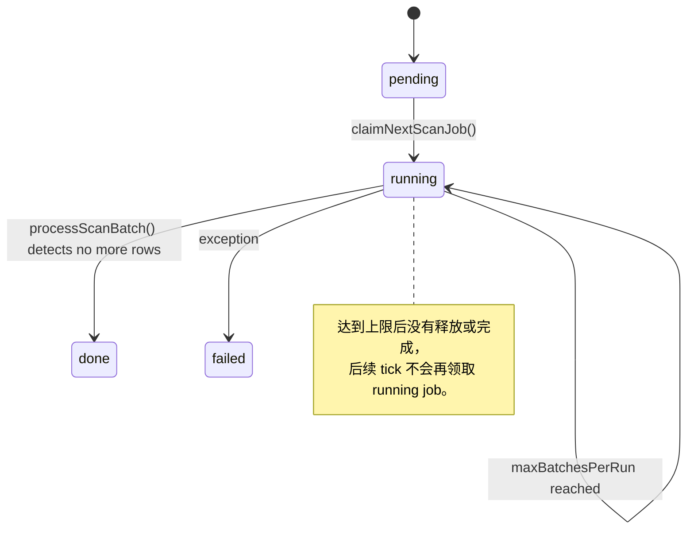
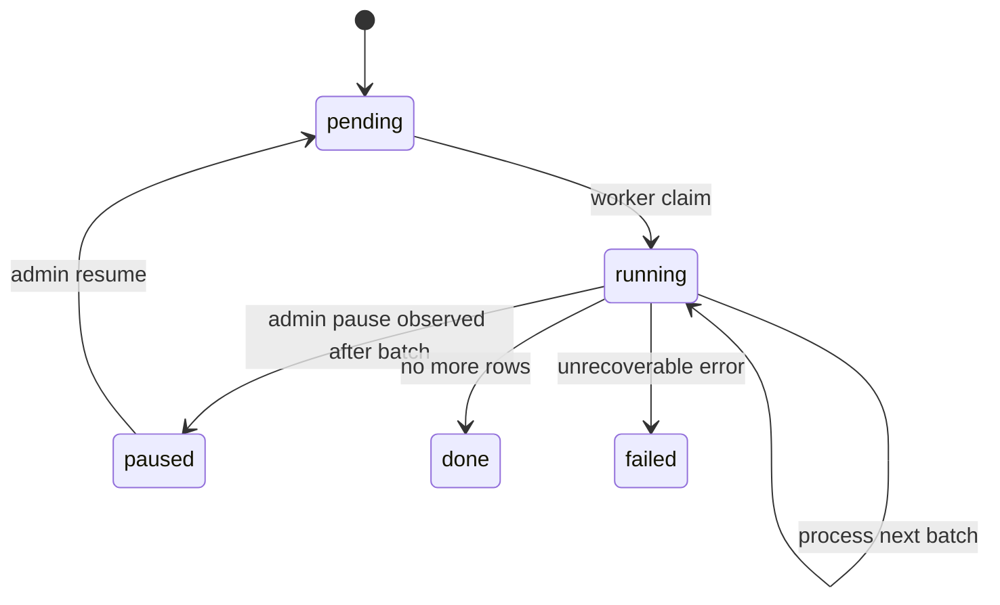

## Context

`moderation_scan_jobs` 是 cnode-next 内容巡检的持久化任务队列。管理员新增敏感词或手动创建巡检任务后，HTTP 请求只写入 `pending` job，由 `apps/api/src/worker/moderation-scan.ts` 的常驻 worker 领取并批量扫描话题和回复。

当前远程服务器实测发现：worker 启动后将 job 从 `pending` 改为 `running`，扫描到 `maxBatchesPerRun * batchSize` 后停止本轮处理，但 job 仍保持 `running`。后续 tick 只通过 `claimNextScanJob()` 查询 `pending` job，因此不会继续处理这个 `running` job，任务永久悬挂。

现有状态流如下：

## Goals / Non-Goals

**Goals:**

- 手动创建的历史巡检任务 MUST 在 worker 领取后执行到 `done`、`failed` 或管理员暂停。
- 历史巡检 MUST 优先扫描最新话题和最新回复，让管理员尽快看到近期内容命中。
- `maxBatchesPerRun` 不能导致任务永久停留在 `running`。
- worker 重启、崩溃或锁过期后，未完成任务 MUST 能被后续 worker 恢复。
- 保留批量扫描和批间 throttle，避免一次性加载全库内容。

**Non-Goals:**

- 不替换为 BullMQ、Redis Stream、Cloudflare Queue 等新队列系统。
- 不改变 `moderation_scan_jobs` 和 `moderation_hits` 表结构。
- 不改变命中规则、敏感词模型和管理员审核 API。
- 不恢复或迁移 legacy `nodeclub` 的历史巡检状态；legacy 只作为管理员触发后任务应可完成的行为参考。

## Decisions

### Decision 1: 手动任务连续处理到完成

worker 领取手动历史扫描任务后，`processJob()` 应持续调用 `processScanBatch()`，直到返回 `done`、任务被暂停、或抛错进入 `failed`。

被拒绝的方案：继续保留 `maxBatchesPerRun` 截断并等待下一轮 tick。这个方案需要额外把任务释放回 `pending` 或支持领取 `running` 任务，状态机更复杂，并且用户明确期望“每次都跑完”。

目标状态流：

### Decision 2: 将 `maxBatchesPerRun` 限定为调度切片，不破坏完成性

`maxBatchesPerRun` 可以继续用于定时增量任务的单轮资源保护，但不能让 job 留在不可恢复的 `running`。若实现仍保留切片语义，到达上限时必须将未完成任务恢复为可领取状态，例如 `pending`，并保留游标。

被拒绝的方案：删除字段和环境变量。删除会扩大变更范围，也会破坏已有运维配置。当前只需要修复完成性和恢复语义。

### Decision 3: 恢复 `running` 悬挂任务

worker 启动或 tick 时应能识别已有 `running` 但没有活跃 worker 处理的任务。最小实现可以在单实例 worker 模型下优先恢复最早的 `running` 任务，或在获取 Redis worker lock 后处理当前 `running` 任务。

被拒绝的方案：只处理新创建的 `pending` 任务。该方案不能修复已经卡住的生产任务，也不能覆盖 worker 崩溃后的恢复场景。

### Decision 4: 历史巡检按最新内容优先

历史巡检使用主键倒序扫描话题和回复，初始游标为 `0` 时从当前最大 `id` 开始，后续批次使用 `id < cursor` 继续向旧内容推进。增量巡检仍保留 `id > cursor` 的正序语义，只扫描新增内容。

被拒绝的方案：继续从最老内容开始扫描。该方案会让管理员长期看不到近期明显违规内容的命中，不符合线上巡检的运营优先级。

## Risks / Trade-offs

- 长时间连续扫描占用数据库连接 → 保留 `batchSize` 和 `throttleMs`，每批只读取必要字段，并在每批后更新游标。
- 管理员暂停不够及时 → 每批开始前通过 `refreshJob()` 检查状态，暂停最多延迟一个批次生效。
- 多 worker 同时恢复同一任务 → 继续使用 Redis lock 确保同一时间只有一个 worker 执行扫描任务。
- 历史大表扫描时间长 → 这是手动巡检任务的预期成本，运行过程持续写入游标和计数，便于观察进度。

## Migration Plan

1. 发布修复后的 API 镜像并重启 `worker` 服务。
2. worker 启动后应恢复当前停留在 `running` 的未完成任务，或管理员可通过恢复接口将其重新置为 `pending` 后执行。
3. 回滚时使用上一版镜像；若任务再次卡在 `running`，可临时通过管理员恢复接口或数据库操作改回 `pending` 后重启 worker。

## Open Questions

- 定时增量任务是否也应连续执行到完成，还是按 `maxBatchesPerRun` 切片后释放回 `pending`？当前变更优先保证所有任务不会永久悬挂。
