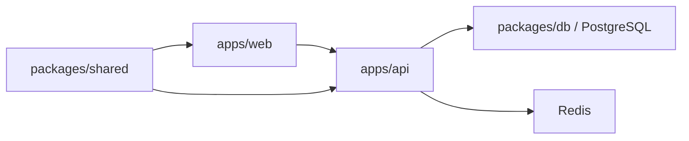

# Design: cnode-next Architecture

## Overview

该变更将 legacy nodeclub 重写为 TypeScript monorepo，并以共享契约连接 SSR Web、Hono API、PostgreSQL 数据层和后台任务。

## Decisions

### Monorepo 与共享契约

使用 pnpm workspace 管理 Web、API、数据库和共享包。API DTO、Zod schema、常量与纯函数收敛到 `packages/shared`，避免前后端各自维护契约。

### PostgreSQL-first 数据层

使用 Drizzle 管理 PostgreSQL schema 和 reviewed migrations。MongoDB 只作为一次性迁移来源，不作为新应用运行时 fallback。

### SSR Web 与独立 API

Web 使用 React Router SSR，API 使用 Hono。服务间通过公开 API 契约通信，浏览器和 SSR 的 API base URL 均由运行时配置提供。

### Cookie session 与账号兼容

认证使用 cookie session、GitHub OAuth 和本地账号。迁移时保留 legacy 密码 hash 验证能力，避免要求所有用户重设密码。

### 显式数据迁移

Mongo 到 PostgreSQL 的迁移按依赖顺序执行，并通过 ID map、计数对账和 smoke 检查验证。迁移失败时停止切换，不允许普通服务启动隐式执行迁移。

### 不可变镜像部署

CI 构建并发布可追溯镜像。`deployment/docker-compose.yml` 只引用已发布镜像，部署使用 `pull` 和 `up --no-build`，真实 dotenv 与基础设施配置不进入版本库。

## Trade-offs

- PostgreSQL-only 降低多数据库兼容成本，但本地开发和测试也必须遵守 PostgreSQL 语义。
- 独立 Web/API 增加运行时配置边界，但允许镜像在不同环境复用。
- 显式迁移和发布门禁增加步骤，但提供可审查、可回滚的变更路径。
