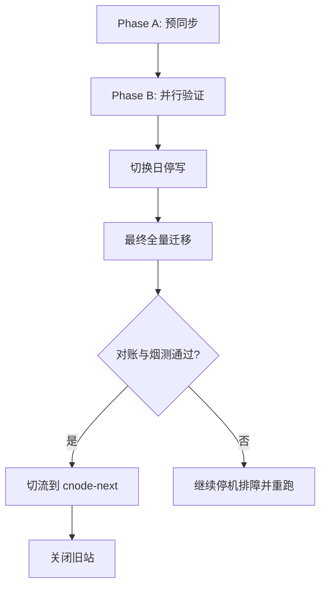
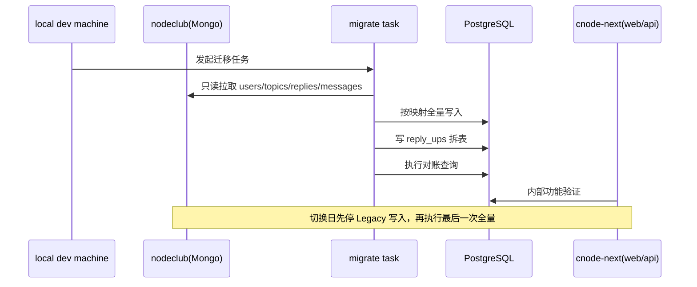

## Context

项目将从 `nodeclub/`（Express + MongoDB）迁移到 cnode-next（Hono + PostgreSQL），并采用 docker-compose 承载 API、PostgreSQL、Redis。根据当前决策，迁移期间以 Mongo 为唯一权威数据源；新站并行期仅内部测试，测试写入可被后续全量重跑覆盖。切换日执行停机迁移并直接下线旧站，不设计回滚。

新增约束是：远程主机已经承载历史 cnode 的 Mongo/Redis 等服务，团队希望在正式迁移前，从本地开发机连接远程主机，先完成一次端到端迁移彩排和功能测试。

## Goals / Non-Goals

**Goals:**
- 定义可重复执行的迁移阶段流程：预同步、并行验证、最终停机全量重跑、切流下线。
- 约束 docker-compose 下的建表与迁移执行位置，避免网络/环境变量误用。
- 定义上线闸门：数据对账、关键功能烟测、耗时与停机窗口可预测。
- 定义本地到远程主机的演练路径（连接方式、最小权限、数据隔离、可重复执行）。

**Non-Goals:**
- 不实现双写冲突合并。
- 不覆盖业务功能重构或 UI 调整。
- 不提供回滚流程设计。

## Decisions

### Decision 1: 采用双阶段全量迁移
- 选择：并行期重复执行全量迁移；切换日停写后再执行一次最终全量迁移。
- 理由：与"Mongo 单一真相源"策略一致，避免增量同步漏数风险，流程简单可审计。
- 备选方案：增量 CDC（复杂、维护成本高）、双向同步（冲突处理复杂）。

### Decision 2: compose 内执行建表与迁移
- 选择：建表与迁移命令在 compose 网络内执行（如一次性任务容器）。
- 理由：避免宿主机环境与容器网络不一致导致连接失败；保证与生产网络拓扑一致。
- 备选方案：宿主机直接执行（依赖端口暴露和本地环境，漂移风险高）。

### Decision 3: 切换日不回滚，改为强闸门放行
- 选择：不设计回滚路径，但引入严格验收闸门后再切流。
- 理由：符合当前运维偏好，减少双系统维护负担。
- 备选方案：保留回滚窗口（更安全，但流程更长）。

### Decision 4: 新站并行期仅内测开放写入
- 选择：允许测试写入，但声明切换前会被最终全量覆盖。
- 理由：满足验证需求，同时保持权威源单一。
- 备选方案：新站只读（更保守，但降低测试覆盖）。

### Decision 5: 本地演练采用受控远程连接，不暴露公网数据库
- 选择：从本地发起到远程主机的受控连接（例如 SSH 隧道或内网跳板），访问现网 Mongo 读数据；目标 PG 使用本地或独立预发布实例。
- 理由：满足"本地跑完整流程"诉求，同时避免直接暴露线上 Mongo/Redis 端口。
- 备选方案：直接公网开放数据库端口（风险高，不采用）。

### Decision 6: 本地演练阶段不得写入源库
- 选择：迁移彩排不得对 Mongo 执行写入；若现有 Mongo 未启用认证，则通过只读迁移脚本、目标库隔离和命令审查控制风险。
- 理由：当前旧 Mongo 未启用认证，启用认证需要修改并重启生产 Mongo，属于额外生产变更；彩排阶段不引入该风险。
- 备选方案：启用 Mongo 认证并创建只读账号（权限更强，但需要生产变更）。

## Risks / Trade-offs

- [停机窗口超时] -> 迁移前至少完成两轮全量演练并记录耗时上限。
- [映射缺陷导致最终数据偏差] -> 每次全量后执行固定对账清单并抽样登录/内容链路。
- [误在宿主机执行命令连错库] -> 所有运行手册命令显式使用 `docker compose run/exec`。
- [并行期测试写入被覆盖造成误判] -> 在内测说明中声明"测试数据非最终"并定时重置。
- [本地演练误写线上数据] -> 迁移脚本只读取 Mongo，所有写入仅指向演练 PostgreSQL；不启用 Mongo auth 时通过命令审查和目标库隔离降低风险。
- [远程链路抖动导致迁移中断] -> 支持分批读取、断点重跑和迁移结果幂等覆盖。

## Migration Plan

### Phase A: 预同步与环境就绪
1. 在本地准备演练目标环境（compose 或独立 PG），并配置远程源库连接参数。
2. 启动 compose 基础服务（postgres、redis、api 运行所需网络）。
3. 在 compose 内执行建表命令（Drizzle push pg）。
4. 运行一次全量迁移并完成首轮对账。

### Phase B: 并行验证
1. 旧站继续生产写入（Mongo 权威）。
2. 新站仅内部测试并允许测试写入。
3. 按日执行全量重跑，覆盖测试数据并验证一致性。
4. 从本地执行完整功能回归，记录 API 行为、迁移耗时和失败样本。

### Phase C: 切换日
1. 旧站进入停写/停机模式。
2. 执行最终全量迁移。
3. 执行最终对账与关键烟测。
4. 通过后切流到新站并关闭旧站。

### Local-to-Remote Rehearsal Runbook (Command Templates)

目的：在正式切换前，从本地开发机完成“远程读源 + 本地/预发布写目标”的全流程彩排。

统一前置约束：
- 迁移流程不得写入远程 Mongo；如远程 Mongo 未启用认证，不要求为彩排单独启用只读账号。
- 不暴露数据库公网端口。
- 目标库必须是演练库（非生产目标库）。

#### 模式 A: SSH 隧道（默认）

1. 建立隧道

```bash
ssh -N \
  -L 37017:127.0.0.1:27017 \
  -L 36379:127.0.0.1:6379 \
  -p <ssh-port> <ssh-user>@<remote-host>
```

2. 启动本地演练环境

```bash
docker compose up -d postgres redis api
docker compose ps
```

3. 建表 + 全量迁移

```bash
docker compose run --rm api pnpm db:push:pg

docker compose run --rm \
  -e MONGO_URI=mongodb://host.docker.internal:37017/${MONGO_DB} \
  api pnpm tsx scripts/migrate-mongo-to-pg.ts
```

4. 最小对账 + 烟测

```bash
docker compose exec postgres psql -U <pg-user> -d <pg-db> -c "select count(*) from users;"
docker compose exec postgres psql -U <pg-user> -d <pg-db> -c "select count(*) from topics;"
docker compose exec postgres psql -U <pg-user> -d <pg-db> -c "select count(*) from replies;"
docker compose exec postgres psql -U <pg-user> -d <pg-db> -c "select count(*) from messages;"
docker compose exec postgres psql -U <pg-user> -d <pg-db> -c "select count(*) from reply_ups;"
pnpm dev
```

#### 模式 B: 跳板机（内网）

1. 通过跳板执行同样流程，仅替换连接入口

```bash
ssh -J <bastion-user>@<bastion-host> -N \
  -L 37017:127.0.0.1:27017 \
  -L 36379:127.0.0.1:6379 \
  <target-user>@<target-host>
```

2. 其余步骤与模式 A 相同（建表、全量迁移、对账、烟测）。

通过标准（两种模式一致）：
- 连续两次全量重跑成功。
- 五项计数对账通过（users/topics/replies/messages/reply_ups）。
- 登录、发帖、回复、消息链路烟测通过。





## Open Questions

- 最终运行手册中是否将建表和迁移拆为两个独立一次性容器（`migrate-schema` / `migrate-data`）？
- 最终全量迁移允许的最大停机时长阈值是多少（例如 30 分钟或 60 分钟）？
- 最终对账报告是否需要自动产出并归档（JSON/Markdown）？
- 本地到远程连接最终采用哪种固定方案（SSH 隧道或内网跳板）？
