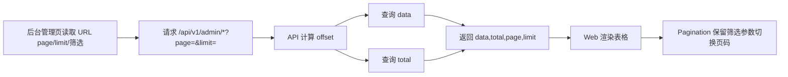

## Context

后台管理当前已经有多个列表页和列表接口，但分页能力不一致。`apps/api/src/routes/admin.ts` 中 `/admin/topics` 只支持 `limit`，部分列表固定返回最近若干条，部分查询没有 `total`；`apps/web/app/routes/admin/*.tsx` 多数页面只渲染当前返回结果，没有页码。数据增长后，管理员无法访问历史话题、用户、审计日志、举报、敏感词或封禁规则。

公开话题列表已经采用 `page`、`limit`、`total` 模式，Web 侧也已有 `apps/web/app/components/Pagination.tsx`。后台分页应复用这些既有模式，同时保持后台 API 的权限校验和管理页面结构。

## Goals / Non-Goals

**Goals:**

- 后台管理列表接口统一支持 `page`、`limit`，并返回 `total`。
- 后台管理页面使用页码分页访问完整数据集。
- 搜索、状态筛选等条件切换分页时必须保留。
- `limit` 有上限，避免管理员误请求过大数据集。
- 概览摘要接口保持固定最近 N 条，不被分页改造影响。

**Non-Goals:**

- 不改变公开 API 的分页格式。
- 不引入无限滚动、游标分页或虚拟列表。
- 不一次性重构所有后台 UI 样式，只补齐分页能力。
- 不改变管理权限策略。

## Decisions

### Decision: 使用 page/limit/total，而不是 cursor

后台管理页面采用页码分页：请求参数为 `page`、`limit`，响应包含 `data`、`total`、`page`、`limit`。

Rejected alternatives:

- Cursor pagination：适合高频流式列表，但后台管理需要跳转到指定页和查看总数，页码更直观。
- 仅支持 offset/limit：API 直接暴露 offset 不利于 Web URL 可读性，也不符合现有公开话题列表模式。

### Decision: 每个列表接口保留自己的排序和筛选语义

分页只改变数据窗口，不改变列表原有排序和筛选含义。例如话题管理仍按创建时间或后续指定排序，审计日志仍按时间倒序。

Rejected alternatives:

- 为所有列表强制统一排序字段：实现简单但会破坏不同后台列表的业务语义。
- 只给前端做客户端分页：无法访问超过接口固定返回数量之外的数据，不解决根因。

### Decision: 复用现有 Pagination 组件

Web 后台优先复用 `apps/web/app/components/Pagination.tsx`。如后台需要更紧凑样式，可在现有组件上增加可选 className 或新增轻量包装组件，但不重复实现分页逻辑。

Rejected alternatives:

- 每个后台页面手写分页按钮：容易出现 URL 参数保留不一致。
- 引入第三方表格分页组件：增加依赖，超出当前需求。

### Decision: 摘要接口不分页

`/admin/stats`、`/admin/recent-users`、`/admin/recent-topics` 等概览摘要仍返回固定最近 N 条。完整列表分页应在对应管理页处理。

Rejected alternatives:

- 所有返回数组的后台接口都分页：会让概览页实现复杂化，也改变摘要模块语义。

## Risks / Trade-offs

- [Risk] 每个接口单独查询 `total` 会增加数据库查询次数 → Mitigation: 仅管理后台使用，列表规模可接受；必要时后续按热点接口优化。
- [Risk] 不同接口响应格式变更可能影响现有前端读取 → Mitigation: 同步更新对应 `apps/web/app/routes/admin/*.tsx` loader 和组件，不要求外部兼容。
- [Risk] 搜索/筛选参数在分页跳转时丢失 → Mitigation: Pagination 调用必须传入当前 searchParams。
- [Risk] `page` 超出总页数返回空列表 → Mitigation: API 保持确定性返回空 `data` 和正确 `total`，前端允许用户回到上一页。

## Migration Plan

1. 先为 API 列表补齐 `page`、`limit`、`total`，保持默认第一页和当前默认 limit。
2. 再逐个后台页面接入 URL page/limit 和分页控件。
3. 保留概览最近 N 条接口不变。
4. 回滚时可恢复前端不显示分页；API 多返回字段不破坏 JSON 客户端读取。

## Open Questions

- 后台默认 `limit` 建议使用 20 或 50；实现时优先保留页面当前展示规模，统一限制最大 100。
