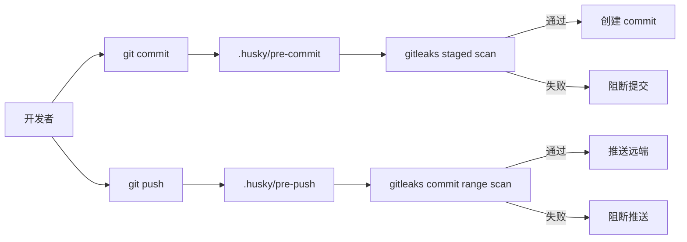

## Context

仓库已有 `.gitleaks.toml`，并已验证 `gitleaks detect --config .gitleaks.toml --redact --no-banner` 可以正常运行。但目前没有 git hook 安装机制，也没有 `package.json` 中的统一命令，开发者必须记得手动运行 gitleaks。项目现在包含数据库、Redis、SMTP、GitHub OAuth、OSS 等敏感配置，相比 legacy `nodeclub/` 的本地配置约定，新仓库需要更明确的提交前保护。

## Goals / Non-Goals

**Goals:**

- 使用 Husky 提供仓库内可版本化的 git hooks。
- 提供一条安装命令，让开发者安装本仓库 Husky hooks。
- 提供 `pnpm` secret scan 命令，供本地手动运行和后续 CI 复用。
- pre-commit 扫描 staged changes，降低误提交真实 secret 的概率。
- pre-push 扫描即将推送的 commits，覆盖绕过 pre-commit 或直接修改历史的情况。
- 文档说明如何安装、运行、处理误报和风险性跳过。

**Non-Goals:**

- 不引入 Husky 之外的 lefthook、pre-commit 等额外 hook 框架。
- 不自动修改全局 git 配置。
- 不在本变更中接入远程 CI secret scanning。
- 不处理已经进入 git 历史的真实密钥轮换或历史清理。

## Decisions

### Decision: 使用 Husky 管理本地 hooks

仓库新增 `.husky/pre-commit` 和 `.husky/pre-push`，根 `package.json` 提供 `hooks:install` 和 `prepare` 脚本执行 Husky 安装。这样 hook 文件可版本化，并复用社区常见的 Node.js 项目 hook 管理方式。

替代方案：使用 `.githooks` + `core.hooksPath`。拒绝原因是项目采用 Node.js workspace，Husky 的安装方式更符合团队预期，也能通过 `prepare` 在依赖安装后自动完成本地 hook 初始化。

替代方案：提交 `.git/hooks` 文件。拒绝原因是 `.git/` 不属于仓库内容，无法版本化。

### Decision: pre-commit 扫描 staged diff，pre-push 扫描 commit range

pre-commit 使用 gitleaks 的 git staged 检测能力或等价 staged diff 扫描，目标是快速阻断将要提交的秘密。pre-push 根据 Git 传入的 local/remote ref 扫描即将推送的 commit range，目标是捕获绕过 pre-commit 的情况。

替代方案：每次 hook 都跑全历史 `gitleaks detect`。拒绝原因是速度更慢，并且历史中的既有误报会阻断普通开发流程。

### Decision: hooks 缺少 gitleaks 时 fail closed

hook 检测不到 `gitleaks` 命令时 SHALL 失败并给出安装提示，而不是静默跳过。开发者可使用显式环境变量跳过，用于紧急场景。

替代方案：缺少 gitleaks 时自动跳过。拒绝原因是这会让安全能力在未安装工具的环境中形同虚设。

## Risks / Trade-offs

- [Risk] 开发者没有安装 gitleaks 导致提交失败 → 提供清晰安装提示和文档。
- [Risk] hook 扫描耗时影响提交体验 → pre-commit 只扫描 staged 内容，pre-push 只扫描即将推送的范围。
- [Risk] 误报阻断紧急修复 → 文档提供修正规则、allowlist 和显式跳过方式，但要求开发者理解风险。
- [Risk] Windows shell 环境兼容性有限 → hook 使用 POSIX shell；Windows 用户通过 Git Bash 运行。

## Migration Plan

1. 新增 `pnpm secrets:scan`、`pnpm secrets:scan:staged` 和 `pnpm hooks:install` 等命令。
2. 新增 `.husky/pre-commit` 和 `.husky/pre-push`。
3. 新增 Husky 安装命令和文档，说明首次 clone 后执行安装命令。
4. 本地验证 hook 命令和 gitleaks 扫描命令。

## Open Questions

- 后续是否把同一命令接入 GitHub Actions 或其他 CI，需要另一个变更决定。
