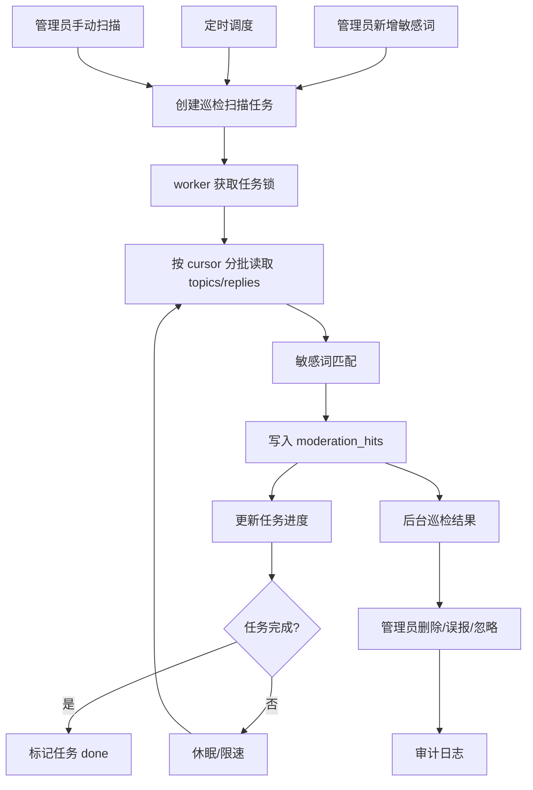

## Context

cnode-next 当前已有敏感词库和提交时检查：`apps/api/src/lib/moderation.ts` 读取 `sensitive_words`，话题和回复创建/编辑路径调用 `checkContent()`。但历史内容不会被重新检查，后台 `/admin/moderation` 只读取 `topics.status = "muted"`，无法覆盖 `replies`，也不记录命中的敏感词和处理状态。

legacy nodeclub 没有完整自动巡检实现，线上运营更依赖人工判断。本变更不是复刻一个已有后台任务，而是在新 PostgreSQL-first 架构里补齐“新增敏感词后检查历史内容”的运营闭环，同时避免扫描任务影响 `api.cnodejs.org` 和 `next.cnodejs.org` 的线上请求。

## Goals / Non-Goals

**Goals:**

- 添加敏感词后能低负载扫描历史话题和回复。
- 支持定时增量扫描新增或更新内容。
- 扫描任务可暂停、可恢复、可限速，内存占用与全库数据量无关。
- 巡检结果覆盖 topic 和 reply，并记录命中词、上下文、来源和处理状态。
- 管理员在后台复核命中内容，处理动作进入审计日志。

**Non-Goals:**

- 不在前台读取路径实时扫描敏感词。
- 不在新增敏感词的 HTTP 请求内同步扫描全库。
- 第一阶段不自动删除历史命中内容。
- 不引入外部队列系统；优先复用 PostgreSQL 和 Redis。

## Decisions

### Decision 1: 使用独立 worker 执行扫描任务

扫描任务 SHALL 由独立 worker 进程执行。Docker 部署中可复用 API 镜像，通过不同 command 启动 worker service。

Rejected alternatives:

- 在 API 请求进程中执行扫描：会与线上请求争 CPU/内存，扫描异常可能影响 API 可用性。
- 使用外部队列服务：当前系统已有 PostgreSQL/Redis，新增外部依赖会增加部署复杂度。

### Decision 2: 用数据库任务表和命中表表达巡检状态

新增 `moderation_scan_jobs` 保存任务状态、游标、批大小、限速和错误；新增 `moderation_hits` 保存命中对象、命中词、预览、处理状态和处理人。

Rejected alternatives:

- 继续只用 `topics.status = muted`：无法覆盖 replies，也无法记录命中词、上下文和复核状态。
- 只写审计日志不建命中表：审计日志不适合承载待处理队列和重复扫描去重。

### Decision 3: 批量 keyset pagination，不做全库加载

扫描 SHALL 使用 `id > cursor ORDER BY id LIMIT batch_size` 的方式读取必要字段。每批处理后立即写入命中、更新游标，并按配置 sleep。

Rejected alternatives:

- `OFFSET` 分页：大表后段性能差，且内容变化时不稳定。
- 一次性拉取所有内容：内存和事务风险不可控。

### Decision 4: 历史命中默认进入复核队列，不自动隐藏

新增敏感词可能误伤旧内容，尤其中文短词。第一阶段命中只进入 `moderation_hits.status = pending`，管理员确认后再删除或忽略。

Rejected alternatives:

- 命中后自动删除：误伤不可逆，不符合社区历史内容迁移阶段的安全策略。
- 命中后自动 `muted`：现有 reply 缺少 `status`，且隐藏语义会影响计数和展示一致性。

### Decision 5: 定时扫描只扫描增量内容

定时任务 SHALL 根据上次完成时间或 `last_scanned_at` 游标扫描新增/更新内容。全量历史扫描仅由新增敏感词或管理员手动触发。

Rejected alternatives:

- 每次定时全量扫描：数据增长后会持续消耗数据库和 CPU。
- 仅新增敏感词时扫描：无法覆盖后续绕过写入检查或迁移补数据的情况。

## Risks / Trade-offs

- [Risk] 敏感词数量很大时应用层逐词匹配变慢 → 第一版通过批大小和限速控制资源，后续可替换为 AC 自动机而不改变任务/命中表契约。
- [Risk] worker 多实例重复执行任务 → 使用 Redis lock 或 PostgreSQL advisory lock，并在任务表中做状态转移保护。
- [Risk] 扫描过程中敏感词被删除或修改 → 命中记录保存当时的 keyword text；后续删除词不自动删除历史命中，由管理员处理或重新扫描。
- [Risk] 误伤内容过多导致后台队列爆炸 → 支持按词、类型、时间范围筛选，并允许管理员暂停任务。
- [Risk] 删除 reply 后 topic reply_count 需要一致 → 复用现有 reply soft delete 逻辑，确保计数、用户积分和审计策略明确。

## Migration Plan

1. 增加 `moderation_scan_jobs` 和 `moderation_hits` 表及必要索引。
2. 部署 worker service，但默认允许通过环境变量关闭定时扫描。
3. 后台“巡检结果”切换为读取 `moderation_hits`，保留空队列兼容。
4. 敏感词新增接口创建针对新增词的扫描任务。
5. 开启手动扫描，再开启定时增量扫描。
6. 若出现资源压力，可暂停 worker 或调大 `MODERATION_SCAN_THROTTLE_MS`，API/Web 不需要回滚。

## Open Questions

- 严重分类的敏感词是否允许自动隐藏，还是全部必须人工复核？第一版建议全部人工复核。
- 命中 reply 的默认处理是 soft delete reply，还是隐藏整条 topic？第一版建议只处理命中的 reply。
- 巡检命中是否需要通知作者？第一版建议只做审计，不发通知，避免扰动历史用户。
