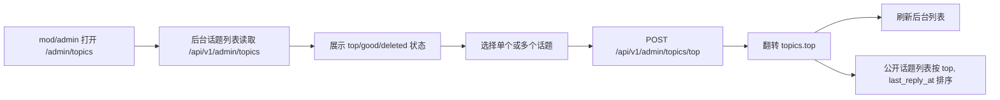

## Context

legacy nodeclub 的置顶行为由 `nodeclub/web_router.js` 中 `POST /topic/:tid/top` 暴露，并在 `nodeclub/controllers/topic.js` 中翻转话题 `top` 布尔字段。首页在 `nodeclub/controllers/site.js` 使用 `sort: '-top -last_reply_at'`，因此置顶话题排在普通话题前面，置顶内部仍按最后回复时间排序。

新版本已经具备 `topics.top` 字段、公开列表 `StatusBadge type="top"` 展示、后台话题列表和 `/api/v1/admin/topics/:action` 批量操作接口。但当前置顶操作入口和权限契约不清晰，且 API 位于 `adminRequired()` 下，不满足“mod 和 admin 都可以操作置顶管理”的要求。

## Goals / Non-Goals

**Goals:**

- 让 `mod` 和 `admin` 都能在后台话题管理页置顶/取消置顶。
- 保持 legacy nodeclub 的 `top` 布尔翻转语义，不引入新的置顶模型。
- 让后台操作完成后立即展示最新状态，公开列表继续用“置顶”徽标和置顶优先排序体现结果。
- 保证置顶操作不影响积分、计数器、发布时间和最后回复时间。

**Non-Goals:**

- 不增加置顶过期时间、置顶权重、分区置顶或人工排序。
- 不改变加精、隐藏、删除等其他运营动作的权限，除非实现时需要拆分共享路由以避免把这些动作同时开放给 mod。
- 不新增数据库迁移；复用 `topics.top`。

## Decisions

### Decision: 复用 `topics.top` 布尔字段

采用现有 `packages/db/src/schema/topic.ts` 的 `topics.top` 字段表达置顶状态。

Rejected alternatives:

- 新增 `pinned_at` 或 `pin_order` 字段：可以支持更复杂排序，但超出 legacy 行为，且需要迁移和更多 UI 规则。
- 建立独立 pin 表：适合多维度置顶，但当前只有全站置顶，不需要额外复杂度。

### Decision: 置顶操作保持翻转语义

`POST /api/v1/admin/topics/top` 对传入 ID 集合逐条翻转 `top` 状态，已置顶变为未置顶，未置顶变为置顶。

Rejected alternatives:

- 分成 `pin` 和 `unpin` 两个动作：语义更显式，但会偏离 legacy `POST /topic/:tid/top` 的切换行为，也会增加前端操作数量。
- 根据批量选择自动统一成同一状态：会让混合选择的结果不直观，且不是当前 API 的行为。

### Decision: 置顶权限使用 mod/admin，其他动作保持原权限边界

置顶管理需要 `mod` 和 `admin` 都可操作。若现有共享接口将 `top`、`good`、`mute`、`delete` 绑定在同一个 `adminRequired()` 路由内，实现时应将 `top` 拆为 `modRequired()` 或在路由内按 action 分支检查权限，避免无意扩大其他动作权限。

Rejected alternatives:

- 继续只允许 admin：不满足运营要求。
- 将所有话题管理动作都开放给 mod：实现简单，但会扩大删除等高风险动作权限。

### Decision: 后台 Web 通过现有 `/admin/topics` 承载管理入口

在 `apps/web/app/routes/admin/topics.tsx` 继续承载置顶管理，不新增独立页面。

Rejected alternatives:

- 新建 `/admin/pins`：能聚焦置顶，但会让话题运营动作分散，也不符合当前后台信息架构。
- 在公开话题详情页加入置顶按钮：接近 legacy EJS 的页面内管理入口，但当前新后台已经承担运营管理职责，先不扩散到前台详情页。

## Risks / Trade-offs

- [Risk] 现有 `/api/v1/admin/topics/:action` 若整体改成 `modRequired()`，可能把删除、隐藏、加精也开放给 mod → Mitigation: 仅对 `top` action 开放 mod/admin，其他 action 维持原有权限。
- [Risk] 批量翻转混合状态会让部分话题置顶、部分话题取消置顶 → Mitigation: UI 文案明确为“切换置顶”，或在操作后刷新列表显示结果。
- [Risk] 公开列表排序如果仍只按 `last_reply_at`，置顶状态不会实际影响首页 → Mitigation: 检查 `apps/api/src/routes/topic.ts` / `topicQueries.getByQuery` 的排序，确保公开话题列表按 `top` 优先。
- [Risk] 缓存中的首页列表可能短时间保留旧置顶状态 → Mitigation: 复用现有短 TTL；如实现中已有首页 KV/Redis key，可在置顶操作后清理相关 topics 列表缓存。

## Migration Plan

1. 复用现有 `topics.top` 数据，无需 schema migration。
2. 调整 API 权限与置顶 action 行为，部署后现有置顶数据继续生效。
3. 更新后台话题管理页交互和状态文案。
4. 回滚时恢复 API 权限和前端按钮文案即可，数据库无需回滚。

## Open Questions

- 是否需要在置顶操作后主动清理 Cloudflare KV 首页缓存，取决于当前缓存 key 是否能从 API 服务端访问；若不能访问，接受短 TTL 延迟。
