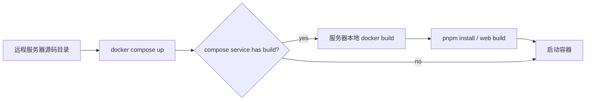
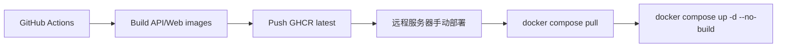

## Context

cnode-next 生产当前通过 `/root/workspace/cnode-next/docker-compose.prod.yml` 在海外服务器运行 API、Web、worker、PostgreSQL 和 Redis。远程服务器上当前已经存在 `ghcr.io/cnodejs/cnode-api:latest` 和本地 `cnode-next-web:latest` 镜像，但 compose 文件仍包含 `build:`，因此部署或恢复时仍可能在服务器上执行 `pnpm install`、React Router build 和 Docker 多阶段构建。

远程服务器还同时运行 legacy `nodeclub`、MongoDB、Redis、Caddy 等服务。把构建留在服务器上会与线上服务争抢 CPU/内存，并让部署过程依赖服务器上的源码和构建缓存。

现有流程：

目标流程：

## Goals / Non-Goals

**Goals:**

- GitHub Actions 构建并推送 `ghcr.io/cnodejs/cnode-api:latest` 和 `ghcr.io/cnodejs/cnode-web:latest`。
- 生产 compose 不包含任何 `build:`，服务器只拉取镜像并启动容器。
- GitHub Actions 不保存服务器 SSH 凭据，不连接远程服务器。
- Web 镜像环境无关，浏览器侧 API base 从服务器 `.env` 的运行时配置注入。
- 文档明确手动部署命令和镜像发布职责边界。

**Non-Goals:**

- 不实现自动 SSH 部署、自动回滚或 release gate。
- 不引入 sha tag、semver tag 或多环境 registry 策略，本变更只用 `latest`。
- 不自动执行数据库 migration。
- 不改变 legacy `nodeclub` 的部署方式。

## Decisions

### Decision 1: GitHub Actions 只 build/push，不 SSH 部署

workflow 只负责 checkout、Docker buildx 构建、登录 GHCR、推送 `latest` 镜像。远程服务器部署由运维手动执行或后续服务器侧脚本处理。

被拒绝的方案：GitHub Actions 通过 SSH 登录 `QCloud_US_CNODE` 执行部署。该方案需要在 GitHub 保存服务器 SSH key，扩大凭据暴露面，也不符合当前明确要求。

### Decision 2: 生产 compose 移除所有 `build:`

`api`、`web`、`worker`、`migrate-schema`、`migrate-data`、`reconcile` 都只引用 GHCR 镜像。API、worker 和 migration/reconcile 继续共用 `CNODE_API_IMAGE`，Web 使用 `CNODE_WEB_IMAGE`。

被拒绝的方案：保留 `build:` 作为 fallback。fallback 会继续允许服务器构建，无法消除内存升高风险。需要本地构建时可以另建开发 compose 或显式使用 `docker build`，不应放在生产 compose。

### Decision 3: 使用 `latest` 作为唯一发布 tag

workflow 每次主分支构建成功后覆盖推送 `latest`。服务器执行 `docker compose pull` 即获得最新镜像。

被拒绝的方案：同时使用 git sha tag 部署。sha tag 可追溯性更好，但需要服务器 `.env` 更新 tag，本次用户明确选择 `latest`，优先降低运维复杂度。

### Decision 4: Web API base 改为运行时配置

SSR 侧已经读取 `APP_API_INTERNAL_BASE_URL` 和 `APP_API_BASE_URL`。浏览器侧当前读取 `import.meta.env.VITE_APP_API_BASE_URL`，这是构建时固化值。为了让同一个 Web 镜像可在不同服务器环境复用，浏览器侧必须读取 SSR 注入的运行时配置，例如 `window.__CNODE_CONFIG__.apiBaseUrl`，其值来自服务器 `.env` 的 `APP_API_BASE_URL`。

被拒绝的方案：在 GitHub Actions 中传 `VITE_APP_API_BASE_URL` build arg。这个方案仍然把环境差异绑定到镜像构建，违背“根据 `.env` 走”的要求。

## Risks / Trade-offs

- `latest` 覆盖导致回滚不如 sha tag 精确 → 保留 GHCR 历史包版本或重新从旧 commit 推送 `latest`。
- 浏览器侧运行时配置注入遗漏会导致客户端 mutation 请求打到默认域名 → 增加验证，检查 SSR HTML 包含 runtime config，浏览器侧 `getApiBaseUrl()` 读运行时值。
- 移除 compose `build:` 后服务器无法临时本地构建生产服务 → 这是预期约束；紧急情况下可手动 `docker build` 并覆盖 `CNODE_*_IMAGE`，但不作为标准生产路径。
- GHCR 拉取权限配置不正确会导致服务器 `pull` 失败 → 若镜像保持 public，无需服务器登录；若 private，文档必须说明 `docker login ghcr.io`。

## Migration Plan

1. 合并 workflow 和 compose 变更。
2. 在 GitHub Actions 首次构建并推送 API/Web `latest` 镜像。
3. 远程服务器确认 `.env` 中 `APP_API_BASE_URL` 为公网 API 地址，`APP_API_INTERNAL_BASE_URL` 可由 compose 保持 `http://api:3001`。
4. 服务器执行 `docker compose -f docker-compose.prod.yml pull api web worker`。
5. 服务器执行 `docker compose -f docker-compose.prod.yml up -d --no-build api web worker`。
6. 验证 Web 浏览器侧交互、SSR loader、API、worker 均使用拉取镜像运行。

## Open Questions

- GHCR 包是否保持 public？如果设为 private，部署文档需要增加服务器 `docker login ghcr.io` 步骤。
