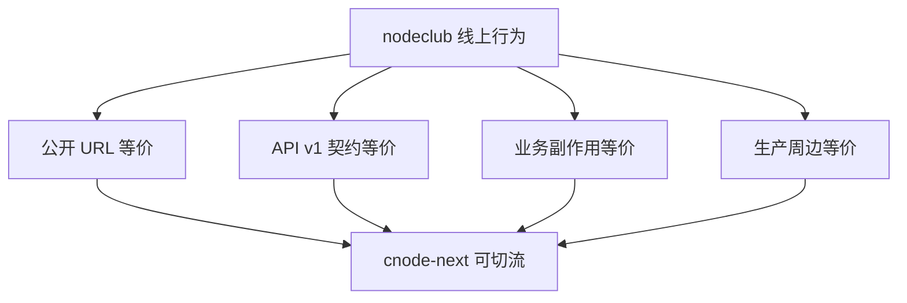
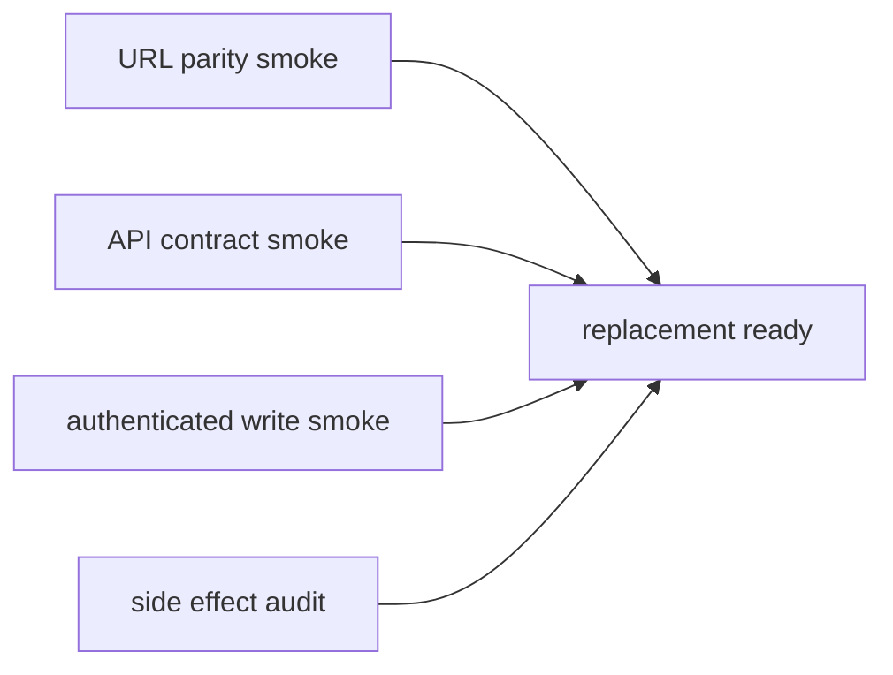

## 背景

“完全替代 nodeclub 线上行为”需要同时满足三个层面：

核心判断不是“是否已有类似页面”，而是旧用户、第三方客户端、搜索引擎、管理员和迁移数据在新系统中是否得到同等结果。

## 设计决策

### 1. 以 nodeclub 线上路由为验收清单

`nodeclub/web_router.js` 和 `nodeclub/api_router_v1.js` 是准入清单。每个 legacy route 必须属于以下之一：

- 已实现等价行为。
- 已实现兼容 redirect。
- 明确写入 Non-goals，并说明线上兼容策略。

拒绝方案：只按新 UI 信息架构验收。原因是旧链接和第三方客户端仍以 nodeclub 行为为准。

### 2. API response shape 不追求新增字段，但 legacy 字段必须稳定

新 API 可以返回额外字段，但 legacy 字段名、嵌套结构、成功/失败格式和状态副作用必须保持兼容。

拒绝方案：为了新前端重塑 API。原因是 `/api/v1/*` 是公开契约。

### 3. 生产副作用必须真实执行

积分、计数器、消息、邮件、限流、收藏数、浏览数、已读状态不能只返回成功响应，必须在 PostgreSQL/Redis/SMTP 上完成真实状态变化。

拒绝方案：只做页面 smoke。原因是线上社区的可信状态来自这些副作用。

### 4. 分页必须按总数计算

首页、用户话题、用户参与、收藏列表必须能从数据库 count 或等价机制得到总页数，不能用当前页长度代替 total。

拒绝方案：无限滚动或只展示 recent。原因是 legacy 页面有可索引、可跳转的分页语义。

### 5. GitHub OAuth 使用显式 pending profile 状态

GitHub callback 找不到 `github_id` 时，不直接创建用户，也不直接失败。系统应保存短期 pending profile 状态并跳转选择页，由用户选择“注册新账号”或“关联老账号”。

拒绝方案：email 已存在时返回 409。原因是 legacy 支持绑定老账号，且规格明确要求补回 egg-cnode 丢失的流程。

## 验收矩阵

每个矩阵项必须能在本地连接 rehearsal PostgreSQL/Redis，或在远程 rehearsal 环境中以只读或可恢复写入方式验证。
