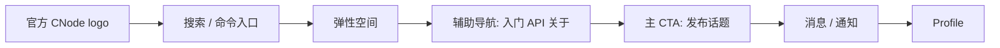
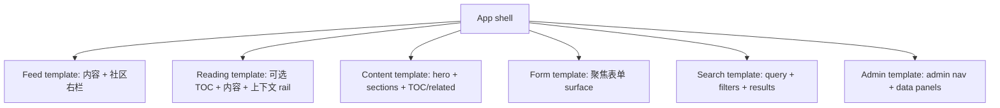
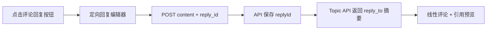

## Context

`apps/web` 已通过 `modernize-web-ui` 获得现代组件基础，但当前产品仍缺少统一视觉系统。上一个 change 明确没有覆盖视觉重设计、间距、圆角、动效和设计语言。因此现在虽然有 shadcn/ui，但仍混合了默认样式和临时布局：主站 Header 与后台 Header 视觉不同，topic 详情页在宽 shell 内又居中套 `max-w-3xl`，静态页面只是占位，footer 只有一行字，首页右栏信息密度低于老版 `nodeclub/views/sidebar.html`。

官方 CNode logo (`cnodejs_light.svg`) 带来明确品牌约束：大量路径为白色，品牌绿是 `#80bd01`。系统必须在保证对比度的前提下融入它，而不是把所有 surface 都做成厚重绿色条。

## Goals / Non-Goals

**Goals:**

- 建立 CNode 专属品牌系统，而不是泛用 shadcn 默认风格。
- 让主站和后台像同一个产品的不同模式。
- 定义 route 级页面模板，让宽度、rail、footer、内容 surface 可预测。
- 重设计首页右栏、topic 详情、评论回复、内容页、footer、command/search 与 message/notify。
- 将 agent 自验收作为完成门槛。

**Non-Goals:**

- 不做无限嵌套评论。
- 不重写论坛领域模型，除右栏聚合、头像归一化、评论引用摘要所需的小范围 API shape 外。
- 不替换 React Router、Tailwind v4、shadcn/ui、zustand 或 react-markdown。
- 不像素级复刻老版 CNode；老代码仅作为信息架构参考。

## Decisions

### D1: 以官方 CNode 绿色作为品牌锚点

主品牌色 SHALL 派生自官方 logo 绿 `#80bd01`，并定义更深的 hover/pressed 色值和柔和绿色 surface。Node.js green 只作为生态气质参考，不作为精确 token 来源。

被否决方案：

- 保留 shadcn 默认 primary：过于通用，无法形成 CNode 品牌识别。
- 使用 Node.js `#339933` 作为主色：气质接近，但忽略用户提供的官方 CNode 资产。
- 整条 Header 使用重绿色背景：过重，容易退回老站视觉重量。

### D2: 定义可复用产品 shell cluster 模型

公共 Header 使用左右 cluster：

后台模式复用同一模型，增加 Admin badge，并使用后台导航。Profile 始终是最右侧项。桌面端不重复展示“首页”，因为 logo 已承担回首页职责。

被否决方案：

- logo + 所有导航都放左侧：会让搜索降级，不适合内容社区。
- 搜索作为右侧普通文字链接：过弱，无法承担核心发现入口。
- 后台另起 shell：正是当前不一致的来源。

### D3: 用命名页面模板替代临时宽度

route layout SHALL 使用命名模板：

topic 详情使用 reading template。大桌面可扩展到比 feed shell 更宽，以支持左侧 TOC、中间阅读列、右侧上下文 rail。这种差异必须来自命名 reading shell，而不是随意使用 `max-w-*`。

被否决方案：

- 所有页面强制单一 max-width：topic 长文 + TOC 场景会受限。
- 每个 route 自行决定宽度：造成当前错位问题。

### D4: 首页右栏升级为社区仪表盘

首页右栏 SHALL 继承并现代化老版 `nodeclub/views/sidebar.html` 的职责：用户/登录引导、发布 CTA、无人回复话题、积分榜、合作/社区链接和赞助位。同时新增“最新回复”，因为讨论活跃度比单纯新话题更能体现社区生命力。

被否决方案：

- 保留三个薄 card：信息密度不足。
- 在右栏重复最新话题：和主 feed 冲突。
- 移动端隐藏右栏内容：丢失关键社区上下文。

### D5: 评论使用线性流 + 单层引用预览

评论回复 SHALL 保持时间线线性。评论可通过 `reply_id` 指向另一条评论，但 UI 展示 quote preview，而不是嵌套树。

被否决方案：

- 无限嵌套评论：复杂，且不适合 CNode 论坛阅读方式。
- 展示无行为的“回复”按钮：破坏用户信任。
- 只把引用写进 content：丢失结构化回复关系。

### D6: 在 API/data 边界归一化头像 URL

Web UI SHALL 接收可用的 `avatar_url` 绝对 URL，或空值并由统一 fallback 处理。组件不应自行猜测 `avatar`、`avatar_url`、相对路径和 legacy static host。

被否决方案：

- 每个组件各自 fallback：导致头像渲染不一致。
- 要求 seed 数据完整：无法覆盖生产迁移和老用户数据。

### D7: topic 详情作为阅读产品设计

topic 详情 SHALL 包含面包屑、标题、状态/tags、作者/meta/stats、正文 surface、评论流、定向回复编辑器、符合条件时显示的左侧 TOC、右侧上下文 cards。TOC 只来自 topic Markdown headings，永不包含评论区标题。

被否决方案：

- topic 仅作为居中文章：破坏论坛上下文和 shell 对齐。
- TOC 只放右栏：会和作者/相关/最新回复上下文冲突。
- 永远显示空 TOC：短问答页会产生噪音。

### D8: 自验收作为完成门槛

实现 SHALL 包含路由矩阵走查、桌面/移动端检查、console 检查、控件行为检查，以及标记完成前的修复。

被否决方案：

- 依赖用户视觉验收：已经导致多轮单点纠错。
- 只跑 typecheck/build：无法发现死控件、布局漂移和视觉不一致。

## Risks / Trade-offs

- [Risk] 范围横跨 UI、API shape 和内容页 → Mitigation: 按模板/capability 实施，每个 route family 完成后先自查。
- [Risk] 三栏 reading layout 可能拥挤 → Mitigation: 只在大桌面启用左侧 TOC rail，低于阈值折叠为双栏/单栏。
- [Risk] 官方 light logo 不适合白底 → Mitigation: 使用受控品牌 surface，或准备文档化的深色/compact 变体，不能随意改品牌语义。
- [Risk] 首页右栏聚合增加 API 成本 → Mitigation: 使用专用聚合 endpoint 或可 KV/Redis 缓存的小 payload endpoint。
- [Risk] command palette 范围过大 → Mitigation: 首版只覆盖搜索入口、快速导航、发布、消息、后台入口和最近/热门结果。
- [Risk] agent 可能因时间压力跳过 audit → Mitigation: 将自验收任务写入 `tasks.md` 并作为完成门槛。

## Migration Plan

1. 建立 token、logo primitive、shell 组件和 route templates。
2. 先重构 Header/Footer 和共享 surface，避免逐页漂移。
3. 实现 feed/home sidebar 和 topic detail reading template，包括评论引用行为。
4. 使用同一模板重做内容页和后台 shell/pages。
5. 增加 command/search 与 notification/message 表现层。
6. 执行完整 agent-owned UI audit，修复所有关键问题，再标记完成。

Rollback strategy: 本 change 以 UI 为主，可按 route/component family 回退。为右栏/回复摘要新增的 API 应保持 additive，即使前端暂不使用也安全。

## Open Questions

- 合作品牌/广告位首版应使用 `apps/web` 静态 typed config、API-backed site settings，还是数据库表？
- 官方 logo 应直接引用 CNode static CDN、复制进 repo，还是通过 app assets 管理？
- 匿名用户点击“发布话题”应直接跳转 signin + redirect，还是先打开登录提示？
