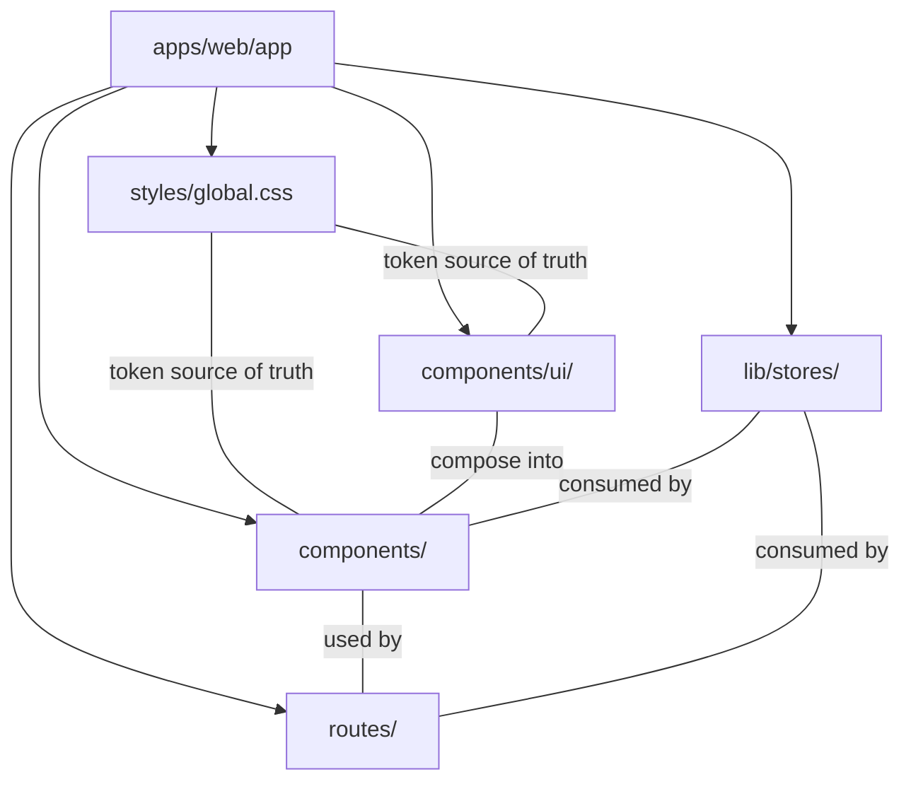
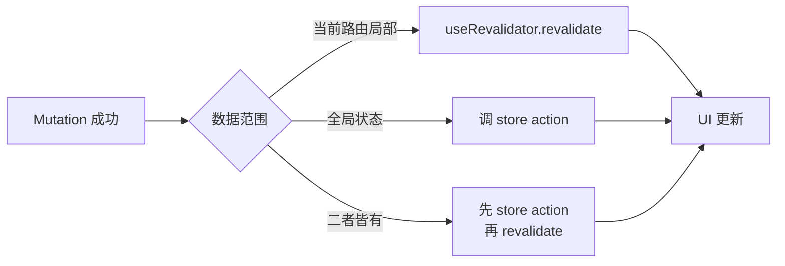

## Context

`apps/web` 已用 React Router v8 (SSR) + Tailwind v4 + Cloudflare Workers 实现 33 个路由、11 个域组件,功能基本对齐 nodeclub。但 UI 层停在"能跑":无设计 token(只有 2 个 CSS 变量)、无原子组件(全是裸 Tailwind 字符串)、Dropdown 缺 outside-click、Modal 无 focus 管理、Mutation 后 `window.location.reload()`、核心 `MarkdownView` 是 TODO 桩、Emoji 当图标。`AGENTS.md` 写了 `shadcn/ui` 但未落地。

本次一次性建立现代化 UI 基础设施:语义 token + shadcn 原子组件 + zustand 状态 + react-hook-form 表单 + react-markdown 渲染。

## Goals / Non-Goals

**Goals:**

- 建立完整语义 token 系统(light/dark),消除字面量色值与 `dark:` 双份写法
- 引入 shadcn/ui 原子组件层,替换所有手写交互组件,顺手修复 Dropdown outside-click、Modal focus 管理两个 bug
- 用 zustand 管理全局状态(auth/theme/ui),消除 Layout 每次导航拉 `/auth/me`,用 `useRevalidator` 替换所有 `window.location.reload()`
- 用 react-hook-form + zod 复用 `packages/shared` schemas,统一登录/注册/发帖/回复/设置/管理后台表单
- 落地 react-markdown + rehype-sanitize,补齐 MarkdownView 这个核心功能桩
- 用 lucide-react 替换全部 Emoji 图标
- 所有改动控制在 CF Workers bundle 预算内(<150KB gz 增量)

**Non-Goals:**

- 不重写后端 API 或数据模型
- 不引入 TanStack Query(loader 仍负责 SSR 首屏,客户端用 zustand + revalidate)
- 不做设计语言层面的视觉重设计(间距/圆角/动效后续再说)
- 不做命令面板(cmdk)/搜索体验升级(可作后续 change)
- 不做 DataTable/TanStack Table 复杂数据组件(管理后台用 shadcn Table 足够)
- 不做主题预设切换器(只保留 light/dark/system 三态)
- 不改 root.tsx 防 FOUC 的 inline script 机制

## Decisions

### D1: UI 库选 shadcn/ui,不选 Mantine/Ant Design/HeroUI

**决策**:用 shadcn/ui,组件源码复制进 `apps/web/app/components/ui/`。

**理由**:

- Tailwind-native:与现有 Tailwind v4 完全同构,不会出现两套样式系统打架
- 复制即用:不是 npm 依赖,源码进仓库可控可改,Workers bundle 零额外 runtime 成本
- 底层 Radix UI:DropdownMenu/Dialog/Sheet 自动处理 outside-click/escape/focus trap,直接修复现状两个 bug
- CSS vars 主题:与本次 token 系统天然契合,`bg-background`/`text-foreground` 等语义 class 接管暗色切换
- React 19 / React Router v8 官方支持

**被否决方案**:

- Mantine:有自己的样式系统(emotion/CSS-in-JS),与 Tailwind 并存会产生两套样式语言;runtime 包体积大;Provider 包裹破坏 SSR
- Ant Design:完全对立的样式系统(less + CSS-in-JS),体积大,与 Workers + Tailwind 栈冲突
- HeroUI/NextUI:基于 Tailwind 但仍是 npm runtime 依赖,不如 shadcn 复制源码可控;主题系统不如 shadcn 贴近 CSS vars

### D2: 状态管理选 zustand,不选 TanStack Query / jotai / Context

**决策**:zustand 作全局状态,React Router v8 原生 `useRevalidator()` 处理 mutation 后刷新。

**理由**:

- 状态扁平(user/theme/ui 开关),zustand 的 store 模型最适合
- 无 Provider 包裹,root.tsx 不用改,迁移成本零
- `persist` middleware 现成,theme 直接接 localStorage
- mutation 后 `revalidate()` 比 `reload()` 轻 —— 不丢滚动位置、不闪屏、不重拉全局
- loader 仍负责 SSR 首屏数据,store 只管跨路由共享状态,职责清晰

**被否决方案**:

- TanStack Query:用户明确不倾向;且 Query 的 cache/dedup 能力对这种规模应用过重,store + revalidate 已够用
- jotai:原子模型更适合细粒度派生状态,本场景状态扁平用不上;persist 不如 zustand 现成
- React Context:user/auth 在多层组件树里共享会触发不必要的 re-render,zustand 的 selector 订阅更精细

### D3: 主题系统用 Tailwind v4 CSS-first `@theme`,不用 tailwind.config.ts

**决策**:在 `styles/global.css` 里用 `@theme inline` 声明 token,`--background`/`--foreground` 等映射到 `:root` 与 `.dark` 下的具体色值。组件里用 `bg-background` 等 Tailwind class。

**理由**:

- Tailwind v4 默认就是 CSS-first 配置,`tailwind.config.ts` 在 v4 是兼容层
- shadcn 官方有 v4 适配路径,CLI 会检测
- 一份 CSS 文件就是单一来源,不用在 JS 与 CSS 之间跳

**被否决方案**:

- 保留 tailwind.config.ts:v4 下是过渡方案,与 shadcn v4 模板不一致
- 纯内联 style:不可复用

### D4: 表单用 react-hook-form + @hookform/resolvers + zod,复用 packages/shared schemas

**决策**:所有表单(登录/注册/发帖/回复编辑/设置/管理后台)走 react-hook-form + zod resolver,schema 从 `packages/shared` 导入。

**理由**:

- `packages/shared` 已有 Zod schemas(登录、注册、发帖等),前后端共享,前端表单直接用同一份 = 前后端校验一致
- shadcn Form 组件(Form/FormItem/FormField/FormLabel/FormMessage)就是为 react-hook-form 设计的
- 比 `useState` + 手写校验更可维护,错误提示位置统一

**被否决方案**:

- 纯 useState + 手写校验:现状就是这么做的,每个表单各写一套,重复且易漏
- Formik:react-hook-form 性能更好(非受控),与 shadcn 集成更现成

### D5: Markdown 用 react-markdown + remark-gfm + rehype-sanitize + rehype-highlight

**决策**:重写 `MarkdownView`,pipeline 为 `react-markdown → remark-gfm → rehype-sanitize → rehype-highlight`。`MarkdownEditor` 预览分支复用同一 pipeline。

**理由**:

- react-markdown 是 React 生态最成熟的 Markdown 渲染器
- remark-gfm 支持 GFM(表格、删除线、任务列表、自动链接)
- **rehype-sanitize 是硬性要求**:论坛允许任意用户发帖,不装就会 XSS(`<script>`、`onerror=` 都会跑)
- rehype-highlight 做代码高亮,复用 highlight.js 主题

**被否决方案**:

- marked + DOM injection:需要手动做 XSS 防护,容易漏
- markdown-it:同样需要手动 sanitize,且 React 集成不如 react-markdown 原生
- 不渲染(现状):核心功能缺失

### D6: 图标统一用 lucide-react,替换所有 Emoji

**决策**:所有 Emoji 图标换成 lucide-react 图标(Search/Pencil/Mail/User/Bell/Moon/Sun/Monitor/Star/Flag/Eye/MessageSquare 等)。

**理由**:

- shadcn/ui 官方图标库
- tree-shaken,只用导入的
- 跨平台渲染一致、可调色、有 a11y 属性
- SVG,无字体依赖

**被否决方案**:

- 保留 Emoji:跨平台渲染不一致、无 a11y、没法调色
- Heroicons/Iconify:可用但与 shadcn 生态不贴近

### D7: 目录结构

- `styles/global.css`:token 单一来源
- `components/ui/`:shadcn 原子组件(复制进来)
- `components/`:域组件(Layout/Sidebar/TopicListItem 等)
- `routes/`:33 个路由,只做 loader/action + 装配
- `lib/stores/`:zustand stores(auth/theme/ui)

### D8: Mutation 后刷新策略

- **局部**:回复后刷新话题页 → `revalidate()`
- **全局**:登录写 user store → `useAuthStore.setUser()`
- **二者**:发帖(全局计数 + 当前列表) → 先 store action 再 revalidate

## Risks / Trade-offs

- **[Risk] Tailwind v4 + shadcn CLI 兼容性**:shadcn 初始化默认假设 v3 + `tailwind.config.js`,v4 要走 CSS-first 路径 → 按官方 v4 文档手动初始化 `components.json` 与 `global.css` 的 `@theme` 块,不全依赖 CLI
- **[Risk] CF Workers bundle 体积**:新增依赖累计 < 150KB gz,在 10MB 预算内 → 但 react-markdown pipeline 是最大单项(~30KB gz),如发现超预算可改用同步懒加载(只在话题详情页引入)
- **[Risk] SSR 与 zustand persist 冲突**:zustand persist 在服务端读 localStorage 会报错 → theme store 用 `skipHydration: true`,客户端 mount 后 `rehydrate()`;或更简单 —— theme 不进 store,保留 root.tsx 的 inline script 防 FOUC,store 只管切换交互
- **[Risk] Markdown XSS**:rehype-sanitize 配置过松会漏,过紧会误杀合法 HTML → 用 rehype-sanitize 默认 schema,按需放行 `class`(给代码高亮用)
- **[Trade-off] 一次性大改动范围大**:横跨 token/组件/状态/表单/Markdown/域组件 6 个域,PR 巨大 → 按 capability 分组提交(每个 spec 对应一组 task),但实施顺序按依赖关系:theme → ui-components → state → forms → markdown → 域组件重写
- **[Trade-off] 不引入 TanStack Query**:失去自动 cache/dedup,客户端拉数据场景(search 实时搜索、message 标记已读)要手写 → 这些场景少且明确,zustand + 本地 useState 已够;后续如复杂化再引入不迟
- **[Trade-off] 表单 schema 复用 packages/shared**:如 shared schemas 与表单字段不完全对应(如确认密码字段)→ 在表单层用 `.extend()` 扩展,不污染 shared 契约
