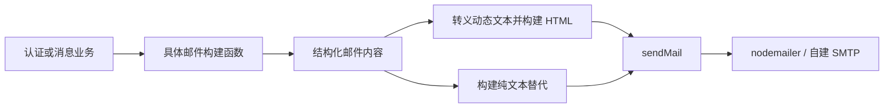

## Context

`apps/api/src/lib/mail.ts` 当前同时负责 SMTP 投递和四类邮件内容拼装。账号激活与密码重置邮件只有最小 HTML，回复与 @ 提及邮件直接把 `topicTitle`、`replyContent` 和 `topicUrl` 插入 HTML，缺少纯文本替代，也没有统一的品牌、转义与邮件客户端兼容策略。

Web 已在 `apps/web/app/components/Layout.tsx`、`apps/web/app/components/CNodeLogo.tsx` 和 `apps/web/app/lib/brand.ts` 中确立官方 CNode logo、品牌绿 `#80bd01`、深色品牌 surface、卡片和主 CTA。邮件不能直接运行 React、TailwindCSS 或 Web 深色模式，因此需要在 API 内生成独立、自包含的邮件文档，同时保持 `nodeclub/common/mail.js` 所代表的线上触发语义。

邮件的数据流如下：

## Goals / Non-Goals

**Goals:**

- 四类现有邮件共享与 CNode Next Web 一致的品牌布局和内容层级。
- 每封邮件同时提供 HTML 和语义等价的纯文本版本。
- 动态文本、属性值和 URL 在进入 HTML 前经过明确的安全处理。
- 模板输出可脱离 SMTP 进行确定性单元测试。
- 保持现有公开函数签名、触发条件、用户偏好、去重和 SMTP 重试行为。

**Non-Goals:**

- 不提供营销邮件、批量发送、订阅管理、打开率或点击率追踪。
- 不复用 React SSR、Tailwind 编译结果或 shadcn/ui 组件。
- 不承诺不同邮件客户端像素级一致，也不实现依赖客户端支持的 Web 深色模式。
- 不改变 legacy `nodeclub` 现网代码；cnode-next 上线前仍由原系统按原方式发信。

## Decisions

### 1. 使用 React Email 的类型化 TSX 模板

在 `apps/api/src/lib/mail-template.tsx` 使用 React Email 组件建立共享布局，并通过 `@react-email/render` 输出 HTML；结构化构建函数返回 `{ subject, html, text }`，具体 `send*Mail` 函数只负责准备业务字段并调用 `sendMail`。

选择原因：共享布局已经包含较多结构和内联样式，TSX 组件比长 HTML 字符串更易审查、组合和维护；React 默认转义文本节点，React Email 还提供经过邮件客户端验证的语义组件。拒绝手写 HTML 字符串是因为标签结构无法获得类型检查且规模增长后难以维护；拒绝 Handlebars/EJS 是因为模板变量仍需额外建立转义约束，且项目没有跨语言模板需求。

### 2. 使用保守的表格布局和内联样式

HTML 文档采用最大宽度约 600px 的居中表格：浅灰页面背景、深色品牌 header、官方 light logo、白色正文卡片、品牌绿 CTA 和简洁 footer。关键视觉属性全部内联，并为窄屏使用流式宽度；不依赖 JavaScript、外部 CSS、Web Font、CSS variables 或复杂选择器。

选择原因：表格和内联样式对常见桌面、移动端和 Web 邮件客户端兼容性最好。拒绝直接复制 Web DOM/Tailwind 类，因为邮件客户端不会加载应用 CSS；拒绝纯图片邮件，因为可访问性、图片拦截和内容检索体验较差。

### 3. 远程 logo 仅作品牌增强，文字身份始终存在

header 使用 `https://static2.cnodejs.org/public/images/cnodejs_light.svg`，同时提供有意义的 `alt`、固定尺寸和邻近的文字身份。即使客户端拦截图片，邮件仍可识别为 CNode 通知。

选择原因：该资源与 Web 当前品牌来源一致，且无需增加附件投递。拒绝 CID 内嵌是因为会增加附件构造和客户端差异；拒绝 base64 data URI 是因为部分邮件客户端不支持且会增大邮件体积。

### 4. 动态内容默认视为不可信纯文本

`topicTitle` 和 `replyContent` 在写入 HTML 文本节点前统一转义 `& < > " '`。回复内容不作为可信 Markdown/HTML 渲染，而是以保留换行的文本摘要呈现；过长摘要使用确定性的字符上限截断。URL 通过 `URL` 解析，仅允许 `http:` 和 `https:`，再进行属性转义；内部激活和重置 URL 由受控 base URL 与编码后的 key 构造。

选择原因：当前直接插值允许用户内容改变邮件结构，甚至形成恶意链接或标记。拒绝在邮件中渲染原始 Markdown/HTML，因为它扩大 XSS、CSS 注入和客户端兼容面；拒绝依赖字符串替换清理危险标签，因为黑名单无法覆盖全部 HTML 解析边界。

### 5. CTA 后提供可复制的原始链接

账号激活、密码重置和话题通知均提供主 CTA；按钮下方显示可复制链接，纯文本版本也包含完整 URL。HTML 中的可见链接可以安全换行，避免长 URL 撑破移动布局。

选择原因：部分客户端会禁用样式或按钮点击，原始链接提供可靠回退。拒绝只保留按钮，因为其目的地址不易检查或复制。

### 6. 测试模板输出而不是连接 SMTP

导出异步模板构建函数，用单元测试覆盖四类邮件的主题、React Email 渲染结果、CTA URL、品牌标识、纯文本版本、React 文本转义和危险 URL 拒绝。`sendMail` 的 nodemailer 投递与五次重试逻辑保持原样，不在模板测试中启动 SMTP。

选择原因：纯输出测试速度快且稳定，能直接验证本次变化。拒绝仅使用快照测试，因为大段 HTML 快照容易被无意更新；使用关键语义断言并辅以结构检查更能定位回归。

## Risks / Trade-offs

- [SVG logo 在部分邮件客户端不显示] → 保留 `alt`、文字品牌和完整内容，不让关键操作依赖图片。
- [内联 HTML 字符串可读性低] → 将布局、按钮、内容块拆成少量职责明确的纯函数，但不引入通用模板框架。
- [不同客户端 CSS 支持不一致] → 只使用保守布局和基础样式，核心信息顺序在无样式时仍成立。
- [摘要截断可能切断语义] → 仅在邮件预览中限制长度，并始终提供“查看话题”链接访问完整内容。
- [URL 校验使历史异常链接无法发送] → 业务调用方应继续传入基于 `APP_WEB_BASE_URL` 的绝对 HTTP(S) URL；测试覆盖合法生产与本地 URL。
- [共享品牌值与 Web 分散维护] → 在模板旁记录其来源并用测试锁定 logo URL 和主色；不为两个不同运行时强建共享 UI 包。

## Migration Plan

1. 增加纯模板构建与安全辅助函数，并完成模板单元测试。
2. 将四个现有 `send*Mail` 函数切换到新模板输出，保持函数签名和 `sendMail` 不变。
3. 运行 API 定向测试、类型检查和 lint；使用测试数据人工检查生成 HTML 的桌面及窄屏结构。
4. 随 API 常规部署生效，无数据库迁移和配置迁移。

回滚时恢复四个 `send*Mail` 函数原有正文构造即可；SMTP 配置、调用方和持久化数据均未变化。

## Open Questions

无。第一版以当前官方静态 logo 和固定 CNode 品牌 token 为准；若未来需要多品牌或可运营配置，应另行提案。
