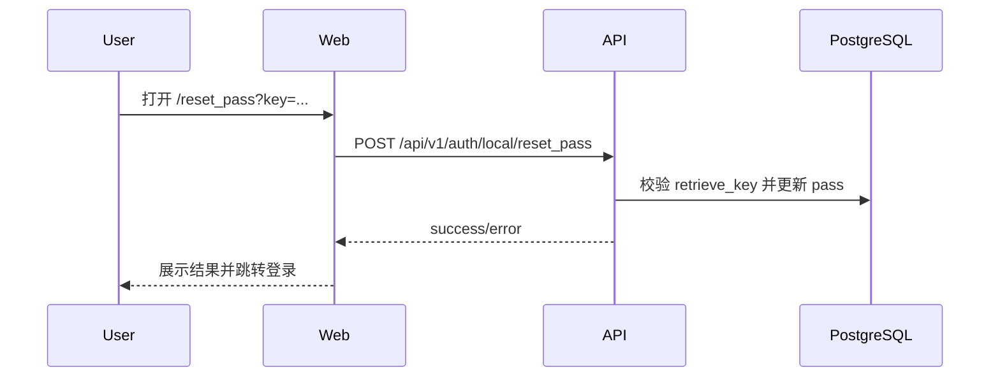
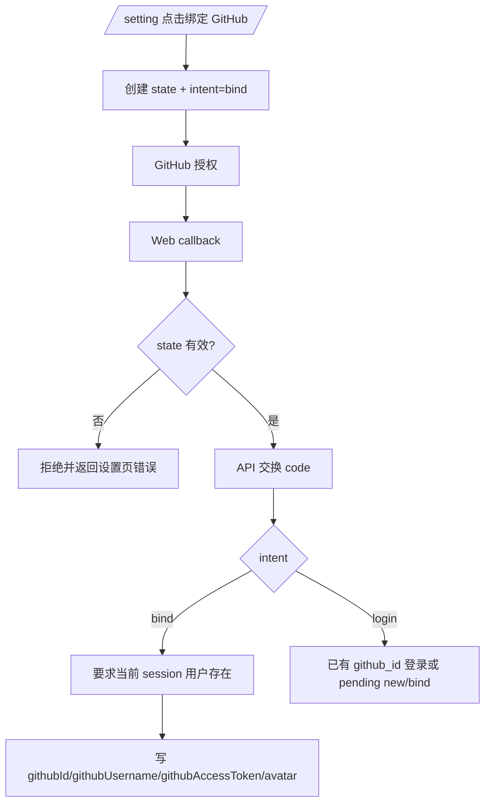
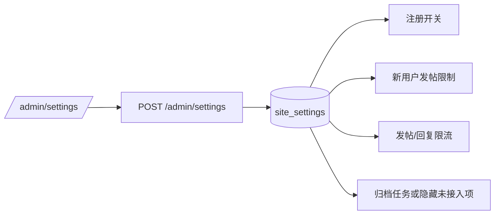
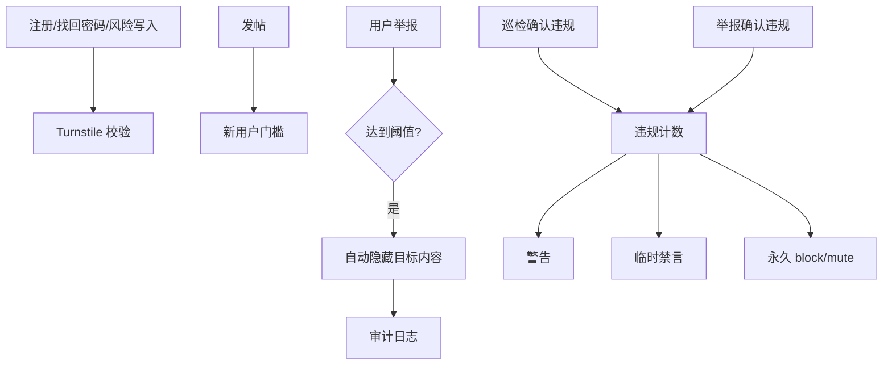

## Context

这次变更来自迁移后的运营自查：账号设置、GitHub 登录/绑定、密码邮件链接、管理员用户操作和后台表格布局都已经有代码雏形，但存在误导用户或影响线上运营的边界问题。legacy `nodeclub/controllers/sign.js`、`nodeclub/controllers/github.js`、`nodeclub/controllers/user.js` 与 `nodeclub/web_router.js` 中相关能力直接服务线上用户，cnode-next 不能只保留“按钮和接口存在”的表象。

当前实现要点：

- `/setting` 使用 `requireUser` 和 `/api/v1/auth/me` 数据，但未展示 email 和 GitHub 绑定状态。
- GitHub OAuth 仅覆盖未登录用户登录/注册/关联老账号，缺少已登录用户从设置页绑定当前账号。
- OAuth 发起时生成 `state`，但没有持久化或在 callback 校验。
- `sendActiveMail()` 和 `sendResetPassMail()` 使用 `APP_API_BASE_URL` 生成用户点击链接，而 `/active_account`、`/reset_pass` 是 Web 路由。
- 后台用户管理 API 对 block/mute/delete_all 没有阻止管理员操作自己。
- Admin shell 使用前台 `max-w-6xl` 宽度，复杂表格列没有宽度和长文本策略。
- `/admin/settings` 能写入 `site_settings`，但注册、发帖、限流、归档等业务路径不读取这些值。
- 举报 API 能创建记录，但前台没有举报入口，后台列表返回原始 report 行导致 `topic_title/topic_id/reporters` 等 UI 字段为空。
- IP 封禁后端有精确匹配和 CRUD，前端添加按钮 disabled，移除按钮未接线，CIDR 不匹配。
- `anti-spam` spec 已声明 Turnstile、新用户限制、举报自动隐藏和渐进封禁，但代码没有对应闭环。
- 登录页没有找回密码入口，虽然 `/search_pass` 和 `/reset_pass` 已存在。
- 邮件发送在无 `SMTP_HOST` 时静默跳过，生产会让找回密码/激活显示“已发送”但用户收不到。
- 敏感词后台展示 `hit_count`，但实时过滤和巡检不会更新该字段。
- 搜索页文案声明搜索标题、内容和社区讨论，API local search 只查标题且返回 raw topic 行。
- 管理概览 `pendingReports` 硬编码为 0，无法反映真实举报队列。

## Goals / Non-Goals

**Goals:**

- 让用户在设置页看到邮箱、GitHub 绑定状态和可理解的身份信息。
- 支持已登录用户从设置页绑定 GitHub 到当前账号。
- 让 OAuth state、邮件链接域名和 pending profile cookie 形成可验证闭环。
- 防止管理员对自己执行会破坏自身账号状态或内容的高风险动作。
- 后台表格在长标题、长邮箱、长 target、长 preview、长错误栈、极端时间文案下仍可读、可滚动、可操作。
- 系统设置、举报、IP 封禁和反垃圾需求不再停留在“可保存/有表/有按钮”的表象。

**Non-Goals:**

- 不提供改邮箱功能。
- 不提供 GitHub 解绑/换绑功能。
- 不改变本地账号密码 hash 和 legacy 密码兼容策略。

## Decisions

### D1: 邮件中的用户入口统一走 Web 域名

密码找回链接使用 `APP_WEB_BASE_URL/reset_pass?key=...`，账号激活链接使用 `APP_WEB_BASE_URL/active_account?key=...`。Web 页面再调用 API 完成状态变更。

被拒绝方案：继续使用 API base URL 直接处理用户点击。这个方案无法提供一致页面反馈，也会让 `/reset_pass` 这类 Web route 链接失效。

### D2: GitHub OAuth 使用 intent 区分登录和绑定

Web 发起 GitHub OAuth 时生成并保存 state，同时携带 intent：`login` 或 `bind`。callback 必须校验 state。`bind` intent 只能在当前用户已登录时完成，并把 GitHub profile 绑定到当前 user id；`login` intent 保持现有两段式注册/关联老账号流程。

被拒绝方案：复用 `/auth/github/new` 的“输入用户名密码关联老账号”来做设置页绑定。这个方案让已登录用户还要再次输入密码，且无法明确表达“绑定当前 session 用户”。

### D3: 后台自操作保护放在 API 层

block、mute、delete_all 等高风险用户操作必须在后端判断 `targetUser.id === currentUser.id` 并拒绝。前端同时隐藏或禁用对应按钮，但后端是强制边界。

被拒绝方案：只在前端隐藏按钮。管理员可直接调用 API，不能依赖 UI 防护。

### D4: Admin shell 放宽，表格按列类型定义策略

后台 shell 从前台宽度提升到 `max-w-screen-2xl` 或等价宽度；表单/设置类内容用内部 `max-w-*` 控制，不无限拉宽。表格页按列类型处理：时间列 `whitespace-nowrap`，操作列固定宽度或换行，ID/IP/email `break-all`，标题 `truncate`，preview/detail/error `break-words` 或折叠展示。

被拒绝方案：全局给 `TableCell` 加 `break-all`。这会破坏时间、按钮、badge 和短标签的可读性；列级策略更可控。

### D5: 系统设置按业务读取点接入，而不是只保存 key-value

`site_settings` 仍作为轻量配置存储，但每个设置项必须有明确读取点：`allow_signup` 在 Web signup loader 和 API signup route 生效；`new_user_min_hours/new_user_min_replies` 在创建话题前生效；`rate_topic/rate_reply` 在限流中间件计算 limit 前生效；`archive_days` 仅在存在归档 worker/API 时展示和执行，否则不得在 UI 中表现为已生效。

被拒绝方案：保留设置页保存成功但业务路径不读。这个方案会让管理员误以为运营策略已上线。

### D6: 举报后台 API 返回页面需要的聚合 DTO

举报列表不再直接返回 `reports` 表原始行，而返回包含目标类型、目标 ID、所属话题 ID、标题摘要、举报人数量、最近描述和状态的 DTO。前台在话题和回复位置提供举报入口，创建 report 后进入后台队列。

被拒绝方案：前端继续猜 `topic_title/topic_id/reporters`。schema 中没有这些字段，继续猜会导致后台列表空标题和错误链接。

### D7: IP 封禁支持单 IP 和 CIDR，UI 接入 CRUD

IP 封禁规则仍存储在 `ip_bans.ip`，匹配时识别单 IP 与 CIDR。后台提供新增、移除和错误反馈。CIDR 解析失败必须拒绝写入，避免无效规则让管理员误判。

被拒绝方案：只做字符串精确匹配。spec 和 UI 文案已经承诺 CIDR，精确匹配会造成“规则存在但不生效”。

### D8: 反垃圾能力完整落地，不再拆分或降级

本变更直接实现新用户发帖限制、Turnstile、高风险行为验证、举报阈值自动隐藏、IP/CIDR 封禁和渐进封禁。管理员后台必须能看到这些自动动作的结果和审计日志，避免线上运营依赖“后续补齐”的空承诺。

被拒绝方案：将 Turnstile、自动隐藏或渐进封禁拆为后续 change。用户明确要求上线前补齐，继续拆分会让生产环境保留已知风险。

### D9: 邮件发送在生产必须失败可见，开发才允许跳过

`sendMail()` 在 `APP_ENV=production` 或非 development 环境缺少 `SMTP_HOST` 时必须返回错误并让调用方返回失败，避免密码找回和账号激活假成功。development 可以继续跳过或记录日志。

被拒绝方案：继续无 SMTP 时静默返回。这个方案让最关键的账号恢复链路不可用且不可观测。

### D10: 搜索能力以 DTO 契约为准，不以 DB 行直出

搜索 API 必须明确支持的范围：至少标题；如果页面文案声明内容搜索，则 API 必须查标题和内容。返回结果必须匹配 `TopicList` 可消费的 topic DTO，而不是数据库 raw row。

被拒绝方案：只改文案。搜索页已经是用户入口，长期只搜标题会降低可用性；如果因性能暂不搜内容，也必须在 spec 和文案中明确。

### D11: 管理指标必须真实或不展示

管理概览、敏感词命中次数、未接入设置项遵循同一原则：没有真实数据来源或业务读取点时，不展示成已生效指标；存在展示时必须接真实查询和更新路径。

被拒绝方案：保留硬编码或永远为 0 的指标。后台运营页面不应给管理员错误信号。

## Risks / Trade-offs

- [Risk] GitHub bind intent 增加 OAuth 状态分支，容易影响现有登录流程 → Mitigation: 保持默认 intent 为 `login`，新增验证覆盖登录、注册、关联、设置页绑定四条路径。
- [Risk] 邮件链接切到 Web 域名依赖生产 `APP_WEB_BASE_URL` 配置 → Mitigation: `.env.example`、部署文档和 verifier 明确区分 `APP_WEB_BASE_URL` 与 `APP_API_BASE_URL`。
- [Risk] 禁止管理员自操作会改变少数调试习惯 → Mitigation: 只限制 block/mute/delete_all 等破坏性动作，不限制查看自己、刷新 token 或修改个人资料。
- [Risk] 后台变宽后设置页内容过宽 → Mitigation: 设置页、概览页使用内部卡片宽度或 grid 控制；只有数据表格消耗更宽 shell。

## Migration Plan

1. 先实现 API 安全边界和邮件链接域名修正，低风险部署。
2. 再实现 GitHub bind intent/state 校验，保留现有 `/auth/github/new` 登录路径。
3. 最后调整后台宽度和列级 UI 策略。
4. 回滚时可先回滚 Web UI；API 自操作保护和邮件 Web 链接不需要数据迁移。

## Open Questions

- GitHub 绑定成功后是否保留 GitHub avatar 覆盖用户当前头像？现有登录流程会更新 avatar，本变更默认沿用现有行为。
- 如果当前账号已绑定 GitHub，再次绑定另一个 GitHub 是否允许覆盖？建议本变更拒绝覆盖，后续解绑/换绑单独提案。
