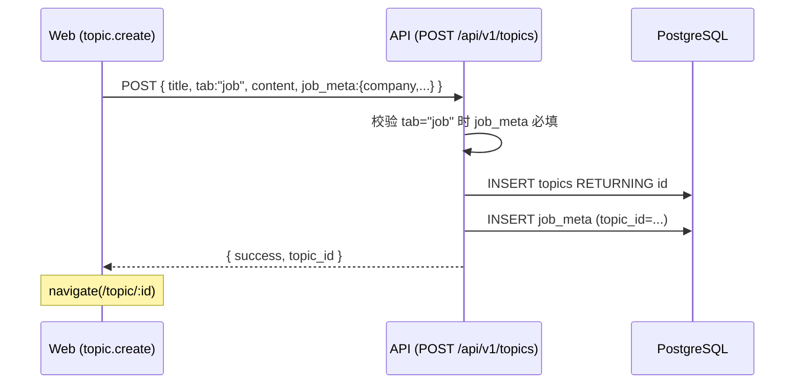
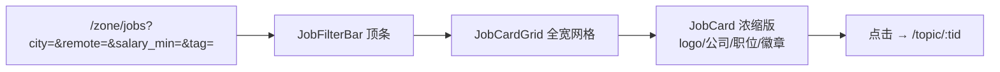
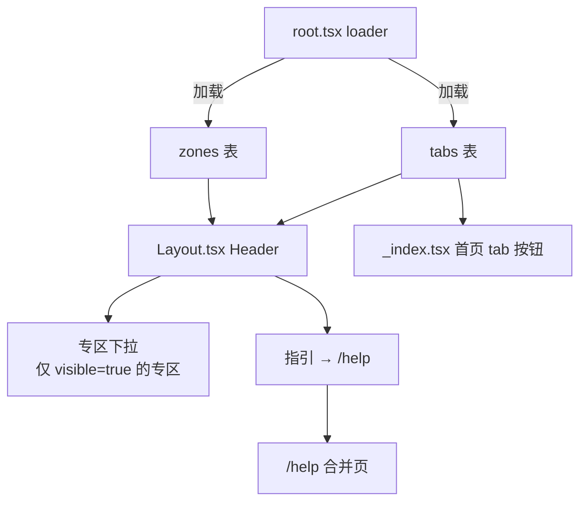
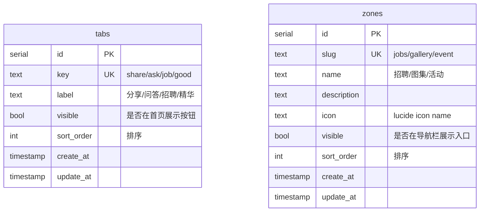
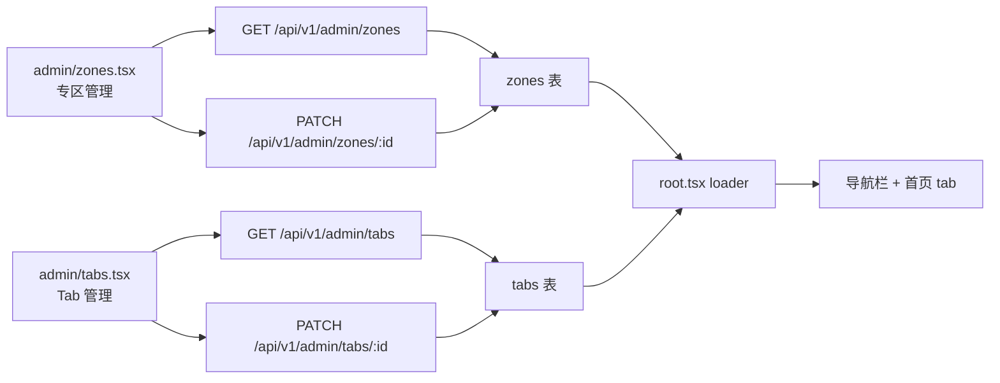

## Context

cnode-next 现有内容模型：`topics` 表（`packages/db/src/schema/topic.ts:4`）承载所有社区内容，`tab` 字段区分分类（share/ask/job），`content` 为 markdown 文本。首页通过 `apps/api/src/routes/topic.ts:82` 的 `excludeTabs: ["job"]` 已将招聘从默认流中剥离，但招聘帖仍混用 markdown blob 存储结构化信息（公司/薪资/地点混在正文里），无法被筛选、无法被卡片化展示。

现有互动能力（reply 评论区、收藏、积分、浏览计数、OSS 上传通路 `auth.ts:384`）均已稳定。本设计的目标是在不动这些基础设施的前提下，给招聘一个结构化的专区形态，并验证可复制的专区扩展模式。

## Goals / Non-Goals

**Goals:**
- 落地"topics 基础表 + 专用 meta 侧表"的专区扩展模式，验证其为后续专区（gallery/event）的模板
- 招聘信息结构化：公司/职位/地点/远程/薪资/经验/技术栈/联系方式/logo 上传
- 专区列表卡片化 + 顶条 facet 筛选，移动端适配
- 详情页 content 上方插入 meta 卡片（含 CTA）
- 发帖/编辑表单按 tab 条件渲染右侧 meta 字段
- 导航栏新增专区入口，并合并分散的指引页面
- 将首页 tab 按钮与导航栏专区入口从硬编码改为 DB 驱动，管理后台可控制可见性
- 管理后台新增专区管理、Tab 管理两个页面

**Non-Goals:**
- 不新建独立 `jobs` 内容类型表
- 不做通用 facet 框架（每专区定制筛选器）
- 不改变首页社区流形态（`TopicList` + `FeedGrid` 不动）
- 不回填历史 `tab=job` topics 的 meta
- 不做 job_meta 的审核扫描与全文搜索集成
- 不做其他专区（gallery/event 为后续工作）
- 不改变首页 API 排除逻辑（`topic.ts:82` 的 `excludeTabs: ["job"]` 是硬编码行为层，与 `tabs.visible` UI 层独立）

## Decisions

### D1: 架构选择 — topics 不动 + job_meta 侧表（B 方案）

**决策**：招聘不新建独立内容类型，复用 `topics` 表（`tab='job'`）+ 新增 `job_meta` 侧表（1:1 FK → `topics.id` ON DELETE CASCADE）。评论区复用现有 `reply` 表。

**被否决的方案**：
- **A. topics + JSON meta 列**：在 topics 加 `meta jsonb` 列。否决理由：字段类型安全弱（运行时 Zod 校验，无 Drizzle 强类型），跨专区查询会混入非该专区行。
- **C. 独立 `jobs` 表**：完全独立内容类型 + 独立全栈代码。否决理由：公共字段（author_id/visit_count/status/create_at...）重复，评论区需 polymorphic reply（改 reply 表加 `target_type` 列，影响现有 reply 系统）。虽支持"每专区定制筛选器"，但互动复用要求与"独立表"天然冲突 —— 用户明确选择保留评论并复用 reply，B 方案使评论区零改动。

**理由**：用户决策点（保留评论复用 topic + 单次 POST 提交）直接判了 B。job_meta 跟随 topic 生命周期，FK CASCADE 保证删除 topic 时 meta 自动清理。

### D2: 数据模型 — job_meta 表字段

```mermaid
erDiagram
    topics ||--|| job_meta : "1:1 tab=job"
    topics {
        serial id PK
        text title
        text content
        text tab
        int author_id FK
        int reply_count
        int visit_count
        bool top
        bool good
        text status
        timestamp create_at
        timestamp update_at
    }
    job_meta {
        int topic_id PK_FK
        text company
        text company_logo
        text position
        text location
        text remote
        int salary_min
        int salary_max
        text experience
        text_arr tech_tags
        text contact
        timestamp create_at
        timestamp update_at
    }
```

**字段说明**：
- `topic_id`：PK 同时是 FK → `topics.id`，`ON DELETE CASCADE`
- `remote`：枚举值 `on-site` / `hybrid` / `remote`，用 text 存储（避免 enum 迁移复杂度，Zod 校验）
- `salary_min/max`：整数（单位 K），便于范围筛选；`null` 表示面议
- `tech_tags`：`text[]` PostgreSQL 数组，支持 `&&` 交集筛选
- `contact`：明文存储（邮箱/链接/微信号），CTA 按内容形态分发（见 D6）
- `company_logo`：OSS URL，复用 `uploadPrefix()` 前缀

**被否决的方案**：
- `salary_range` 用 range 类型：PG range 查询语法重，前端传参不便，拆成 min/max 更直观
- `tech_tags` 关联表：标签数量有限（每帖 3-8 个），数组足够，避免 join 开销
- `contact` 脱敏存储：v1 不做，保持简单，后续如需可在展示层脱敏

### D3: API 契约 — 单次 POST 提交

**决策**：扩展 `createTopicBodySchema` / `updateTopicBodySchema`（`packages/shared/src/schemas/topic.ts:47,55`）接受可选 `job_meta` 对象，单次 POST/PUT 提交。



**校验规则**（在 Zod 层用 superRefine 实现）：
- `tab !== "job"` 时 `job_meta` 必须为 `undefined`（传了报错）
- `tab === "job"` 时 `job_meta` 必填且字段必填（company/position/location/contact 不可空，salary/experience 可选）

**被否决的方案**：
- 拆两次 API 调用（先建 topic 再补 meta）：否决理由：失败时需补偿事务回滚，复杂度高；用户明确选择单次提交
- job_meta 独立 CRUD 端点：否决理由：job_meta 无独立生命周期，随 topic 走，独立端点制造"meta 可独立修改"的错误心智模型

### D4: 专区展示 — 顶条 facet 筛选 + 全宽卡片网格

**决策**：专区路由 `/zone/jobs` 使用全宽布局（不复用 `FeedGrid` 的 20rem 侧栏骨架），顶部 `JobFilterBar` + 下方 `JobCardGrid`。



**筛选维度与 facet 来源**：
- `location`：从 `job_meta.location` 聚合 distinct 值
- `remote`：固定枚举 on-site/hybrid/remote
- `salary_min`：用户传入下限，`job_meta.salary_max >= :salary_min` 筛选
- `tech_tags`：用户传入 tag 数组，`job_meta.tech_tags && :tags` 交集筛选

**facet 聚合策略**：专区列表首次加载时，并行请求 facet 值（`SELECT DISTINCT location FROM job_meta JOIN topics WHERE tab='job' AND topics.visible`），缓存 5 分钟。分页时 facet 不变。

**移动端适配**：`JobFilterBar` 在 `<md` 折叠为"筛选"按钮触发的 Sheet（复用 `ui/sheet`），`JobCardGrid` 改为单列。

**被否决的方案**：
- 侧栏筛选面板（复用 `FeedGrid` 骨架）：否决理由：移动端需变抽屉，桌面端挤占卡片空间；用户明确选择顶条
- 通用 facet 框架（schema 驱动）：否决理由：用户明确选择每专区定制筛选器，避免提前抽象

### D5: 详情页 meta 卡片位置 — content 上方

**决策**：在 `topic.$tid.tsx` 的 content `<Card>` 内部，`<MarkdownView>` 上方插入 `<JobMetaCard>`（仅 `tab=job` 且有 meta 时渲染）。

```
┌─ Card ─────────────────────────────┐
│  ┌─ JobMetaCard ────────────────┐  │  ← 新增，仅 tab=job
│  │  logo 公司 · 职位              │  │
│  │  [地点][远程][薪资][经验]       │  │
│  │  [tech_tags...]               │  │
│  │  contact: ...   [立即投递 ↗]  │  │
│  └──────────────────────────────┘  │
│  ┌─ MarkdownView ───────────────┐  │  ← 现有，不动
│  │  JD 正文 (content)           │  │
│  └──────────────────────────────┘  │
└────────────────────────────────────┘
```

**被否决的方案**：
- meta 卡片放 content 下方：否决理由：用户点进卡片主要看公司/薪资/投递方式，放下方要求先扫完 JD，效率低；用户明确选择上方
- meta 信息嵌入 markdown 渲染：否决理由：侵入 MarkdownView 渲染器，复杂度高，且 meta 与 content 耦合不可控

### D6: CTA 投递按钮形态

**决策**：`contact` 字段值按形态分发 CTA 行为，v1 实施时按以下规则：

| contact 形态 | CTA 行为 |
|---|---|
| 邮箱（含 @） | `mailto:` 链接 |
| URL（http/https） | 跳转新窗口 |
| 其他（微信/QQ/电话） | 弹出 Sheet 显示联系方式 + "复制"按钮 |

此决策标为"实施时最终确认"，提案不锁定具体组件。

### D7: 导航栏 — 专区下拉 + 指引合并 + DB 驱动

**决策**：导航栏（`Layout.tsx:74-87`）新增"专区"下拉，含招聘入口；"入门/API/关于"合并为单一"指引"入口指向 `/help`。专区列表从 `zones` 表异步加载（通过 `root.tsx` loader），不再硬编码。首页 tab 按钮从 `tabs` 表异步加载，替代 `_index.tsx:37-43` 的硬编码 `TABS` 数组与 `brand.ts:17` 的 `getTabLabel`。



**三层独立控制模型**：

| 层 | 控制项 | 数据源 | 行为 |
|---|---|---|---|
| API 行为层 | `topic.ts:82` `excludeTabs: ["job"]` | 硬编码 | tab=job 永远不在首页列表 API 返回 |
| UI tab 层 | 首页 tab 按钮可见性 | `tabs.visible` | 控制按钮渲染，不影响 API 返回 |
| 导航层 | 专区入口可见性 | `zones.visible` | 控制导航栏专区下拉是否出现该专区 |

**migration/bootstrap 默认值**：
- `tabs`：share/ask/job/good 全部 `visible=true`（保持现状）
- `zones`：jobs `visible=false`（内测能力，暂不开放，需管理员主动开启）

**数据库发布边界**：
- 非临时数据库的 schema 变更 SHALL 通过 Drizzle migration 文件执行，不使用 `drizzle-kit push` 直接改当前连接库。
- `tabs` 与 `zones` 的生产必需默认行 SHALL 作为 migration/bootstrap 数据幂等初始化，不能依赖 `pnpm db:seed`。
- `pnpm db:seed` 只允许用于空库初始化或本地开发测试数据，MUST NOT 删除 `users` / `topics` / `replies` / `messages` / `topic_collects` 等业务表。
- 对非临时数据库执行 migration 前，必须确认目标 DB、记录核心表 row counts，并具备可恢复备份。

**指引合并形态**：v1 采用"单页 + 锚点"，`/help` 渲染合并后的内容，原有 `/getstart` `/about` `/faq` 路由保留（避免外链 404），但导航栏不再直接暴露。`/api` 因含 SwaggerUI 组件体量大，v1 保留独立路由 `/api`，在 `/help` 页面提供链接而非内嵌。

**被否决的方案**：
- 4 页全合并为单页内嵌 API 文档：否决理由：SwaggerUI 重，内嵌影响 `/help` 页性能
- 删除原有路由强制迁移：否决理由：外链/书签 404 成本高，保留路由做软合并
- 复用 `site_settings` KV 表存 tab/zone 配置：否决理由：site_settings 是扁平 KV，不支持排序字段、结构化配置；专用表更清晰

### D8: tabs 与 zones 表设计

**决策**：新增两张独立配置表，而非复用 `site_settings` 或合并为一张通用表。



**字段说明**：
- `tabs.key`：与 `topics.tab` 字段值对应，UNIQUE 约束
- `tabs.visible`：控制首页 tab 按钮渲染；`visible=false` 时首页不展示该按钮，但 `?tab=xxx` 直接访问仍可见（向后兼容）
- `zones.slug`：与专区路由 `/zone/:slug` 对应，UNIQUE 约束
- `zones.visible`：控制导航栏专区下拉是否展示该专区；`visible=false` 时专区路由仍可直接访问

**被否决的方案**：
- 合并为一张 `navigation_items` 通用表：否决理由：tab 与 zone 字段集不同（tab 有 key 对应 topics.tab，zone 有 slug 对应路由），强行合并会产生冗余字段
- 复用 `site_settings` KV：否决理由：不支持 sort_order，结构化配置差

### D9: 管理后台 — 专区管理与 Tab 管理

**决策**：新增两个独立管理后台页面 `admin/zones.tsx` 和 `admin/tabs.tsx`，提供列表 + 编辑 + 可见性开关 + 排序。



**管理后台 UI 形态**：列表表格 + 行内编辑，每行包含可见性 Checkbox 和排序输入，保存调用 PATCH 端点。不新增/删除 tab/zone（v1 只管理现有 migration/bootstrap 行的可见性与排序），加新区或新 tab 通过 migration/bootstrap 完成。

**被否决的方案**：
- 在现有 `admin/settings.tsx` 加 Tab：否决理由：settings 是系统级配置（注册/限流），tab/zone 是内容运营配置，职责不同
- 完整 CRUD（新增/删除 tab/zone）：否决理由：tab/zone 与代码逻辑（专区组件、tab 枚举）强绑定，运行时新增无对应代码的 tab/zone 会产生悬空配置；v1 只做可见性与排序管理

## Risks / Trade-offs

- **[历史招聘帖无 meta 无法进专区]** → 历史topics在 `tab='job'` 但无 `job_meta` 行的，专区列表不展示（JOIN 过滤）；详情页 JobMetaCard 不渲染。迁移历史数据为 Non-goal，但需在专区列表 SQL 明确 INNER JOIN job_meta。
- **[job_meta 字段未做审核扫描]** → `moderation-scan.ts` v1 不扫 company/contact 文本，可能漏过敏感词。已知缺口，在 Non-goals 标注，后续增强。
- **[facet 聚合查询性能]** → 首次加载 `SELECT DISTINCT location` 全表扫，数据量大时慢。缓解：专区列表 facet 查询加 5 分钟缓存（复用 `kvSet`/`kvGet`，`_index.tsx:7` 已有缓存模式）。
- **[root loader 性能]** → `root.tsx` loader 新增加载 zones + tabs，每次请求多两次 DB 查询。缓解：数据量小（几张配置行），加 5 分钟 KV 缓存。
- **[tab 隐藏后专区仍在]** → `tabs.visible=false` 时首页不展示 tab 按钮，但 `?tab=xxx` 仍可访问，`/zone/:slug` 也可访问。这是设计意图（三层独立），非 bug，需在文档说明。
- **[管理后台只管理可见性不管理新增]** → v1 不支持运行时新增 tab/zone（与代码强绑定）。加新 tab/zone 需 migration/bootstrap + 代码。接受此限制，避免悬空配置。
- **[单次 POST 提交失败回滚]** → INSERT topics 成功但 INSERT job_meta 失败时，topic 拋留无 meta。缓解：API 层用事务包裹两次 INSERT。
- **[JobCardGrid 与 TopicList 两套列表组件]** → 视觉与维护成本翻倍。接受此 trade-off：专区与社区是不同内容形态，组件分离是正确抽象。

## Open Questions

- **OQ1**: `contact` 展示是否需要登录可见？v1 默认不挡，后续如遇爬虫问题再加门槛。
- **OQ2**: job_meta 字段在编辑时的 diff 策略 —— 整体 upsert 还是按字段 patch？倾向整体 upsert（简单），实施时确认。
- **OQ3**: 专区列表的分页方式 —— 复用现有 `Pagination` 组件（`apps/web/app/components/Pagination.tsx`）还是无限滚动？倾向复用 Pagination 保持一致。
