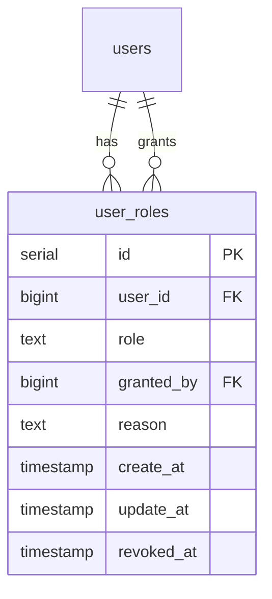
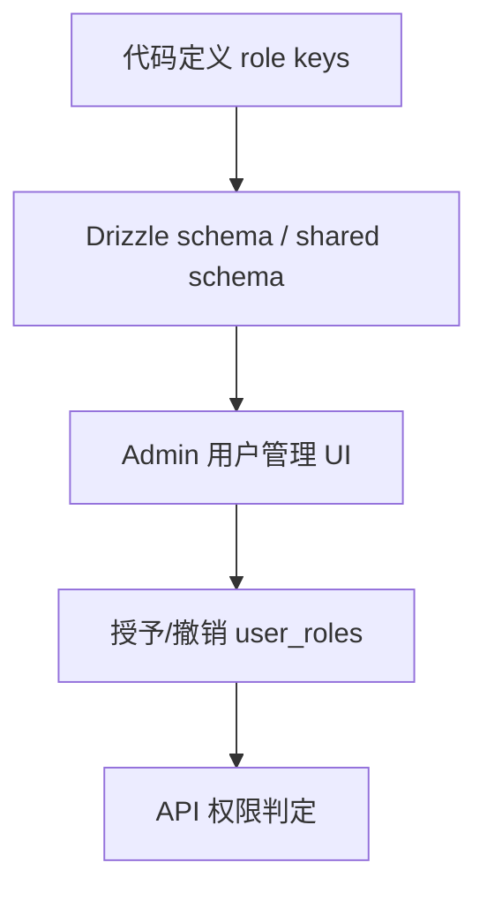
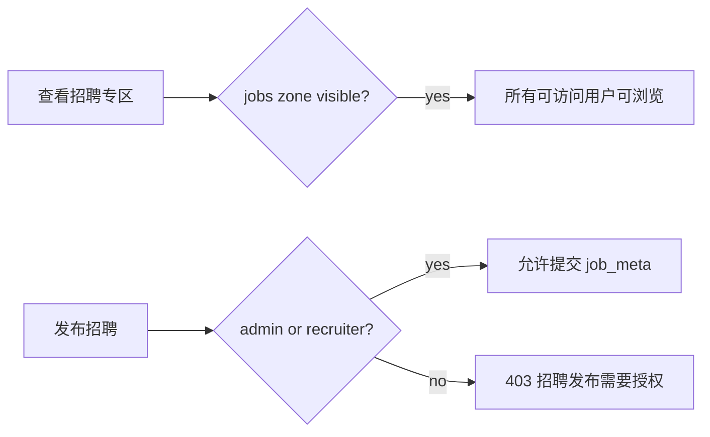

## Context

当前系统已有代码/env 级管理员判定（`APP_ADMINS` / 后端 `adminRequired()`），并已引入 `tabs` 表管理首页 tab 的 label、visible 和 sort_order。招聘专区通过 `tab='job'` + `job_meta` 侧表实现，但发布路径仍复用普通 topic 创建逻辑。legacy nodeclub 中招聘 tab 属于社区分类，但在 cnode-next 中已经被提升为结构化专区，因此发布风险高于普通 `share` / `ask`。

同时，`api-contract` 已要求公共接口排除 `dev` / `test`，说明这两个 tab 在历史数据和线上兼容中有明确语义；但 `admin-tab-management` 当前只 bootstrap `share` / `ask` / `job` / `good`，导致后台无法看到所有代码支持的 tab。

## Goals / Non-Goals

**Goals:**

- 引入简单、代码控制的用户角色分配系统，首批角色为 `moderator` 和 `recruiter`。
- 管理员仍由代码/env 控制，不进入 DB 角色表。
- 使用 `recruiter` 白名单限制招聘发布能力。
- 使用 `moderator` 表达非 admin 的社区治理身份，为内容治理权限拆分提供基础。
- 将 `dev` / `test` 注册为内部 tabs，管理后台可见，前台只对管理员可见。
- 保持 tab 和 role 的存在性由代码/migration 控制，后台只负责授予、撤销和展示配置。

**Non-Goals:**

- 不实现完整 RBAC、动态权限配置或动态新增 role key。
- 不支持后台动态新增、删除 tabs。
- 不实现招聘审核、企业认证、付费发布或公司域名验证。
- 不改变普通 topic 发帖的新用户门槛、Turnstile 和 rate-limit 基础规则。

## Decisions

### Decision: 使用简单 `user_roles`，不做完整 RBAC

系统 SHALL 新增 `user_roles` 表保存用户角色分配：`user_id`、`role`、`granted_by`、`reason`、`create_at`、`update_at`、`revoked_at`。有效角色以 `revoked_at IS NULL` 判定，PostgreSQL 使用 partial unique index 保证同一用户同一角色最多一个有效授权。

替代方案：

- `user_capabilities`：能力粒度更精确，但运营语义弱，用户管理 UI 不如“版主/猎头”直观。
- 完整 RBAC（`roles` / `permissions` / `role_permissions`）：扩展性最强，但对当前仅两个角色过重，且权限映射最终仍需代码实现业务边界。
- site setting allowlist：实现最快，但缺少审计、搜索和撤销历史，不利于长期运营。

### Decision: 管理员保持代码/env 级最高权限

管理员 SHALL 继续由现有管理员判定控制，DB 角色表不得作为 admin 的唯一来源。管理员天然拥有 `moderator` 和 `recruiter` 能力，但不需要写入 `user_roles`。

替代方案：把 admin 迁入角色表。拒绝原因：DB 误操作可能删除最后一个 admin，或 DB 篡改直接获得最高权限；环境级 admin 对恢复和应急更安全。

### Decision: 角色存在性代码控制，角色授予后台控制

允许的 role key SHALL 由 shared 常量或 schema 固定为 `moderator` / `recruiter`。后台只能对这些已知 role 授予/撤销，不提供新增角色 key 或配置角色权限映射。

### Decision: `recruiter` 控制招聘发布，不能控制招聘可见性

`tabs.visible` 和 `/zone/jobs` 继续控制招聘内容入口展示；`recruiter` 只控制是否能创建 `tab='job'` 话题。普通用户可以浏览招聘专区，但不能发布招聘。

### Decision: `dev` / `test` 是 admin-only internal tabs

`dev` / `test` SHALL 注册进 `tabs` 表并在 `/admin/tabs` 中展示，但前台 tab 栏只对管理员显示。公共 API 仍按既有 `api-contract` 排除 `dev` / `test`；直接请求 `?tab=dev` / `?tab=test` 的非 admin 用户 SHALL 返回权限错误或空列表，具体实现选择需与现有公开 API 兼容策略一致。

替代方案：将 `dev` / `test` 作为 authenticated tabs 对所有登录用户展示。拒绝原因：登录用户范围过宽，内部测试内容可能泄露。

## Risks / Trade-offs

- [Risk] 角色系统被误认为完整权限系统 → Mitigation：spec 明确 role key 和权限映射代码控制，不提供动态权限配置。
- [Risk] 只在前端隐藏招聘发布入口但 API 未校验 → Mitigation：`POST /api/v1/topics` 和 topic update 路径必须后端强校验 `recruiter`。
- [Risk] `dev` / `test` 在 tabs 表设为 visible 后误对公众展示 → Mitigation：增加 admin-only/internal 判定，`visible` 只表示“在允许的人群中展示”。
- [Risk] 撤销角色后历史授权不可追踪 → Mitigation：使用 `revoked_at` 软撤销并写审计日志。

## Migration Plan

1. 新增 `user_roles` 表和 partial unique index。
2. 补充 `tabs` bootstrap/migration，幂等 upsert `dev` / `test`，默认隐藏且 admin-only。
3. 部署 API 兼容读逻辑：无角色用户视为空角色数组，admin 仍由现有逻辑判定。
4. 上线后台角色授予/撤销 UI 后，由管理员手动授予首批 `recruiter`。

Rollback：保留 `user_roles` 表不影响普通登录和发帖；如需回滚招聘限制，可暂时只允许 admin 发布招聘，避免重新开放给全部用户。

## Open Questions

- 非 admin 直接请求 `?tab=dev` / `?tab=test` 时返回 403 还是空列表？建议面向 Web 返回 403，面向 legacy-compatible public API 可保持空列表。
- `moderator` v1 是否只用于内容删除/处理举报，还是同步开放加精、锁定、置顶？建议先开放处理举报、隐藏/删除、锁定，不开放角色管理和站点设置。
