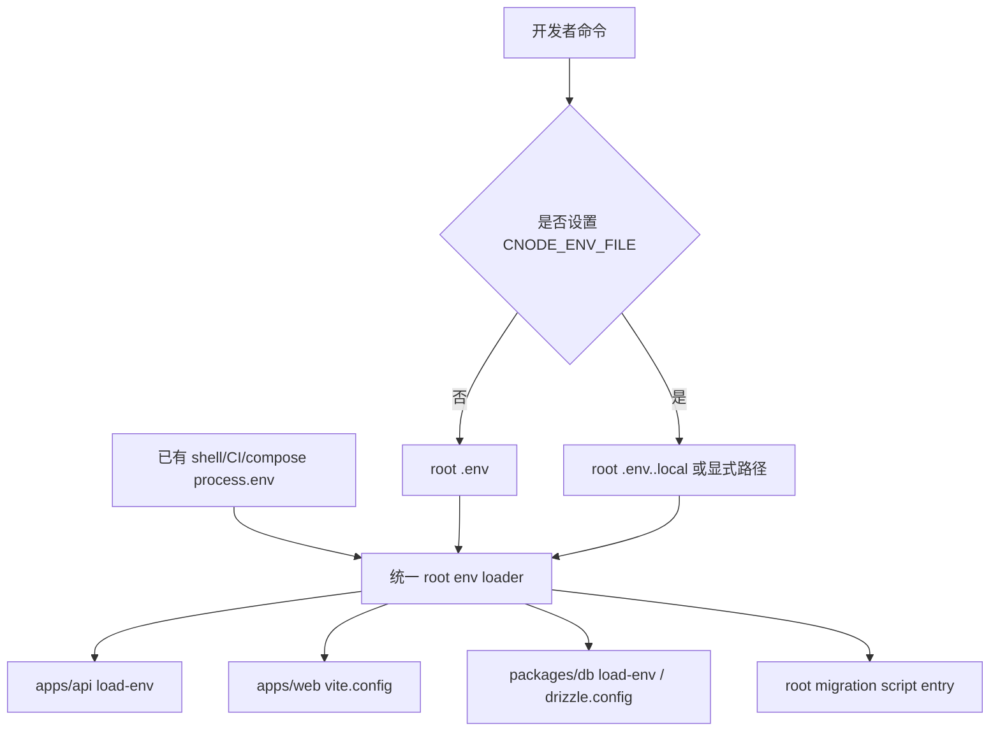

## Context

当前 monorepo 有三个本地 env 加载面：`apps/api/src/load-env.ts` 使用 `dotenv` 从仓库根读取 `.env` 后再读取 `.env.local` 并覆盖；`packages/db/src/load-env.ts` 自行解析仓库根 `.env.local` 和 `.env`，但不覆盖已有变量；`apps/web` 由 React Router/Vite dev 入口处理，容易读取 app 目录下的 `.env` / `.env.local`。新的目标是把默认本地数据源收敛为仓库根 `.env`，不再默认读取 `.env.local`。更关键的是，很多 package scripts 直接调用 CLI：`react-router dev/build/typegen`、`drizzle-kit push/generate`、`tsx scripts/*`、`node dist/index.js`。这些 CLI 不一定经过应用源码里的 `import "./load-env"`，所以只在代码入口里加载 env 不能解决脚本层问题。

legacy `../nodeclub/` 的生产行为是通过服务器环境配置连接线上 MongoDB 和外部服务。本项目不迁移 legacy 的 dotenv 文件布局，只保留“运行时通过环境变量提供连接和 secret”的行为边界，并把 PostgreSQL-first 的本地开发和迁移验证路径规范化。

## Goals / Non-Goals

**Goals:**

- 让 `pnpm dev`、单独 Web/API dev、DB scripts 和迁移脚本使用同一套 root env contract。
- 明确每类 package script 如何加载 env，但不改变应用默认启动命令。
- 默认本地开发只读取仓库根 `.env` 作为真实配置来源，避免 `.env.local` 和 app-local `.env*` 漂移。
- 允许通过显式 `CNODE_ENV_FILE` profile 连接远程 rehearsal 数据库，但不让远程 DB 成为默认 `pnpm dev` 行为。
- 保持生产部署由 compose/runtime 注入环境变量，不依赖应用读取服务器上的 dotenv 文件。
- 迁移过程中不读取后打印、不删除、不覆盖用户现有真实 `.env` 文件。

**Non-Goals:**

- 不引入 SQLite 或 `DB_DIALECT` 兼容路径。
- 不新增完整配置服务或远程 secret manager。
- 不把真实 secret 写入 `package.json` scripts。
- 不修改 `../nodeclub/` 或 `egg-cnode/`。

## Decisions

### 1. 保持默认命令不变，在对应配置或脚本入口加载 root env

实现必须保持 `package.json` 中应用和数据库工具的默认命令形态，例如 `react-router dev`、`react-router build`、`react-router typegen`、`drizzle-kit push`、`drizzle-kit generate`、`tsx watch src/index.ts`、`tsx src/migrate.ts`。env 加载放在这些命令自然会读取的配置文件或脚本入口中，而不是用额外 launcher 包裹命令。

应用入口 loader 仍可作为运行时兜底：当生产 `node dist/index.js` 或某些直接执行源码入口的方式未经过开发工具配置时，入口可以加载 root env，但生产 compose/CI 已注入的变量必须保持优先。

脚本分层如下：

| 脚本类型 | 示例 | 加载方式 |
| --- | --- | --- |
| Web dev/build/typegen | `react-router dev`、`react-router build`、`react-router typegen` | 保持原命令，`apps/web/vite.config.ts` 加载 root `.env` |
| API dev/worker/gen | `tsx watch src/index.ts`、`tsx src/worker/moderation-scan.ts`、`tsx scripts/gen-openapi.ts` | 保持原命令，API runtime 入口或脚本入口加载 root `.env` |
| DB schema CLI | `drizzle-kit push`、`drizzle-kit generate` | 保持原命令，`packages/db/drizzle.config.ts` 加载 root `.env` |
| DB TS scripts | `tsx src/migrate.ts`、`tsx src/seed.ts` | 保持原命令，脚本内部加载 root `.env` |
| 根迁移脚本 | `tsx scripts/migrate-mongo-to-pg.ts`、`tsx scripts/reconcile-migration.ts` | 保持原命令，脚本顶部加载 root `.env` |
| 验证/安全工具 | `oxlint`、`tsc --noEmit`、`gitleaks`、`docker compose --env-file deployment/.env.production.example config` | 不主动加载 local dotenv，避免无关工具读取本地 secret |

被拒绝的方案：只在根 `pnpm dev` script 里预加载 env。原因是开发者仍会单独运行 `pnpm --filter @cnode/web dev`、`pnpm --filter @cnode/api dev`、`pnpm db:*`，只改根命令会留下入口漂移。

被拒绝的方案：用 `tsx scripts/env-run.ts ...` 或类似 launcher 包裹 `react-router`、`drizzle-kit`、`tsx` 命令。原因是这会改变默认启动形态，尤其 Web/Vite/React Router 工具链不应被额外启动器包裹。

被拒绝的方案：只在 `apps/web/vite.config.ts`、`apps/api/src/index.ts`、`packages/db/src/migrate.ts` import loader。原因是 `drizzle-kit push/generate`、`react-router typegen`、部分 root `tsx scripts/*` 不一定经过这些源码入口，脚本如何加载仍然不确定。

被拒绝的方案：立即新增 `packages/env` 并引入完整 schema 校验。原因是当前问题是加载平面和优先级不一致，完整配置包会增加变更面；后续如果需要强校验，可以在统一 loader 稳定后再演进。

### 2. 加载优先级为已有环境变量最高，显式 profile 其次，默认 root `.env` 再次

目标优先级：`process.env` 已存在值 > `CNODE_ENV_FILE` 指向的显式 env file > root `.env` > 代码默认值。这样 CI、compose、shell export 不会被本地文件覆盖；远程 rehearsal 只有开发者显式选择时才覆盖默认本地值。root `.env.local` 不参与默认加载。

被拒绝的方案：默认自动加载 `.env.remote.local` 或按文件名自动选择。原因是远程数据库具有误操作风险，必须通过命令显式选择。

### 3. package scripts 保持默认形态，加载点必须可追踪

实现时应把脚本分为两类：需要应用运行时 env 的脚本必须在其自然配置入口或脚本入口加载 root `.env`；纯工具脚本不应加载本地 env。这样命令保持熟悉，同时文档清楚标出每类脚本的加载点。

需要 runtime env 的入口包括：Web 的 Vite config、API runtime loader、Drizzle config、DB migrate/seed 脚本、根 migration/reconcile scripts、preflight/smoke scripts。无需加载本地 env 的脚本包括 lint、typecheck 中纯 `tsc`、format、secret scan、compose config verification。

被拒绝的方案：所有 `pnpm` scripts 都统一加载 `.env.local`。原因是 lint、typecheck、secret scan、compose config 等工具不需要本地 secret，强行加载会扩大 secret 暴露面。

### 4. `.env.local` 和 app-local `.env*` 废弃为默认入口，但实施不得破坏用户现有文件

root `.env.local`、`apps/web/.env`、`apps/web/.env.local` 等不再作为推荐或依赖的本地配置入口。实施时可以更新文档和 ignore 规则，并让 Web 入口读取 root `.env`；但不得删除、覆盖或打印用户已有真实文件内容。如果需要清理，必须提示用户手动确认。

被拒绝的方案：直接删除所有散落 `.env*`。原因是当前工作区可能包含用户真实配置和 secret，自动删除或迁移会破坏环境并可能泄露内容。

### 5. 远程 DB 使用显式 profile，并推荐 SSH tunnel 本地端口

远程 rehearsal 配置建议放在 `.env.remote.local` 或 `.env.rehearsal.local`，通过 `CNODE_ENV_FILE` 明确启用。DB host 推荐写成 SSH tunnel 的本地监听地址，例如 `DB_HOST=127.0.0.1`、`DB_PORT=15432`。

被拒绝的方案：把远程 DB 配置放入默认 `.env.local`。原因是 `pnpm dev` 可能启动可写 API 并误连 rehearsal 或生产-like 数据库。

### 6. 生产部署继续由 compose 注入 env

`deployment/docker-compose.prod.yml` 当前通过 `environment` 将 server-local env 展开到 API、Web、worker 和 migration profiles。本次不把生产变更为应用内 dotenv 读取，避免本地开发约定影响生产部署边界。

被拒绝的方案：生产容器启动时也读取 root dotenv 文件。原因是容器镜像应环境无关，生产 secret 应由部署系统注入，且部署 runbook 已围绕 compose env 展开。

## Risks / Trade-offs

- [风险] loader 合并顺序实现错误导致 root `.env` 覆盖 CI 或 compose 值 → [缓解] 明确测试 `process.env` 已存在值优先，并为 profile 覆盖默认值添加测试。
- [风险] 某个 CLI 的配置入口未加载 env，导致脚本层 env 继续漂移 → [缓解] 在 tasks 中逐个检查自然加载点，并增加脚本矩阵文档；验证 `pnpm --filter` 单独执行路径。
- [风险] Web dev 继续被 Vite 默认 app-local env 影响 → [缓解] 在 `apps/web/vite.config.ts` 显式加载 root env，并更新文档废弃 app-local env；如发现 app-local 文件存在，只提示不读取或不推荐，不打印内容。
- [风险] 远程 profile 被用于 `pnpm dev` 后误写远程 DB → [缓解] 文档默认只推荐 DB/migration 命令使用 profile；实现可对 `APP_ENV=development` 且远程 profile 名称包含 `remote`/`rehearsal` 的 Web/API dev 打警告或要求显式允许标志。
- [风险] `.env.local` 作为历史文件继续存在，开发者不知道该用哪个 → [缓解] 文档将 root `.env` 定为唯一默认真实入口，`.env.local` 仅作为既有文件被保护，不参与默认加载。

## Migration Plan

1. 建立 root env loader，并先用测试固定加载优先级。
2. 按脚本矩阵接入 Web Vite config、API runtime loader、Drizzle config、DB scripts 和 root migration scripts；默认 package scripts 保持原样。
3. 保留应用内 loader 作为兜底，但避免用 cwd 相对路径猜测 root `.env`。
4. 更新 `docs/development.md` 和 `README.md`，说明 `.env`、`.env.<profile>.local`、`CNODE_ENV_FILE`、脚本矩阵和 `.env.local`/app-local env 废弃边界。
5. 更新 `.env.example` 注释，展示默认本地配置和显式远程 profile 的安全用法，但不包含真实 secret。
6. 保留所有现有真实 `.env*` 文件不动；如工作区存在 app-local env，只在最终说明中提示用户可确认后手动迁移/删除。
7. 运行 typecheck/test 中与 env loader、Web config、DB scripts 相关的验证。

## Open Questions

- 是否需要为 `CNODE_ENV_FILE` 指向仓库外路径提供支持，还是只允许仓库根内的相对路径？默认建议支持相对路径，绝对路径需谨慎。
- 是否要提供 `pnpm db:remote` / `pnpm migrate:remote` 这类便捷 script，还是只文档化 `CNODE_ENV_FILE=.env.remote.local pnpm ...`？默认建议先文档化，避免 scripts 误导。
- 对 `pnpm dev` 使用远程 profile 时，是仅警告还是强制要求 `CNODE_ALLOW_REMOTE_DB=1`？默认建议先警告，若团队频繁误连再收紧。
- root env loader 是否应后续提升为独立 workspace package？默认先保持最小实现，避免改变应用默认启动方式。
