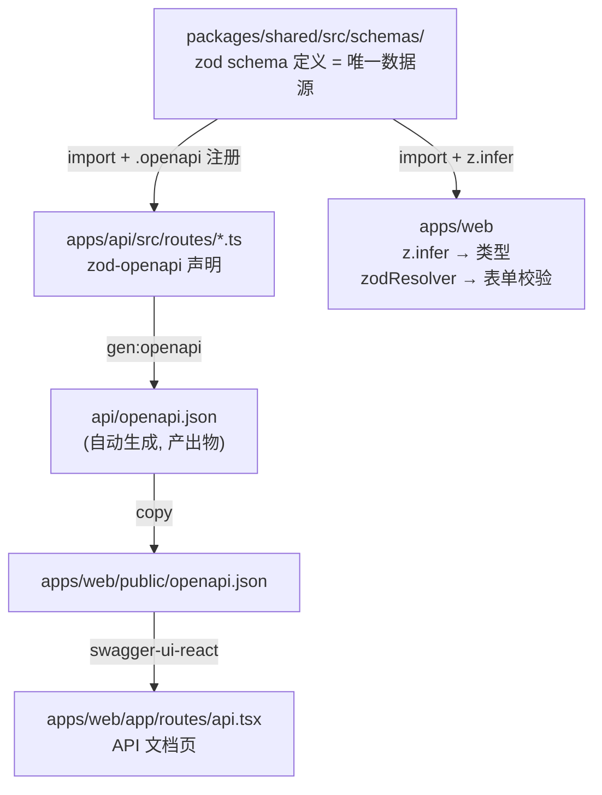

## Context

cnode-next 的 API 契约目前有四份独立维护的"真理"：

1. `api/openapi.yaml`（1385 行手写 OAS 3.1，含 45 处 `x-contract-response-fields` 扩展）
2. `apps/api/src/routes/*.ts` 内联的 zod schema（9 文件，137 个端点，但只有约一半用了 `@hono/zod-validator`）
3. `packages/shared/src/types/index.ts` 手写 DTO（`TopicDTO`/`UserDTO`/`MessageDTO`）
4. `apps/web/api-contract.manifest.json` 手写 48 行契约清单

外加 `apps/web/app/routes/api.tsx` 硬编码 4 行表格冒充 API 文档页。

它们之间没有机械同步机制——漂移已经发生：`shared/schemas/signupSchema` 的字段名是 `loginname`，`api/routes/auth.ts` 的 `signinSchema` 字段名是 `name`；`shared/constants/` 的 6 个常量全部是死代码（无外部消费者）；`shared/schemas/` 的 `createTopicSchema`/`updateTopicSchema`/`createReplySchema` 与 api 内联版本重复且无消费者。

## Goals / Non-Goals

**Goals:**

- 将 `apps/api/src/routes/*.ts` 的 zod 声明收敛为 API 契约的唯一数据源。
- 从路由自动生成 `api/openapi.json`，取代手写 `api/openapi.yaml`。
- web 调用类型从 OAS codegen 获取（`openapi-typescript`）。
- web 表单运行时 zod schema 从 api re-export 获取（`z.infer` 零损耗派生类型）。
- API 文档页用 `swagger-ui-react` 渲染 OAS。
- 删除所有手写副本和死代码。

**Non-Goals:**

- 不改动 API 业务行为和响应数据结构。
- 不引入 `openapi-fetch`/`orval` 等 runtime client。
- 不改动 `smoke:api-contract` runtime 脚本。
- 不改动 `@cnode/db` 和 Redis 层。

## Decisions

### 决策 1：升级 zod 3→4 + hono 4.6→4.10+（一次性完成）

**选择**：在一个 change 内一次性升级 zod 和 hono。

**理由**：`@hono/zod-openapi` 1.5.1 的 peerDep 是 `zod ^4.0.0` + `hono >=4.10.0`。项目当前是 `zod ^3.24.0` + `hono ^4.6.0`。zod 4 有破坏性变更（错误消息格式、`z.infer` 行为、`z.object().strict()` 等），但项目里只有 8 个文件 import zod，schema 定义集中在 `apps/api/routes/` 和 `packages/shared/schemas/`，可控。

**被否决的方案**：

- 用 `@hono/zod-openapi@0.18.2`（最后支持 zod 3 的版本）——避免升级，但锁定在旧版，未来 zod 4 迟早要升，只是把债推迟。
- 分两个 change（先升 zod，再迁移 zod-openapi）——增加协调成本，且 zod 升级单独做没有直接收益。

### 决策 2：zod-openapi 路由声明风格

**选择**：用 `@hono/zod-openapi` 的 `OpenApiHono` + `route.openapi.register()` 风格，每个端点声明 path、method、zod request/response schema、OpenAPI metadata（summary、tags、security）。

**理由**：`@hono/zod-openapi` 是 Hono 官方维护的中间件，与现有 `@hono/zod-validator` API 接近，迁移成本低。它内部用 `@asteasolutions/zod-to-openapi` 将 zod schema 转为 OAS schema，支持 `z.infer` 派生类型。

**被否决的方案**：

- 手写 `openapi.yaml` + `zod-validator` 双轨——当前状态，漂移无法消灭。
- 用 `@asteasolutions/zod-to-openapi` 直接注册不走 hono 中间件——失去路由级声明和运行时校验的统一。

### 决策 3：web 类型派生用 z.infer，不走 OAS→TS codegen

**选择**：web 调用类型从 api 的 zod schema 用 `z.infer<typeof signupSchema>` 直接派生，不使用 `openapi-typescript` 从 OAS codegen 类型。

**理由**：zod 是 TS-first，`z.infer` 是零往返、零 codegen、零损耗的类型派生。OAS→TS codegen 会丢失 zod 的富信息（refine/transform），且多一层工具依赖。OAS 退化为纯粹的**文档交换格式**，只负责 swagger-ui 渲染和外部消费者，不参与 web 内部类型派生。

**被否决的方案**：

- `openapi-typescript` 从 OAS codegen 类型——多一层 codegen，且 OAS→TS 会丢失 zod 富信息。类型和表单 zod 来源不同（类型从 OAS，表单 zod 从直接 import），链路分裂。
- `openapi-fetch` / `orval` 生成 runtime client——改动 42 处 `apiFetch<T>` 调用点为 hooks 或 client 方法，侵入性过大，超出"只维护 OAS"的诉求。

### 决策 4：所有 zod schema 定义在 packages/shared，api 和 web 共同消费

**选择**：所有 zod schema（请求体、响应体、表单校验）定义在 `packages/shared/src/schemas/`，按领域组织（common/topic/reply/auth/user 等）。`apps/api/src/routes/*.ts` 从 shared import schema 并用 `.openapi()` 注册路由；`apps/web` 从 shared import schema 并用 `z.infer` 派生类型、用 `zodResolver` 做表单校验。

**理由**：web 表单需要运行时 zod schema 对象（不是类型）喂给 `zodResolver`；web 调用类型也需要从 `z.infer` 派生。如果把 schema 定义放在 api 路由里再 re-export，会形成 `shared → api → shared` 循环依赖（api 的 package.json 依赖 @cnode/shared）。把 schema 源头放在 shared 包（叶子包，不依赖 api），api 和 web 都从 shared import，依赖方向一致，无循环。

OAS→zod codegen 工具链不成熟（`openapi-zod` 自述"use at your own risk, un-tested"，`openapi2zod` 低下载），且 OAS 天然表达不了 `.refine()`/`.extend()`，反向 codegen 必然有损。直接在 shared 定义 schema 是零损耗、零额外工具的唯一可靠路径。

**被否决的方案**：

- shared re-export from api——循环依赖（shared → api → shared），架构不合法。
- OAS→zod codegen（`openapi-zod`/`openapi2zod`）——工具不稳，有损转换。
- web 手写一份 zod schema——当前状态，漂移无法消灭。
- web 直接 `import { signupSchema } from "@cnode/api/..."`——跨 app 直接 import 内部模块，耦合过深。

### 决策 5：shared 包重构为 zod schema 源头

**选择**：保留 `packages/shared` 但内容大幅瘦身：

- 删 `src/types/index.ts`（手写 HTTP DTO → web 用 `z.infer`）
- 删 `src/constants/index.ts`（6 个常量全死代码）
- 删 `src/utils/index.ts` + `src/utils/at.ts`（搬到 `apps/api/src/lib/at.ts`，仅 api 消费）
- 重写 `src/schemas/index.ts`：按领域组织，定义所有 zod schema（请求体、响应体、表单校验），api 和 web 共同 import

**理由**：`shared` 从"手写杂物间"变为"跨 app 共享 zod schema 的唯一定义点"。这是它在路线 C 下的唯一职责，也是避免循环依赖的唯一合法位置。

### 决策 6：OAS 覆盖全量 137 个端点

**选择**：9 个路由文件全部迁移到 zod-openapi，包括 `admin.ts`（40 个端点）、`user.ts`（无 zod）、`message.ts`（无 zod）、`community.ts`（无 zod）、`reply.ts` 的 delete/ups（无 zod）。

**理由**：只迁移已覆盖的 42 个端点会让"唯一数据源"仍不完整，admin/user/message/community 的契约继续漂移。一次性迁移消灭所有盲区。

**被否决的方案**：

- 只迁移 OAS 已覆盖的 42 个端点——"唯一数据源"不唯一，admin 等继续手写。
- 分两期（本期 42 个，下期 95 个）——协调成本高，且 42 个已覆盖端点的迁移方式会成为后续的参考，分批反而增加不确定性。

## Risks / Trade-offs

- **[zod 4 破坏性变更引发回归]** → 8 个文件全量迁移后跑 `pnpm test` + `smoke:api-contract` + 手工冒泡核心端点（signup/signin/create topic/create reply）。zod 4 的主要破坏点（`z.string().min()` 错误消息格式、`z.infer` optional 行为）在项目里的影响面有限，因为 schema 多用于 `zValidator` 运行时校验，错误消息不直接面向终端用户。
- **[137 端点全量迁移工作量大]** → 按 9 文件分批迁移，每文件迁移后即跑 typecheck。优先级：topic/reply/auth（核心写入路径）→ user/collect/message（读取路径）→ community/admin（辅助路径）。
- **[`admin.ts` 的 `createReportSchema` 非 zod 校验]** → 迁移时顺手用 zod 重写，但不改校验规则语义（`targetType` 仍是 `"topic" | "reply"`，`type` 仍是 trim+slice(50)）。
- **[`api/openapi.json` 是否进 git]** → 进 git（CI 的 `verify:openapi` 需要文件存在）。新增 `verify:openapi-drift` 检查"重新生成后 git diff 为空"，防止手改产出物。这是可选防护层。
- **[OAS 合规校验依赖]** → 迁移后 OAS 由 zod-openapi 自动生成，合规性由生成器保证，不再需要 redocly lint 兜底。删除 `@redocly/cli` 依赖、`redocly.yaml` 配置、`verify:openapi` 脚本和 `build:api-docs` 脚本。`pnpm verify` 的 OAS 校验环节由 `gen:openapi` 自身保证（生成成功即合规）。
- **[swagger-ui-react SSR 兼容]** → `apps/web` 是 React Router SSR，`swagger-ui-react` 是客户端组件，需用 `ClientOnly` 或 `dynamic import` 包裹避免 SSR 报错。

## Migration Plan

1. **依赖升级**：zod 3→4，hono 4.6→4.10+，安装 `@hono/zod-openapi`、`swagger-ui-react`。
2. **gen 脚本骨架**：在 `apps/api` 搭建 `gen:openapi` 脚本，先产出空的 `api/openapi.json`。
3. **路由迁移**（按优先级）：
   - topic.ts → reply.ts → auth.ts（核心写入路径）
   - user.ts → collect.ts → message.ts（读取路径）
   - community.ts → admin.ts → index.ts（辅助路径）
4. **shared 重构**：删 types/constants/utils，schemas 改为 re-export api。
5. **web 接入**：删 `api-contract.manifest.json`，`apiFetch<T>` 的 T 改用 `z.infer`，`api.tsx` 换 swagger-ui-react。
6. **清理**：删 `api/openapi.yaml`、`api/_generated/`，更新 docs/PR 模板。
7. **验证**：`pnpm verify`（含 `gen:openapi` + `verify:openapi` 前置）全绿，`smoke:api-contract` 通过。

**回滚策略**：迁移按文件粒度提交，每文件迁移后 typecheck + test 通过即可。若 zod 4 升级出现不可逆问题，回滚到迁移前的 commit（`api/openapi.yaml` 仍在 git 历史中）。
