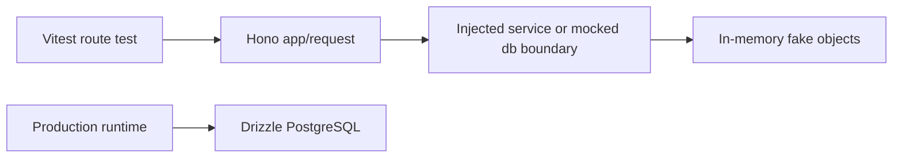

## Context

`apps/api` 当前测试使用 Node 内置 `node:test`，`apps/api/package.json` 手动列出每个测试文件。新增测试文件必须同步修改脚本，否则不会被 `pnpm test` 或 `pnpm verify` 执行。最近后台治理改造暴露了另一个问题：为了避免连接数据库，只能导出生产 helper 做纯函数测试，route 行为缺少稳定、轻量的测试入口。

项目运行时数据库仍然是 PostgreSQL only。用户明确要求本 change 不连接真实 PostgreSQL，包括测试库。因此本设计只建立无数据库连接的 Vitest 测试基础设施和可注入边界，不建立 DB integration test 环境。

## Goals / Non-Goals

**Goals:**

- `apps/api` 使用 Vitest 自动发现测试文件。
- 迁移现有 `node:test` 用例到 Vitest。
- 支持不连接真实数据库的 route-level 测试。
- 明确测试不得引入 SQLite、PGlite、内存 SQL 或 Drizzle 方言 fallback。
- 同步 `docs/conventions.md` 的 API 测试约定。

**Non-Goals:**

- 不连接真实 PostgreSQL、本地测试库、Docker 测试库或远程测试库。
- 不验证 PostgreSQL 查询计划、约束、事务隔离或真实 Drizzle SQL 行为。
- 不改变 API 运行时部署、数据库 schema 或业务逻辑。
- 不把 fake/mock 结果作为数据库真实行为的证明。

## Decisions

### 1. 使用 Vitest 作为 `apps/api` 测试运行器

`apps/api` 新增 Vitest 配置，测试脚本改为 `vitest run` 或等价 glob 自动发现。这样新增 `*.test.ts` 不需要手动更新脚本。

替代方案：继续使用 `node:test` 并改成 shell glob。该方案能解决漏跑文件，但与 `apps/web` 不一致，也缺少 Vitest mock、fixture 和 watch 生态，不采用。

### 2. Route 测试通过可注入依赖或 fake query layer，不连接真实数据库

API route 测试可以使用 Hono `app.request(...)`，但 route 的数据库访问必须通过可注入边界或 mockable module 替换。测试只能验证请求解析、权限分支、响应形状、审计调用意图和服务层编排，不验证真实 PostgreSQL 语义。

替代方案：启动测试 PostgreSQL。用户明确排除“哪怕是测试库”，不采用。

替代方案：使用 SQLite/PGlite。项目规则禁止 SQLite 和 dialect fallback，不采用。

### 3. 测试分层命名

| 层级        | 允许内容                            | 禁止内容           |
| ----------- | ----------------------------------- | ------------------ |
| Unit        | 纯函数、权限判定、schema 解析       | DB 连接            |
| Route       | `app.request`、mock service/db 边界 | 真实 PostgreSQL    |
| Contract    | OpenAPI 生成与静态校验              | 手写漂移契约       |
| DB behavior | 暂不在本 change 建立                | SQLite、真实测试库 |

### 4. 不为了测试扩大生产 API 表面

如果 helper 只服务测试，应优先移动到内部 service 模块并通过该模块测试，或使用 Vitest mock route 依赖。只有通用、稳定、业务可复用的纯函数才导出。

替代方案：继续从 `routes/*.ts` 导出大量测试 helper。该方案会污染 route 模块边界，不采用。

## Database Change Audit

- PostgreSQL schema change: 无。
- Drizzle migration: 无。
- Seed/bootstrap: 无。
- Index/constraint change: 无。
- Backfill/data repair: 无。
- Data cleanup: 无。
- Data semantics change: 无。
- Test database: 不创建、不连接、不要求真实 PostgreSQL 测试库。
- Related docs/wiki: 更新 `docs/conventions.md`；`wiki/` 不需要更新。

## Risks / Trade-offs

- [Risk] 无真实数据库测试无法发现 SQL 条件、外键或事务问题 → 保持 `pnpm typecheck`、OpenAPI 生成和生产 PostgreSQL-only 约束；数据库行为风险通过代码审查和后续专门策略处理，不用 SQLite 替代。
- [Risk] Mock route 测试与运行时行为漂移 → 只 mock 边界，不 mock 被测业务分支；文档明确 fake 不能证明数据库行为。
- [Risk] 迁移测试框架影响 `pnpm verify` → 在 tasks 中要求迁移后运行 `pnpm --filter @cnode/api test`、`pnpm test` 和 `pnpm verify`。

## Migration Plan

1. 为 `apps/api` 添加 Vitest devDependency 和配置。
2. 将现有测试文件从 `node:test`/`node:assert` 迁移到 Vitest API。
3. 将 `apps/api` test 脚本改为自动发现测试文件。
4. 增加一个无数据库连接的 route-level 示例测试。
5. 更新 `docs/conventions.md`。
6. 运行 `pnpm --filter @cnode/api test`、`pnpm test`、`pnpm verify`。

Rollback 策略：恢复 `apps/api` test 脚本和测试 import 即可；无数据或 schema 回滚。
