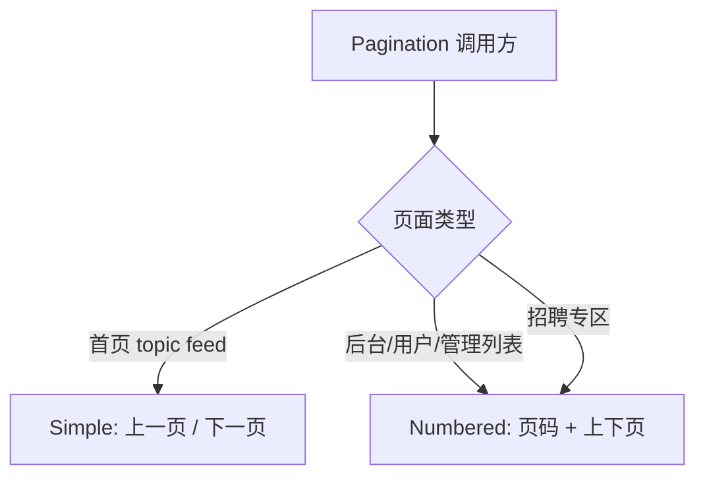
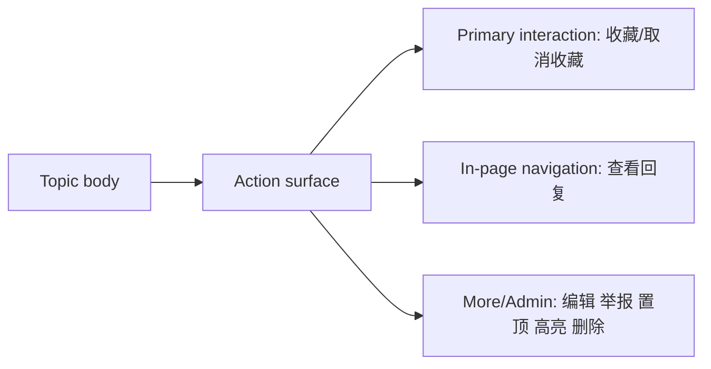
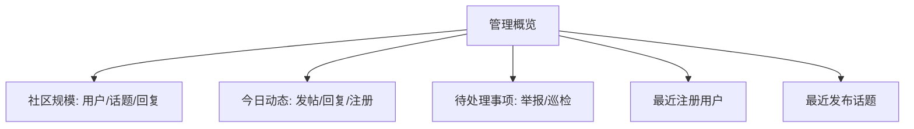

## Context

CNode Next 当前前台已经使用 React Router SSR、Tailwind CSS v4 和 shadcn/ui 原子组件，后台也已有 `AdminLayout`、`AdminPage`、`AdminPanel`、`AdminToolbar` 等专用框架。但线上页面暴露出几个一致性问题：主导航辅助入口过多、首页分页显示超大总页码、发布页写作区偏弱、招聘筛选条像大表单、回复按钮无滚动/聚焦反馈、话题详情 action 区平铺、后台概览和用户表格信息过载。

legacy `nodeclub` 提供的是传统论坛高密度信息流，可作为内容密度参考；但 CNode Next 的品牌视觉已经偏现代卡片式，不能继续复制所有旧站的页码和按钮平铺方式。后台则应保留高密度运营体验，但需要统一表格和筛选规则。

## Goals / Non-Goals

**Goals:**

- 建立前台和后台两套密度档：前台更轻，后台更紧凑但规则一致。
- 收敛主导航、移动端导航和命令面板的信息架构。
- 明确首页分页与后台分页的差异化行为。
- 修复回复入口、话题 action 区、发布页和招聘筛选条的可感知交互问题。
- 降低后台概览页和用户管理页首屏噪音。

**Non-Goals:**

- 不修改 PostgreSQL schema、Drizzle migration、seed、索引或字段语义。
- 不改变现有 API 返回字段，不删除后端统计字段。
- 不引入新的组件库或设计系统依赖。
- 不在本 change 中删除 `/help` 路由；只移除导航入口。若要重定向 `/help`，另起兼容决策。

## Decisions

### 1. 前台与后台采用不同密度档

前台默认控件使用 `h-9`、`rounded-xl`、品牌 token；后台筛选控件也使用 `h-9` 保持一致，后台表格内联编辑允许 `h-8`、`rounded-lg` 以保持数据密度。

长页面通用辅助行为通过共享 `ScrollTopButton` 实现，挂载在主站 `Layout` 和后台 `AdminLayout`，只在滚动超过阈值后显示。

Rejected alternatives:

- 全站统一 `h-10`：前台和招聘筛选会显得过重，后台表格也更难扫描。
- 全站统一 `h-8`：前台主 CTA 和移动端触摸目标不足。
- 每个页面单独实现回到顶部：会产生不一致的阈值、位置和样式。

### 2. 首页分页与后台分页分流

首页 topic feed 使用 simple pagination，只展示上一页/下一页；后台和用户管理列表保留 numbered pagination。

Rejected alternatives:

- 直接修改全局 Pagination：会破坏后台完整数据访问效率。
- 首页完全隐藏分页：无法访问旧内容，不符合论坛浏览习惯。

### 3. 导航入口按用户任务重新分层

`API` 是开发者任务，提升为一级导航；“关于”下拉只承载社区说明和帮助内容。`/help` 的“指引总览”作为聚合页不再占用导航入口。

CommandPalette 作为快速跳转入口必须与导航权限一致。后台相关 action 只对具备 admin 或 mod 权限的用户可见；普通登录用户和匿名用户不得在 CommandPalette 中看到“管理后台”或后台页面入口。前端隐藏只是体验层约束，后台路由仍必须继续通过现有权限校验保护。

Rejected alternatives:

- 保留“指引总览”：页面价值与 `新手指南`、`常见问题`、`关于我们` 重复。
- 将 API 继续放在“关于”内：开发者找 API 时路径过深。
- 仅依赖后台路由 403 而不隐藏 CommandPalette 入口：会让普通用户看到不可用后台内容，形成权限边界噪音。

### 4. 话题详情 action 区分为主互动、页内导航和更多/管理

正文后的按钮不再一字排开。收藏属于主互动；查看回复属于页内导航；编辑、举报、置顶、高亮、删除等是更多/管理动作。移动端可折叠到菜单，但必须保持可发现。

Rejected alternatives:

- 继续平铺所有按钮：不同风险等级动作同级展示，视觉零散。
- 全部收进菜单：收藏和查看回复变得不够直接。

### 5. 回复按钮必须执行可见定位

`添加回复` 和单条 `回复` action 触发后必须滚动到回复编辑器并聚焦 Markdown textarea。定向回复时保留 `@loginname` 和引用预览。

所有写作/编辑表单的提交型主动作统一放在底部右侧操作区，包括发布话题、编辑话题、编辑回复和添加评论/回复。取消、清除引用等辅助动作可以放在主按钮左侧或对应上下文内，但不能让主提交按钮在不同写作场景中左右漂移。

Rejected alternatives:

- 只改按钮样式：无法解决长评论列表中状态变化发生在视口外的问题。
- 将回复编辑器移动到列表顶部：会打断线性论坛阅读流，也偏离 legacy CNode 评论习惯。
- 让回复提交按钮继续左对齐：与发布页右侧主动作不一致，写作类表单 muscle memory 不统一。

### 6. 后台概览从指标墙改为分组摘要

8 张同权重指标卡合并为 3 个 summary card：社区规模、今日动态、待处理事项。待处理事项带跳转入口。

Rejected alternatives:

- 保留 8 张卡但缩小：信息优先级仍然不清晰。
- 只保留待处理事项：会丢失管理员进入后台时的整体运营概览。

### 7. 用户管理列表以识别和治理为主

默认列调整为 `用户 | 状态 | 角色 | 操作`。用户名和邮箱合并到用户列；积分、话题数、回复数从默认列移除，可在用户主页、管理菜单或后续详情容器查看。

Rejected alternatives:

- 保留积分/话题/回复三列：横向空间被低优先级画像数据占用。
- 合并成“贡献”列：仍然占据默认列表注意力。

## Risks / Trade-offs

- [Risk] 移除 `/help` 导航入口后，少数用户找不到聚合页 → 保留路由本身，页脚或直接链接仍可访问；后续再决定重定向。
- [Risk] CommandPalette 过滤逻辑与 Header 权限判断不一致 → 复用 root/auth store 中的 user 权限状态，并保留后端权限校验作为最终边界。
- [Risk] 首页 simple pagination 可能降低跳转到指定历史页的效率 → 首页以浏览新内容为主，历史定向查询通过搜索承担。
- [Risk] 回复滚动定位受 sticky header 遮挡 → 使用 `scroll-margin-top` 或 `scrollIntoView` 后偏移策略，并保留 editor focus。
- [Risk] 用户管理移除贡献列影响管理员快速判断用户活跃度 → 不删除 API 字段，后续可在用户详情或行展开中恢复为次级信息。
- [Risk] 后台控件密度收敛影响移动端可点性 → 移动端保持 Sheet、菜单和至少 36px 触摸目标。

## Migration Plan

1. 更新导航和命令面板入口，不删除 `/help` 路由。
2. 引入或扩展分页显示模式，先让首页使用 simple，保持后台默认 numbered。
3. 调整发布页、招聘筛选条、话题详情 action 区和回复定位交互。
4. 调整后台概览和用户管理表格。
5. 运行 `pnpm lint`、`pnpm typecheck` 和相关组件/路由测试。

Rollback strategy: 所有改动为前端 UI 与交互层变更，可通过回退对应 route/component 改动恢复，不涉及数据库或 API 迁移。

## Database Change Audit

本 change 不包含 PostgreSQL schema、Drizzle migration、seed/bootstrap、索引、约束、backfill、数据修复、数据清理、数据保留或字段语义变更。

## Open Questions

- `/help` 是否在后续变更中重定向到 `/getstart` 或 `/about`？本 change 只移除导航入口。
- 用户管理页是否需要行展开查看积分/话题/回复？本 change 默认不实现，避免扩大范围。
