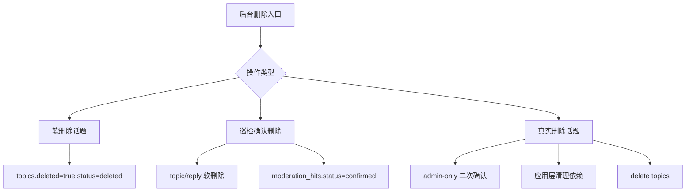
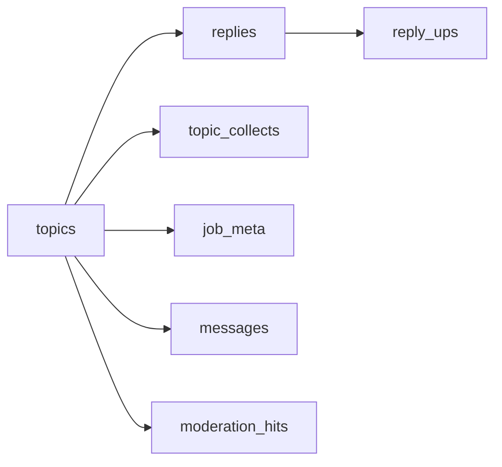

## Context

后台内容治理当前分散在两个页面：`/admin/topics` 用于话题运营动作，`/admin/mod` 用于敏感词巡检任务和命中复核。现有实现已经具备分页、标题搜索、批量置顶/加精/隐藏/软删除，以及巡检任务和命中记录的基础数据模型，但缺少按业务上下文筛选和按任务处理命中的后台工作流。

现有数据库字段已经覆盖第一阶段所需能力：`topics` 提供 tab、状态、运营标记、计数和时间字段；`moderation_hits.scan_job_id` 已关联巡检任务。真实删除会触及 `replies.topic_id`、`topic_collects.topic_id`、`job_meta.topic_id`、`messages.topic_id`、`moderation_hits.topic_id/target_id` 等数据，其中只有 `job_meta.topic_id` 声明了数据库级 cascade，因此真实删除必须由应用层显式清理依赖。

## Goals / Non-Goals

**Goals:**

- 后台话题管理支持多维筛选和排序，并在分页、批量操作后保留筛选上下文。
- 巡检结果支持按任务查看命中，并对任务下待处理命中执行批量确认删除。
- 后台话题管理支持 admin-only 真实删除，明确区别于现有软删除。
- 第一阶段不引入数据库迁移，不改变公共内容可见性规则。

**Non-Goals:**

- 不为每次巡检重复创建同一敏感词命中记录；现有 dedupe 行为保持不变。
- 不把巡检任务的一键确认删除改为真实删除；巡检确认删除继续使用现有话题/回复软删除生命周期。
- 不为普通用户、作者或 moderator 提供真实删除权限。
- 不物理删除审计日志；真实删除只清理被删话题直接关联的运营数据。

## Decisions

### 1. 第一阶段复用现有 schema，不新增巡检 occurrence 表

采用现有 `moderation_hits.scan_job_id` 作为任务归类依据。任务页面展示的是由该任务首次创建的命中记录；若后续任务扫描到同一对象同一敏感词，仍因 `dedupe_key` 不再创建重复待处理命中。

替代方案：新增 `moderation_hit_occurrences` 记录每次任务发现。该方案语义最完整，但需要新表、迁移、回填和额外 UI 解释；当前后台诉求优先解决按任务处理和筛选效率，因此推迟。

### 2. 话题筛选直接扩展后台 topics API

`GET /api/v1/admin/topics` 接收查询参数并组合 SQL 条件：`q`、`tab`、`visibility`、`flag`、`date_field`、`date_from`、`date_to`、`sort`、`page`、`limit`。前端使用 URL 作为筛选状态来源，分页和操作后通过 revalidate 保留参数。

替代方案：在前端加载全量数据后本地过滤。该方案会破坏分页准确性，且不适合后台大数据量列表，因此不采用。

### 3. 删除语义拆分为软删除、巡检确认删除、真实删除

真实删除必须使用独立 API 和独立按钮文案，例如“从数据库永久删除”，不得复用现有“删除”按钮。巡检任务级批量确认删除仍执行现有 `confirm` 语义，避免一次巡检误操作造成不可恢复的数据移除。

替代方案：把现有删除按钮改成真实删除。该方案破坏既有内容治理行为，且与 nodeclub 线上软删除习惯不兼容，因此不采用。

权限边界：

| 操作 | 作者 | moderator | admin | 说明 |
| --- | --- | --- | --- | --- |
| 前台删除自己的话题 | 允许 | 不适用 | 允许 | 现有软删除语义 |
| 后台批量软删除话题 | 不允许 | 受限 | 允许 | 按既有后台权限校验 |
| 巡检命中确认删除 | 不允许 | 不允许 | 允许 | 删除原始话题/回复，但仍为软删除 |
| 巡检任务级批量确认删除 | 不允许 | 不允许 | 允许 | 高风险批量软删除 |
| 后台话题真实删除 | 不允许 | 不允许 | 允许 | 独立入口，物理删除 |

### 4. 真实删除由应用层按顺序清理依赖

真实删除单个话题时，应用层应在事务内处理依赖数据，再删除 `topics`。建议顺序：删除或脱钩收藏、回复、回复点赞、招聘扩展、相关巡检命中、相关消息，再删除话题。若某些表没有外键但保存了 topic/reply 引用，也应纳入清理，避免后台查询出现孤儿数据。

替代方案：修改外键为 `ON DELETE CASCADE`。该方案需要数据库迁移，并可能对现有线上数据产生大范围级联行为；第一阶段不采用。

## Database Change Audit

- PostgreSQL schema change: 无。
- Drizzle migration: 无。
- Seed/bootstrap: 无。
- Index/constraint change: 无。
- Backfill/data repair: 无。
- Data cleanup: 新增真实删除操作会在管理员显式确认后清理单个话题的依赖数据，属于运行时高风险操作，不是自动迁移。
- Field semantics change: 无。现有 `deleted/status` 软删除语义保持不变。
- Related docs/wiki: 实现完成时 MUST 更新 `docs/content-moderation.md` 的巡检任务处理说明，并更新 `wiki/business-rules.md` 的后台真实删除业务规则；`docs/database.md` 不需要更新，因为没有 schema、索引或迁移变更。
- Integrity verification: 实现时 MUST 验证真实删除后不存在指向已删除话题或其回复的收藏、回复点赞、招聘扩展、巡检命中或消息引用。
- Rollback: 应用代码可回滚；已经执行的真实删除因物理数据移除不可自动回滚。

## Risks / Trade-offs

- [Risk] 任务命中数与任务下可见命中列表不完全一致，因为重复命中不会重新归属到后续任务 → 在设计和 UI 文案中说明“本任务新增命中”，后续如有需要再引入 occurrence 表。
- [Risk] 任务级批量确认删除可能一次软删除大量话题/回复 → 使用明确危险文案、二次确认、pending 数量展示、审计日志和权限校验。
- [Risk] 真实删除不可恢复 → 仅 admin 可见，使用独立按钮、二次确认和审计日志；默认删除仍为软删除。
- [Risk] 应用层依赖清理遗漏造成孤儿数据 → 实现时用 schema grep 建立依赖清单，并补充集成测试覆盖收藏、回复、招聘扩展、巡检命中和消息引用。
- [Risk] 多维筛选 SQL 条件组合复杂 → 限定枚举参数，忽略非法参数或返回明确错误，测试覆盖常见组合。
- [Risk] 文档和 wiki 没有同步真实删除与软删除差异 → 将 `docs/content-moderation.md` 和 `wiki/business-rules.md` 更新列入任务完成条件。

## Migration Plan

1. 扩展后台 topics 查询 API 和前端筛选表单。
2. 扩展巡检结果 API 和前端任务过滤/任务级批量确认删除。
3. 增加真实删除 API 和前端 admin-only 二次确认入口。
4. 同步 `docs/content-moderation.md` 和 `wiki/business-rules.md`，明确巡检批量确认删除、软删除和真实删除的边界。
5. 运行 `pnpm lint`、`pnpm typecheck`、相关测试；发布前运行 `pnpm verify`。

Rollback 策略：由于无 schema 变更，可通过回滚应用代码移除新增入口和 API；已执行的真实删除不可由系统自动恢复。

## Open Questions

- 真实删除是否需要限制只能删除已软删除话题？当前设计允许 admin 显式确认后删除任意话题，但实现时可以选择更保守的“必须先软删除再真实删除”。
