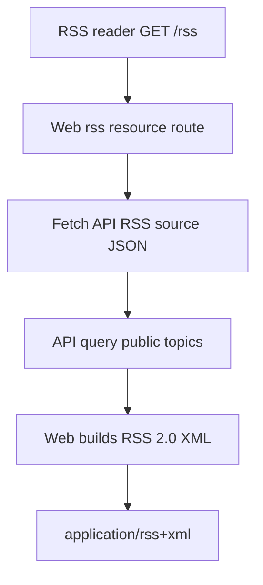

## Context

这次 change 把几个看似分散的问题合并处理：RSS 公开订阅缺失、用户管理操作区按钮墙、审计日志不可运营、后台导航顺序不符合管理员心智。它们共同暴露出同一个设计缺口：后台和公开兼容入口当前满足了“有页面/有接口”，但缺少按任务和语义组织的产品层。

现有事实：

- Web `/rss` 已存在，但只返回空 RSS channel。
- API 下存在隐藏的 `/api/v1/rss` XML 片段，但路径不等于公开 legacy `/rss`，且过滤规则只看 deleted，不符合完整 public visibility。
- `/admin/users` 操作列最多平铺 6 个按钮，治理、权限、账号安全和危险操作同级展示。
- `/admin/audit` 只展示时间、操作人、action、target、result，数据库中的 `target_type`、`target_id`、`detail` 等字段没有传给页面。
- 后台导航为“总览 / 内容 / 用户 / 系统”，但系统组包含审计、系统设置、专区和 Tab 管理，顶部导航还没有覆盖 `/admin/zones` 和 `/admin/tabs` 的系统 active matching。

## Goals / Non-Goals

**Goals:**

- 让 `/rss` 成为真实可订阅的公开 RSS 2.0 feed。
- 让后台用户管理的行操作按风险和语义组织，减少误操作和视觉噪音。
- 让审计页面能回答运营问题：谁、何时、对什么对象、做了什么、高风险在哪里、详情是什么。
- 让后台导航顺序符合运营任务：总览、内容、用户、审计、系统。

**Non-Goals:**

- 不实现 Atom、per-tab RSS 或邮件 digest。
- 不改变已有用户 block/mute/delete/reset/role API 的核心权限语义。
- 不引入新的审计日志存储模型或不可篡改日志系统。
- 不新增数据库迁移。

## Decisions

### 1. Web `/rss` 是唯一公开 RSS 地址，API 提供 RSS source JSON

公开订阅地址必须保持 legacy-compatible：`/rss`。API 负责结构化数据和 public visibility 过滤，Web 负责 RSS XML 表达。



API source JSON 应返回 RSS-ready data，而不是普通 topic list。原因是 RSS 与 `/api/v1/topics` 语义不同：RSS 按 `create_at desc` 表达新发布内容，包含 `job` 公开话题，不等同首页 `all` feed，也不应受 `top` 或 `last_reply_at` 排序影响。

替代方案：API 直接返回 XML。该方案能集中格式逻辑，但把公开 URL 推向 API 域名或要求 Web 代理 XML；当前项目已有 Web `/rss` resource route，因此由 Web 组装 XML 更符合主站 URL ownership。

### 2. RSS 使用全站公开可见话题，包含 job，排除内部和不可见内容

RSS feed 语义为“全站公开内容订阅”，不是首页版面列表。因此 `/rss` 可以包含 `job` 话题，但必须排除：

- `dev` / `test` 内部 tab。
- `topics.deleted=true`。
- `coalesce(topics.status, 'published') = 'deleted'`。
- 被 block 用户创建的话题。

排序采用 legacy RSS 的 `create_at desc`，最多 50 条。

替代方案：复用 `/api/v1/topics?tab=all&limit=50`。该方案会继承首页 `all` 排除 `job` 和 `top/lastReplyAt` 排序，不符合 RSS 作为订阅源的语义。

### 3. 用户管理操作采用“查看 + 管理菜单”的安全审计优先模型

用户列表行不再平铺所有操作。每行只展示少量稳定入口：

```text
查看  管理 ▾
```

管理菜单按风险和语义分组：

```text
用户治理
  屏蔽用户内容 / 恢复用户内容
  禁言 / 解除禁言

角色权限
  授予/撤销版主
  授予/撤销猎头

账号安全
  重置密码

危险操作
  删除所有发言
```

`block` 的 UI 文案统一为“屏蔽用户内容 / 恢复用户内容”，状态 badge 使用“内容已屏蔽”。`mute` 继续表达为“禁言 / 解除禁言”。这让管理员能区分：

| 操作 | 影响历史内容 | 影响未来发言 |
| --- | --- | --- |
| 屏蔽用户内容 | 是 | 不作为主要语义 |
| 禁言 | 否 | 是 |
| 删除所有发言 | 是，破坏性 | 否 |

替代方案：保留“隐藏/禁言”两个常用按钮，其他进更多。用户倾向安全审计优先，因此不采用。

### 4. 审计页面升级为审计中心

审计中心不再只显示原始 action 表格，而是展示可筛选、可归类、可追溯的运营事件流。

```text
审计中心
  指标卡片：高风险、内容删除、权限变更、账号安全、失败/异常
  筛选：时间、事件类型、风险、操作人、目标类型、结果、关键词
  事件流：人话标题 + 风险 badge + 操作人 + 目标 + 结果 + 时间
  展开详情：raw action、target_type、target_id、operator_id、detail JSON
```

事件分类和风险等级在应用层由 action 映射生成，不需要新增数据库字段。

示例分类：

| Category | Actions |
| --- | --- |
| 内容治理 | `top`, `untop`, `good`, `ungood`, `lock`, `unlock`, `delete_topic`, `delete_reply`, `permanent_delete_topic`, `batch_*` |
| 用户治理 | `block_user`, `unblock_user`, `mute_user`, `unmute_user`, `delete_all_user_content` |
| 角色权限 | `grant_role`, `revoke_role` |
| 账号安全 | `reset_password`, `github_bind`, `github_unbind` |
| 安全策略 | `ban_ip`, `unban_ip` |
| 举报巡检 | `report_*`, `moderation_*`, `moderation_scan_*` |
| 系统设置 | `update_settings`, `update_zone`, `update_tab` |

风险等级建议：

| Risk | Examples |
| --- | --- |
| low | `top`, `untop`, `good`, `ungood`, `update_zone`, `update_tab` |
| medium | `lock`, `unlock`, `block_user`, `unblock_user`, `mute_user`, `unmute_user` |
| high | `grant_role`, `revoke_role`, `reset_password`, `ban_ip`, `unban_ip` |
| critical | `delete_topic`, `delete_reply`, `delete_all_user_content`, `permanent_delete_topic` |

API 应返回当前筛选全集的 summary，而不是只让 Web 根据当前页计算，否则指标卡会误导。

### 5. 后台导航按运营任务重排，系统设置放最后

导航目标顺序：

```text
总览
内容
用户
审计
系统
```

侧栏分组建议：

```text
总览
  概览

内容
  话题管理
  巡检结果
  举报队列
  敏感词
  专区管理
  Tab 管理

用户
  用户管理
  封禁管理

审计
  审计日志

系统
  系统设置
```

这样系统设置自然位于最后，审计拥有独立任务入口，专区/Tab 管理被归入内容结构管理。

## Database Change Audit

- PostgreSQL schema change: 无。
- Drizzle migration: 无。
- Seed/bootstrap: 无。
- Index/constraint change: 无。
- Backfill/data repair: 无。
- Data cleanup: 无。
- Field semantics change: 无。`audit_logs.detail` 继续是 text，若内容为 JSON，UI 只做解析展示。
- Related docs/wiki: 实现完成时应同步后台运营、RSS 或业务规则文档。
- Integrity verification: RSS 查询必须验证不返回内部 tab、deleted topic、status deleted topic 和 block 作者内容。
- Rollback: 无 schema 变更，可回滚应用代码；RSS 和后台 UI 会退回旧展示。

## Risks / Trade-offs

- [Risk] 将隐藏的 `/api/v1/rss` XML 改为 JSON 可能影响未记录消费者 → 当前公开入口和页脚均为 Web `/rss`；proposal 明确 `/api/v1/rss` 不是公开 XML contract，必要时可选择新路径避免破坏。
- [Risk] RSS XML escaping 不完整导致非法 XML 或注入 → Web RSS builder 必须统一 escape text/attribute 内容，并去除 XML 非法字符。
- [Risk] 审计 detail 可能包含敏感信息 → API/UI 展示 detail 前必须避免 secrets、token、密码等敏感内容；重置密码审计不得记录新密码。
- [Risk] 用户管理菜单隐藏操作后降低效率 → 安全审计优先是本 change 的明确取舍；菜单分组用清晰标题降低查找成本。
- [Risk] 审计 summary 查询成本增加 → 第一阶段限制筛选范围和分页，必要时后续再加索引或预聚合。

## Migration Plan

1. 定义 RSS source JSON contract，替换或新增 API route。
2. 实现 Web `/rss` XML 组装和公开内容过滤验证。
3. 重构后台导航分组和 active matching。
4. 重构 `/admin/users` 操作列和菜单分组，统一 block/mute 文案。
5. 扩展 audit API 字段、筛选和 summary。
6. 将 `/admin/audit` 改造为审计中心事件流。
7. 补充测试，运行 `pnpm lint`、`pnpm typecheck`、相关测试；发布前运行 `pnpm verify`。

Rollback 策略：由于无 schema 变更，可通过应用回滚恢复旧 UI 和 RSS 行为。

## Open Questions

- RSS source API 是否复用 `/api/v1/rss` 返回 JSON，还是新增 `/api/v1/rss-source` 以避免改变现有隐藏 XML 行为？建议实现前确认。
- 审计中心第一阶段是否需要自定义日期范围，还是仅提供 today / 7d / 30d 快捷范围？
