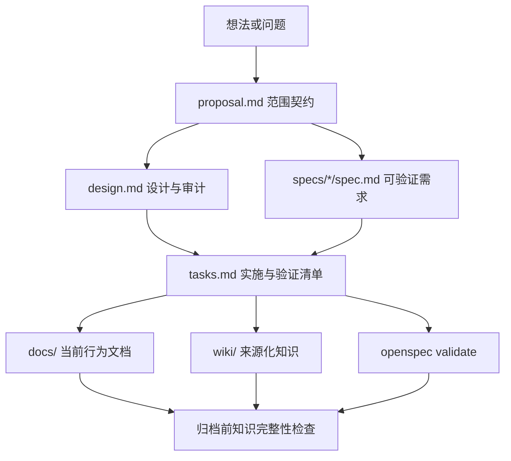
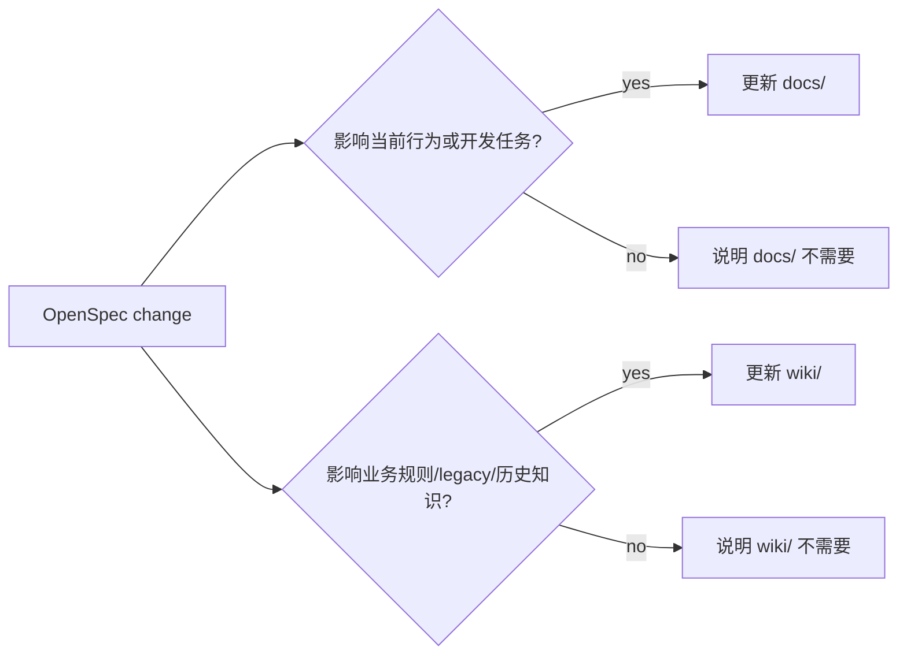
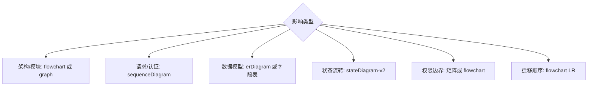
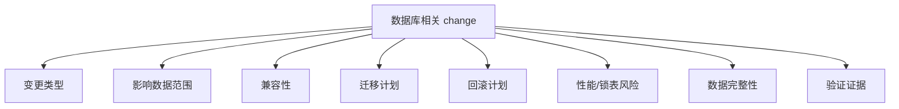

## Context

cnode-next 已经将 OpenSpec 作为行为、产品、API、迁移、发布和架构变更的入口；`openspec/config.yaml` 要求 proposal 有 Non-goals、tasks 分阶段、design 记录替代方案并使用 Mermaid 图。`docs/conventions.md` 也已经划分 `docs/`、`wiki/`、`deployment/` 和 `openspec/` 的职责。

当前缺口不是缺少文档目录，而是 change 生命周期没有强制回答三个问题：本次改造边界是什么、长期知识应沉淀到哪里、数据库类高风险变更如何审计。尤其在 PostgreSQL-only 运行时约束下，schema、migration、索引、约束和 backfill 不能只作为实现任务处理，必须在设计阶段评估兼容性、回滚、性能和数据完整性。

## Goals / Non-Goals

**Goals:**

- 让每个 OpenSpec change 在创建时明确 in-scope、out-of-scope、受影响系统和不受影响系统。
- 让 `docs/` / `wiki/` 同步成为显式影响判定，而不是模型自觉补充。
- 让涉及架构、数据、状态、权限和迁移的 design 必须包含可读图形或矩阵。
- 让数据库变更具备审计能力，覆盖影响范围、兼容性、迁移、回滚、性能、数据完整性和验证。
- 让 tasks 和归档前检查覆盖文档同步和审计证据。

**Non-Goals:**

- 不修改 OpenSpec CLI、schema 引擎或 artifact 依赖图。
- 不把所有小修正都升级为 OpenSpec change。
- 不用脚本强制解析 Markdown 内容作为第一阶段门禁。
- 不改变 `docs/` 与 `wiki/` 的现有分域：`docs/` 仍描述当前任务和运行方式，`wiki/` 仍记录来源化历史、业务规则和待确认项。

## Decisions

### Decision: 使用 Change Scope Contract 约束 proposal

每个 proposal SHALL 在现有 Why / What Changes / Non-goals / Capabilities / Impact 基础上明确改造范围。范围必须覆盖受影响区域、明确不改造区域、legacy 参考边界和高风险类别判断。高风险类别至少包括数据库、安全/权限、API 契约、迁移、部署和数据修复。

替代方案：只保留现有 Impact 段。拒绝原因：Impact 当前偏向代码包和系统清单，不能迫使创建者说明不做什么、为什么不做、哪些长期知识会变化。

### Decision: Documentation Impact 是每个 change 的必填判断

proposal SHALL 包含 `Documentation Impact`，分别列出 `docs/` 和 `wiki/` 的处理结果。处理结果可以是 `Updated`、`Not Required` 或 `Deferred`，但不得省略。需要更新时必须列出目标文件；不需要更新时必须说明原因；延后时必须指出后续任务或 change。

替代方案：在 PR template 中提醒更新文档。拒绝原因：PR 阶段太晚，容易在实现完成后补写，不能反向约束设计范围。

### Decision: 图形说明按影响类型选择 Mermaid 或矩阵

design SHALL 对跨边界、数据模型、状态流转、权限边界和迁移顺序使用图形说明。架构和数据流使用 Mermaid，权限也可以使用矩阵表格；如果判断无需图形，design 必须说明关系足够简单或只涉及单文件/单行为。

替代方案：要求所有 design 都必须有图。拒绝原因：会制造形式主义；纯文案或小范围机械变更不需要图形。

### Decision: 数据库变更必须有 Database Change Audit

凡是涉及 PostgreSQL schema、Drizzle migration、seed/bootstrap、索引、约束、数据 backfill、数据修复、字段语义或数据保留策略的 change，design MUST 包含 `Database Change Audit`。审计必须回答：变更类型、影响表/字段/历史数据、旧代码与新 schema 兼容性、新代码与旧数据兼容性、迁移是否在线安全、锁表/全表扫描风险、回滚是否丢数据、数据完整性验证和文档同步。

替代方案：只在 tasks 中写 migration 和测试。拒绝原因：tasks 只说明要做什么，不能承载迁移风险评估和发布顺序设计。

### Decision: 第一阶段不做 Markdown 校验脚本

本变更 SHALL 先通过 `openspec/config.yaml`、`docs/conventions.md`、`CONTRIBUTING.md` 和专门治理文档建立规则和模板。校验脚本作为后续可选增强，不纳入第一阶段。

替代方案：立即新增脚本检查 proposal/design/tasks 标题。拒绝原因：早期容易导致为了通过格式检查而填空话；先让规则在真实 change 中稳定，再决定哪些内容值得机器校验。

## Risks / Trade-offs

- [Risk] 治理规则过重导致小 change 成本升高 → Mitigation：明确小型文档修正、拼写修正和纯机械格式化可不走 OpenSpec；Documentation Impact 允许 `Not Required`。
- [Risk] 模型生成模板化空话 → Mitigation：要求 docs/wiki 不更新也必须说明原因，数据库审计必须列出具体表、字段、兼容性和验证方式。
- [Risk] 没有脚本门禁仍可能遗漏 → Mitigation：先把规则写入 `openspec/config.yaml` 和贡献文档；后续根据遗漏模式再添加校验脚本。
- [Risk] `wiki/` 被写入无来源推测 → Mitigation：继续遵守 `wiki/writing-guidelines.md`，不确定内容必须写入 `To Confirm`。

## Migration Plan

1. 更新 OpenSpec 规则和贡献文档，先让后续 change 创建时具备范围、文档影响、图形和数据库审计要求。
2. 新增 `docs/openspec-governance.md` 或等价治理文档，提供模板和检查清单。
3. 更新 `docs/conventions.md` 与 `CONTRIBUTING.md` 链接治理文档，并强化 PR notes 对数据库审计摘要的要求。
4. 对后续活跃的数据库/权限类 change 进行人工补充示范；已归档 change 保持历史记录不改写。

Rollback：如规则过重，可保留治理文档但降低 `openspec/config.yaml` 中 MUST 级要求；本变更不影响运行时代码和数据库。

## Open Questions

- 是否在第二阶段新增 `pnpm` 脚本检查 proposal/design/tasks 标题和数据库审计存在性？建议等 2-3 个 change 实践后再决定。
- 是否把后续活跃 change 的补充示范纳入治理流程，还是通过模板和 review 要求承接？建议先通过模板承接，避免改写已归档历史。
