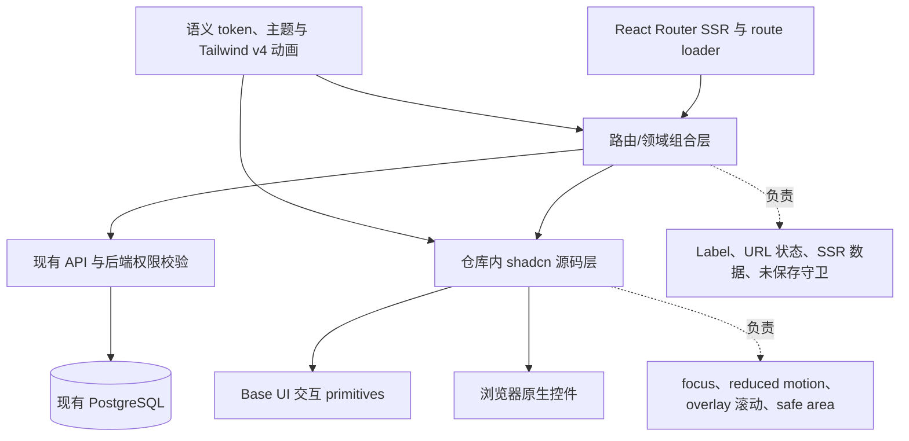
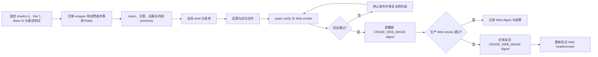

## Context

本设计说明 `proposal.md` 所述系统性 Web UI 整改的实现方式，不重复其动机。当前 `apps/web/components.json` 已把 `~/components/ui` 指向 `apps/web/app/components/ui/`，该目录中的 Button、Dialog、DropdownMenu 等是已进入仓库并经过 CNode 品牌化修改的 shadcn/ui 源码；现有交互 wrapper 以 Radix UI 为基础。本次保留源码所有权和 CNode 品牌差异，但将交互基础整体迁移到 Base UI，不把组件改为 npm 黑盒，也不以 registry 全量覆盖本地源码。

当前实现存在四类会放大逐页迁移风险的基础差异：10 个 wrapper 混用 Radix Slot、`asChild`、`data-state`、menu/overlay 契约；`global.css` 中 light/dark token 与主题基础行为尚未形成可靠契约；组件使用了 `animate-in` 等 class，但没有完整的 Tailwind CSS v4 动画支持；路由内仍混用手写 `select`、分页、确认 Dialog、焦点与状态逻辑。话题发布/编辑页需要适合公共表单的自定义选择器，后台 GET 筛选则依赖原生表单提交语义。React Router SSR 还要求首屏 HTML 与 hydration 前后的控件结构、权限入口和主题状态一致。

现有 API 已负责话题编辑和内容治理授权，数据库与审计语义也已存在。本次只改变 Web 的呈现、交互和共享组件边界，前端权限矩阵仅决定入口是否展示，不能替代后端校验。

## Goals / Non-Goals

**Goals:**

- 在迁移路由前固定语义颜色、主题、动画和共享交互基线，使后续页面只组合稳定 primitive，而不重复修复同一问题。
- 建立可审计的 shadcn registry 引入流程，保留仓库对源码及 CNode 品牌差异的所有权。
- 为公共表单、后台筛选、危险动作、分页/空状态和命令界面提供职责清晰的共享 primitive。
- 让话题动作在匿名用户、普通登录用户、作者、版主和管理员下具有确定且可测试的呈现，并保持后端为最终授权边界。
- 使每一实施阶段都可通过 Web 测试和 SSR build 验证，最终可仅切换不可变 Web 镜像发布或回滚。

**Non-Goals:**

- 不执行 shadcn 全量重生成，不覆盖全部现有组件，也不以长期兼容层同时维持两套 primitive API。
- 不重新设计 CNode 品牌、页面信息架构或全站视觉语言；只处理高影响、可复用、系统性的缺陷。
- 不改 API 契约、后端权限、审计语义、会话角色模型或内容生命周期。
- 不进行全站低优先级文案润色、图片尺寸清理、大列表虚拟化或逐像素视觉重做。
- 不借本次整改重写 Markdown 样式等无关的既有页面样式。

## Decisions

### 1. 保持 shadcn 源码所有权并迁移到 Base UI

`apps/web/app/components/ui/` 继续作为项目拥有的 shadcn 源码层。现有 Radix wrapper 按依赖顺序迁移到 Base UI：原生 Label、Button/Form composition、Avatar/Checkbox/Tabs、Dialog/Sheet、Tooltip/DropdownMenu。registry 输出是待审查的上游参考，不是可无条件覆盖本地文件的生成产物；语义 token、圆角、阴影、中文无障碍文案和 CNode 品牌 class 均属于必须保留的本地差异。

在任何 registry 操作前，先验证与 Tailwind CSS v4、React 19、React Router SSR 和 Base UI 兼容的 shadcn 4 CLI，并将 CLI、Vite 7 与 `@base-ui/react` 以精确版本写入 Web workspace 和 `pnpm-lock.yaml`。当前 legacy `new-york` 没有可直接三方合并的 `base-new-york` 对应物，因此已有 wrapper 使用转换引擎保留原 class；新增组件直接审查 Base registry 输出。之后只从 `apps/web` 通过 workspace 内已锁定的 CLI 执行，不使用未固定版本的 `pnpm dlx shadcn@latest`。

迁移不保留 `asChild` 或 Radix Slot 兼容层：Button、trigger 和链接组合改用 Base UI `render`；菜单链接使用 LinkItem，动作使用 `onClick`；Dialog/Sheet 使用 Backdrop/Viewport/Popup 并为无同树 trigger 的受控场景配置 final focus；Checkbox 明确 native button/hidden input 行为；Tabs 明确 `activateOnFocus`；所有 state selector 映射到 Base UI 属性。每个候选新增组件分别执行 `shadcn add <component> --dry-run` 和 `--diff`，若输出重新引入 Radix、覆盖品牌差异或改写无关组件，则拒绝并手工合并。禁止 `add --all` 或整体更新 `ui/`。

**拒绝的替代方案：**

- 保留 Radix 或建立长期双栈：会让新增 Base registry 组件与旧 wrapper 继续分叉，无法形成单一 composition、focus 和状态契约。
- 全量覆盖现有 shadcn 文件：会丢失已验证的品牌和行为差异，并使 review 无法按组件确认影响。
- 临时运行 latest CLI：同一提交在不同时间可能得到不同源码或依赖，无法从 lockfile 复现。
- 将 shadcn 组件改为 npm 黑盒依赖：失去源码级定制和审查能力，违背当前组件所有权模式。

### 2. 先固定语义 token 与主题，再迁移路由

第一实施阶段先校准 light/dark 下 `background`、`foreground`、`card`、`popover`、`primary`、`muted`、`accent`、`destructive`、`border`、`input`、`ring` 及其 foreground 配对。交互文字和控件边界以 WCAG AA 对比度为验收下限；品牌绿色不能仅因品牌一致性而承担低对比度正文色。组件使用语义 token，品牌 token 只用于确有品牌含义的装饰，不在路由中新增字面量颜色。

主题仍由 `root.tsx` 的同步 head script 在 hydration 前确定，客户端 theme store 在 hydration 后接管 `light`、`dark`、`system` 三态及系统主题监听。`color-scheme` 和浏览器 `theme-color` 必须与实际主题同步，但服务端首屏不得读取 `window`、`localStorage` 或 `matchMedia`。主题初始化只允许有一个持久化值来源，避免 React 首次 render 改写服务端结构。

Tailwind CSS v4 动画使用精确版本的 `tw-animate-css` CSS-first 支持，并由全局样式入口导入；overlay 动画改由 Base UI `data-open`、`data-closed`、`data-starting-style` 和 `data-ending-style` 驱动。`prefers-reduced-motion: reduce` 下，共享层关闭非必要 transform/transition、取消平滑滚动，并保留即时状态变化。不会引入 Tailwind v3 plugin 配置作为兼容旁路。

**拒绝的替代方案：**

- 先逐路由替换控件、最后修 token：同一组件会在主题修复后再次返工，且中间状态无法可靠做视觉回归。
- 在各组件内复制 light/dark 字面量：增加主题分叉，无法统一校准对比度。
- 为每个动画手写 keyframes：会重复 registry 组件已采用的状态 class 契约，维护成本更高。
- 在 render 阶段读取浏览器主题：会造成 SSR 与客户端首帧不一致及 hydration 风险。

### 3. 按依赖与使用场景分四批引入 primitive

现有 wrapper 必须先按 Button/Form → Avatar/Checkbox/Tabs → Dialog/Sheet → Tooltip/DropdownMenu 的顺序迁移并清理 Radix 直接依赖，再按下列顺序引入新增组件。每个组件仍单独执行 dry-run/diff，每一批完成源码审查、类型检查和交互测试后才进入下一批：

1. `Select` + `NativeSelect` + `Textarea`：先形成表单控件基线，并验证 Label、错误态、disabled、focus 和密度。
2. `AlertDialog` + `Alert`：建立阻断式危险确认和非阻断说明/错误状态的不同语义。
3. `Pagination` + `Empty`：统一导航语义和空结果表达。`ui/pagination.tsx` 只负责可访问的分页外观；现有领域 `components/Pagination.tsx` 可继续负责根据 `basePath`、page 和筛选参数生成 React Router URL，再组合 UI primitive，避免路由重复 URL 算法。
4. `Command` + `RadioGroup`：最后迁移 CommandPalette 的键盘交互，并统一互斥选择组。Command 必须支持方向键、Enter、Escape、焦点归还和无结果状态；RadioGroup 必须有可感知组名和选项标签。

共享 primitive 统一拥有以下默认行为：一致的 `focus-visible` ring；disabled/pending 的不可重复触发；reduced-motion 降级；Base UI Dialog、AlertDialog、Sheet、Menu 和 Command overlay 的 Backdrop/Viewport/Positioner/Popup、背景滚动锁定、可滚动内容上限和焦点归还；使用 `100dvh` 与 `env(safe-area-inset-*)` 避免移动端内容或操作区被遮挡。具体 route 不得通过删掉 outline、关闭 focus trap 或自行复制 fixed overlay 来覆盖这些默认值。

**拒绝的替代方案：**

- 一次加入全部组件：依赖与源码 diff 混在一起，难以定位 token、动画或交互回归。
- 让 Pagination primitive 同时读取所有业务 URL：会把列表筛选协议耦合进原子组件。
- 继续使用通用 Dialog 表达所有破坏性确认：缺少 AlertDialog 的阻断语义，且容易让取消、焦点和提交中关闭行为不一致。
- 将 safe-area 和 overlay 修复留给各页面：会在公共和后台 shell 中持续产生不同实现。

### 4. Select 与 NativeSelect 按交互语义分工

公共话题创建和编辑的分类字段使用 shadcn `Select`。该场景选项少但属于主要创作流程，需要一致的品牌弹层、键盘操作、禁用招聘选项说明及表单错误关联。Select 的 trigger 通过 FormControl 与 Label、description、error id 关联，路由负责把选中值写入表单状态和提交 payload。

后台 GET 筛选、审计筛选及其他高密度简单筛选使用 `NativeSelect`。原生 `name`、`defaultValue` 和 FormData 行为更适合无 JavaScript 也可表达的 GET form，并可让 URL 保持唯一筛选来源。loader 从 URL 解析并校验值，提交筛选时重置 page，分页继续保留其余 query 参数。NativeSelect 还用于后台表格内需要紧凑密度的简单枚举；不为这类场景引入 portal 和额外客户端状态。

路由/领域层拥有 Label 文案与 `htmlFor`/id 关联、autocomplete、字段说明和错误、URL 参数、loader 数据、受控值、提交 pending 以及未保存编辑守卫。创建/编辑页依据 dirty state 使用 React Router 导航阻断和浏览器离页提示；成功提交或显式放弃后解除守卫。所有浏览器 API 只在客户端 effect/事件中访问，SSR 首次 render 使用 loader 和确定性默认值。

**拒绝的替代方案：**

- 全站只用 Select：后台 GET form 会增加不必要的 hydration、portal 和状态同步复杂度。
- 全站只用原生 select：公共创作表单无法获得一致的弹层、错误和品牌交互。
- 由 primitive 自动生成业务 Label 或 URL：会把领域文案和路由协议错误地下沉到共享层。
- 用客户端 store 保存后台筛选：刷新、分享链接和返回导航时会丢失可追踪状态。

### 5. 话题动作按身份与风险分层

动作区始终优先展示主互动“收藏/取消收藏”和页内导航“查看回复”。普通用户动作与治理动作分开；所有治理动作收进单一“管理”菜单。作者对自己话题的“编辑话题”保持直接可见。管理员编辑他人话题放入“管理”菜单，避免与作者入口重复。版主不能仅凭版主身份编辑他人话题。角色可叠加：管理员或版主同时是作者时，保留作者的直接编辑入口，并额外展示其治理菜单。

| 身份/关系 | 直接操作 | 次级区域 | “管理”菜单 |
| --- | --- | --- | --- |
| 匿名用户 | 查看回复；收藏入口引导登录 | 无举报 | 不展示 |
| 普通登录用户，非作者 | 收藏/取消收藏、查看回复 | 举报话题 | 不展示 |
| 作者，无治理角色 | 收藏/取消收藏、查看回复、编辑话题 | 不提供举报自己的话题 | 不展示 |
| 版主，非作者 | 收藏/取消收藏、查看回复 | 举报不作为治理入口 | 置顶/取消置顶、高亮/取消高亮、删除帖子 |
| 版主，同时为作者 | 收藏/取消收藏、查看回复、编辑话题 | 无 | 置顶/取消置顶、高亮/取消高亮、删除帖子 |
| 管理员，非作者 | 收藏/取消收藏、查看回复 | 无 | 编辑话题、置顶/取消置顶、高亮/取消高亮、删除帖子 |
| 管理员，同时为作者 | 收藏/取消收藏、查看回复、编辑话题 | 无 | 置顶/取消置顶、高亮/取消高亮、删除帖子 |

“普通登录用户”在此指没有作者关系且没有治理能力的登录用户；身份组合按能力并集呈现，不通过互斥的角色优先级丢失作者入口。前端基于 SSR session/loader 已提供的 admin、moderator 与作者关系得到同一首屏结果，但每个 mutation 仍由现有 API 再次授权。

删除帖子必须使用 `AlertDialog`，标题、目标话题和后果均明确为“删除帖子”，确认按钮使用 destructive variant。请求 pending 时禁止重复提交和关闭确认框，成功后按现有路由语义 revalidate 或导航，失败保留上下文并通过可感知反馈说明原因。置顶和高亮是可逆治理动作，不强制二次确认，但必须有 pending、成功/失败反馈。后台物理删除、任务级批量删除、用户 block/mute 及其他高风险动作继续按实际后果使用明确目标和影响说明；物理删除不得与软删除共用模糊文案。

**拒绝的替代方案：**

- 将编辑、置顶、高亮、删除继续平铺：高频互动和低频治理同权重，移动端也容易误触。
- 把作者编辑藏入管理菜单：降低核心内容维护动作的可发现性，并误把作者能力表现成治理能力。
- 向版主展示编辑他人话题：扩大既有权限边界。
- 仅用 toast 或浏览器 `confirm()` 确认删除：无法稳定表达目标、后果、焦点和 pending 状态。
- 依赖隐藏按钮实现授权：客户端呈现不是安全边界，直接请求仍必须由 API 拒绝。

### 6. 共享层与路由层保持明确所有权

共享层只实现跨页面不应变化的机制：token 消费、控件状态样式、focus-visible、键盘基础交互、reduced motion、overlay scroll lock、safe-area、Alert/Empty 语义和 live region 基础。公共与后台 shell 组合 skip link、main landmark、heading 层级、active navigation 和移动安全间距。

路由层保留会随业务变化的责任：字段 Label 与校验关系、URL-backed tabs/filters、loader 数据、权限与对象关系、mutation/revalidate、hydration-safe 默认值，以及编辑器 dirty state 和未保存离开守卫。CommandPalette 的命令集合与导航目标也属于领域层，`Command` primitive 只提供交互模型。

**拒绝的替代方案：**

- 创建一个知道所有 route、角色和表单的全局 UI store：会复制 React Router URL/loader 状态，并增加 SSR 同步源。
- 让每个 route 自行决定 focus、motion 和 overlay 规则：相同行为会再次漂移。
- 把权限矩阵写进纯视觉 primitive：primitive 无法获得完整领域关系，也不应成为授权层。

## Risks / Trade-offs

- [语义 token 调整会影响全站而非单一路由] → 先建立 light/dark token 对照和代表性 surface 快照，再迁移 route；禁止在 route 用字面量颜色规避问题。
- [legacy `new-york` 没有 Base 对应模板] → 已有 wrapper 使用转换引擎保留原 class；新增组件审查明确的 Base registry 输出，不以切换 preset 为由重做视觉。
- [Base UI composition 和状态属性改变消费者 API] → 迁移前建立行为基线，逐 wrapper 迁移 `asChild`、menu events、positioning 和 state selector，并在每批后 typecheck/test/build。
- [受控 overlay 没有同树 trigger 时焦点无法自动归还] → 为 CommandPalette、治理确认和受控 Sheet 保留触发 ref 或配置 final focus，pending 关闭使用 event details 取消。
- [Checkbox hidden input 或 Tabs 默认激活方式改变表单/键盘行为] → 明确 wrapper DOM 与 `activateOnFocus` 决策，并用表单提交和方向键测试锁定。
- [固定 CLI 后仍可能与 registry 当前输出不同] → lockfile 作为可复现依据，每个组件执行 dry-run/diff 审查并将稳定结论同步到 conventions，不为追随最新模板而升级；临时 `.migration/` 产物在归档前删除。
- [品牌化合并可能遗漏上游无障碍属性] → review 时分别核对结构/ARIA/键盘行为与视觉 class，测试不得只比较截图。
- [Select portal 在 SSR、移动键盘或 overlay 中出现定位问题] → 服务端保持确定 trigger 结构，portal 仅在客户端工作；覆盖窄屏、缩放、Dialog 内使用和 safe-area 测试。
- [NativeSelect 与 Select 外观不可能完全一致] → 统一 token、控件高度、Label、错误和 focus 契约，接受原生下拉菜单由平台渲染以换取 GET/移动端可靠性。
- [权限入口隐藏与后端能力短暂不一致] → 权限测试覆盖每个矩阵行；API 仍是最终授权边界，403 必须转为可感知失败反馈。
- [未保存守卫可能阻止成功提交后的导航] → 成功 mutation 先清理 dirty/解除 blocker 再导航；分别测试站内导航、刷新、关闭标签页与取消离开。
- [reduced-motion 全局规则过强会隐藏必要反馈] → 仅移除非必要时长和位移，保留即时的 open/closed、pending、错误和 focus 状态。
- [分批实现会短期保留新旧控件并存] → 批次以共享契约和目标 route 清单为完成边界，不新增第三种临时控件；每批通过验证后再继续。
- [只回滚 Web 可能恢复旧 UI 缺陷] → 这是可接受的短期退化；记录旧 Web digest，并保持 API/DB 未变以确保回滚兼容。

## Migration Plan

实施和发布按“基础先于消费方”排序，每阶段只扩展 Web，且必须保持可构建状态：

1. **Toolchain/baseline**：固定 shadcn 4、Vite 7 和 Base UI 精确版本；建立现有 composition、菜单、overlay、Checkbox、Tabs 与 SSR 行为测试。
2. **Base migration**：按依赖顺序迁移全部 wrapper 和消费者，执行逐组件迁移审查并把稳定结论同步到 conventions，移除临时报告及 Web 直接 Radix 依赖/import/Slot/失效状态属性。
3. **Foundations/primitives**：修正 token、主题、Tailwind CSS v4 动画和 reduced motion；逐项审查 Base registry，并按四批引入品牌化组件。
4. **Global shell/forms**：修公共/后台 shell、CommandPalette、公共创建/编辑表单与后台 NativeSelect GET 筛选；URL 继续作为 tabs/filter 真相来源，浏览器状态只在客户端接管。
5. **Topic/admin actions**：按权限矩阵重组话题动作，用 AlertDialog 处理 destructive 确认，并迁移后台高风险和批量治理确认，不改变 API endpoint 或审计含义。
6. **Verification**：执行迁移等价性、组件和 route 测试、权限矩阵、键盘、focus、移动端 safe-area、light/dark、reduced-motion、SSR/hydration 和未保存守卫检查；随后运行 `pnpm verify`，确认 Web 无直接 Radix 残留并完成 smoke。

发布前记录当前 Web image SHA tag/digest。由于本 change 不含 API 或数据库变更，生产切换只更新 `CNODE_WEB_IMAGE`；API、worker 和 PostgreSQL 保持原版本。若 Web health、SSR、hydration、关键表单或权限 smoke 失败，恢复上一次成功的 Web image digest 并重新验证，不执行 API 回滚或数据库回滚。不得使用 `latest` 解析回滚目标。

## Database Change Audit

本 change **没有数据库变更**：不修改 PostgreSQL schema、Drizzle schema 或 migration，不新增/修改表、列、索引、约束、seed/bootstrap、backfill、数据修复、数据清理、保留策略或字段语义，也不执行 MongoDB 到 PostgreSQL 迁移步骤。UI 的权限呈现、筛选控件和确认流程继续消费现有 API 与数据字段，不产生新的持久化状态。因此发布不需要 `db:push:pg`、`db:migrate`、数据备份恢复或数据库回滚；发生问题时仅回滚 Web 镜像。
