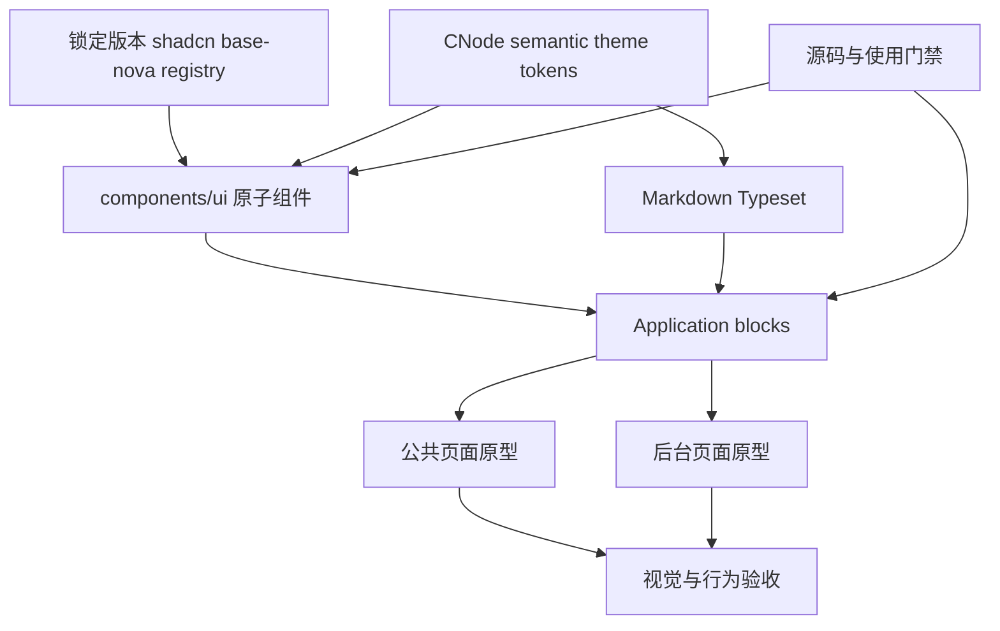
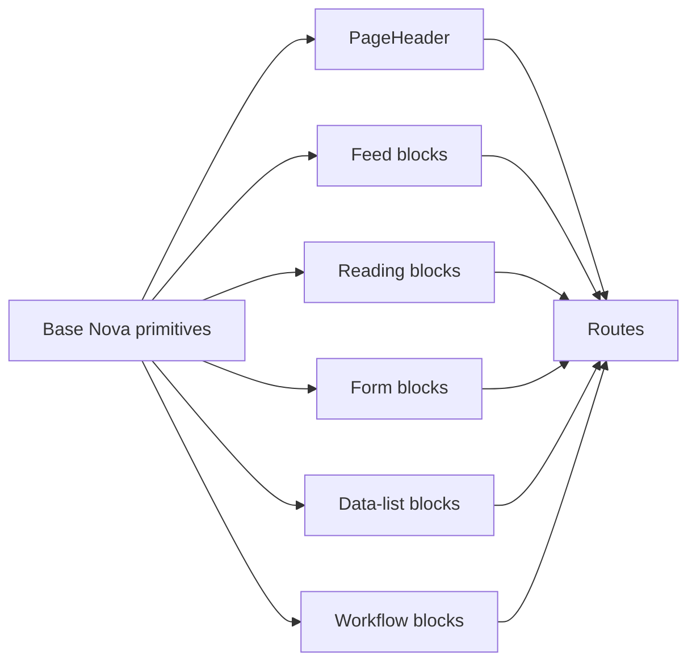
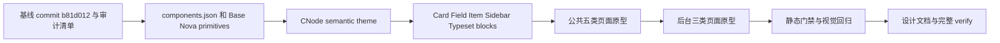

## Context

`harden-web-ui-system` 已把 Web 交互 primitive 从 Radix 迁移到 Base UI，但迁移保留了 legacy `new-york` class，并在 primitive 与 route 中继续使用 `cnode-*`、`surface-*`、自定义 shadow、Card padding 和控件尺寸覆盖。当前 `apps/web/components.json` 的 `style` 仍是 `new-york`，shadcn CLI 将项目识别为 Radix；与此同时 `apps/web/package.json` 和 UI wrapper 已使用 `@base-ui/react`。因此 registry、运行时行为和视觉源码没有共同基线。

页面层已出现可量化漂移：大量 primitive 调用通过 `className` 改变 padding/height/radius/color；Card 仍是旧 API，没有当前 Base Nova 的 `size`、`CardAction` 和 `--card-spacing`；公共页面重复手写品牌 Hero，后台重复维护 AdminPanel/Toolbar/Table spacing；表单仍混用 legacy Form、裸 Label 和 `space-y-*`。Markdown pipeline 已复用 `MarkdownView`，但 Tailwind reset 移除了 list marker，现有 `.markdown-body` 只恢复缩进且没有稳定的内容 rhythm。

线上 `../nodeclub/` 与 `egg-cnode/` 只提供 CNode 内容、动作和信息层级参考。本 change 不复刻 EJS 的视觉实现，不改变业务流程。实施前的可回滚代码基线为 commit `b81d012`。



## Goals / Non-Goals

**Goals:**

- 让 `components.json`、registry diff、运行时 primitive 和文档都以 `base-nova` 为唯一真相来源。
- 保持 Base Nova primitive 源码和视觉 API，不以 CNode 名义修改 atom；CNode 品牌只通过 semantic theme tokens 生效。
- 建立有限、命名、可响应的公共/后台 application blocks 和页面原型，消除 route 自行决定 Card、padding、size、radius 和 color。
- 使用 shadcn Typeset 统一 Markdown 正文与编辑预览，修复完整列表、代码、表格和长内容呈现。
- 用静态门禁、行为测试、浏览器 viewport/theme 验收和稳定文档防止未来漂移。

**Non-Goals:**

- 不修改 API、权限、内容生命周期、PostgreSQL、Redis、OSS、邮件或部署拓扑。
- 不恢复 legacy EJS 样式，也不保持迁移前 `new-york` primitive 的逐像素兼容。
- 不为填充 dashboard 新增虚假指标或无数据来源 chart。
- 不把所有重复 JSX 都抽象成组件；仅提取具有稳定 composition 和至少两个消费者的 application block。

## Decisions

### 1. 以 `base-nova` 重新建立 registry 基线

`apps/web/components.json` 的 style 将迁移为 `base-nova`，并继续锁定 shadcn CLI 与 `@base-ui/react` 精确版本。先在隔离目录获取同版本 Base Nova 输出并记录完整文件清单，再按 primitive 逐个执行 dry-run/diff 和替换；不在同一 diff 中同时迁移调用方。Base UI `render`、overlay focus、safe-area 和 SSR 行为以当前 registry API 为准，不保留 Radix compatibility。

原子组件允许的仓库差异仅限生成环境所需的 alias、React Router composition 适配和经验证的 bug fix。若确需偏离上游，必须以独立补丁记录原因、上游 issue、测试和预计移除条件；品牌视觉不构成偏离理由。

**拒绝的替代方案：**

- 继续使用 `new-york` config 配合手工 Base wrapper：CLI 永远提供错误 registry 基线，下一次更新会再次漂移。
- 在当前 primitive 上逐项“调成像 Nova”：无法证明完整性，也会遗漏新 API 和状态 selector。
- `add --all --overwrite`：diff 无法审查，可能覆盖 alias、行为修复并同时改动大量消费者。

### 2. CNode 只扩展 semantic theme，不暴露 raw palette utilities

主题分三层，但 route 只能消费 semantic roles：

| 层                      | 内容                                          | 消费边界                  |
| ----------------------- | --------------------------------------------- | ------------------------- |
| Brand source            | CNode green/ink 的 light/dark 色值            | 仅 theme 定义内部使用     |
| Standard roles          | core、sidebar、chart tokens                   | primitive、blocks、routes |
| Exceptional brand roles | Logo/marketing 无法由标准角色表达的少量 token | 指定品牌 block            |

`primary` 表达主操作与选中重点，`accent` 表达 hover/selected surface，`secondary` 表达次级状态，`muted` 表达弱层级，`foreground` 表达正文，`sidebar-*` 表达后台导航，`chart-*` 表达真实数据系列。删除 `@theme` 暴露的 `--color-cnode-*` 和通用 `surface-*` utilities；迁移时按用途分类，不进行字符串一对一替换。

Base Nova primitive 不增加 CNode class。主题校准覆盖 light/dark 文本、边界、focus、destructive、sidebar 和 chart 对比度；品牌绿色不能承担低对比正文。

用户提供的 Base theme 片段作为 token inventory 和明暗关系参考，而不是最终色值表。它确认本 change 必须完整提供 core、`chart-1` 至 `chart-5`、`radius` 和 `sidebar-*` roles，并可参考 dark theme 使用 alpha border/input 的层次策略。最终取值遵循以下映射：

| Token group                  | 参考方式                             | CNode 处理                                               |
| ---------------------------- | ------------------------------------ | -------------------------------------------------------- |
| background/card/popover      | 保留 Base 的层级和 foreground 配对   | 可做极轻品牌色温调整，但不降低正文对比度                 |
| secondary/muted/border/input | 保留中性弱层级与 dark alpha 边界策略 | 不直接染成高饱和绿色                                     |
| primary/accent/ring          | 保留交互角色                         | 映射到 CNode green family 并校验 foreground/focus 对比度 |
| destructive                  | 保留标准危险语义                     | 使用 Base 可访问 red，不品牌化                           |
| chart-1..5                   | 保留标准 token 和系列用途            | 建立可区分的 CNode 协调色，不复制单色灰阶                |
| sidebar-*                    | 保留独立 navigation roles            | 移除示例中的无关蓝色，映射 CNode navigation theme        |
| radius                       | 采用锁定 Base Nova preset 默认值     | 不因旧页面或单独示例的 `0.45rem` 另建覆盖                |

theme 值统一使用 OKLCH，便于在保持 lightness/contrast 的同时调整 CNode 色相和 chroma。最终值必须通过对比度和四 viewport 视觉矩阵确认后锁定，不能由 route 通过 Tailwind class补偿。

**拒绝的替代方案：**

- 保留 `bg-cnode-soft` 作为万能品牌背景：同一颜色继续混合 selected、muted、info 和 decoration 语义。
- 在 route 使用 CSS arbitrary value：绕过 theme，无法统一 dark mode 和对比度。
- 为每个页面增加专属 token：把 Tailwind 漂移转移成 token 漂移。
- 原样复制用户提供的中性示例：会把 primary 变成灰阶、dark sidebar-primary 变成无关蓝色，并使 chart 系列缺少 CNode 语义。

### 3. Primitive 与 application block 分层

`components/ui/` 只保存 Base Nova primitive。CNode 应用层可以存在 `PageHeader`、`TopicFeed`、`ReadingShell`、`FormShell`、`DataListShell`、`FilterToolbar` 和 `WorkflowRecord` 等 blocks，但只能组合 primitive，不复制其内部样式或创建替代 variant。



Card 使用当前标准 anatomy：Header 包含 Title、Description、Action，Content 与 Footer 使用 `--card-spacing`；紧凑场景使用 `size="sm"`。列表优先使用 Item，比较型数据使用 Table/Data Table，状态使用 Badge，反馈使用 Alert/Toast，空结果使用 Empty，分组选项使用 FieldSet/Toggle Group。className 在消费者侧仅允许布局、响应式显隐、宽度和上游公开 CSS variables。

**拒绝的替代方案：**

- 禁止所有 application block：route 会复制相同 composition，漂移仍会发生。
- 建立大型 CNode UI wrapper 库：会形成第二套 primitive API，并隐藏 shadcn composition。
- 为所有一次性 JSX 建组件：增加命名和抽象成本，不改善一致性。

### 4. 页面按八个原型迁移

| 原型      | 代表页面                                    | 标准结构                                                   |
| --------- | ------------------------------------------- | ---------------------------------------------------------- |
| feed      | `/`、search、collections                    | PageHeader/filters + feed + optional sidebar               |
| reading   | topic detail                                | optional TOC + readable content + context rail + replies   |
| compose   | create/edit topic/reply                     | PageHeader + FieldGroup + editor + action footer           |
| account   | signin/signup/setting                       | account shell + FieldGroup + helper navigation             |
| directory | users/jobs/resources                        | PageHeader + filters + responsive Item/Card grid           |
| dashboard | `/admin`                                    | simple page header + grouped summaries + real charts/lists |
| data-list | admin users/topics/tabs/zones/keywords/bans | filters + toolbar + Table/Item + pagination                |
| workflow  | moderation/reports/audit                    | queue summary + filters + actionable records               |

后台保留已建立的全宽 Header 与容器内 desktop navigation Card，移动端使用 Base Nova Sheet；两者共享同一 navigation model。该结构避免全高 inset Sidebar 改变既有后台信息骨架。Desktop navigation Card 与右侧完整 PageHeader 使用同一顶部基线，不在左栏增加一层仅用于模拟 breadcrumb 高度的标签。Admin page header 使用 breadcrumb 加紧凑品牌 surface，与公共 Hero 共享颜色和 anatomy，但不使用营销尺度。Topic reading header 留在内容 Card 内，以保持 padding 的 Separator 分隔标题和 metadata。Chart 只用于已有真实时间序列；否则保持摘要和列表，不用装饰数据。

窄屏 data-list 先判断任务是否需要跨列比较。需要比较时保留单一可滚动 Table；适合逐条操作时使用响应式 Item/record。不得维护具有不同操作和状态逻辑的桌面、移动双份 DOM。

除首页 feed 明确保留的简洁上一页/下一页模式外，可分页公共列表与后台列表统一使用共享 numbered pagination：上一页、最多五个连续页码、必要的首末页与省略号、下一页。分页链接必须保留当前筛选 query，不允许 route 自行拼装另一套分页 markup。首页右侧 rail 将实时社区信息按“最新回复、积分榜、无人回复话题”排序；Hero 已承担社区定位说明，因此 rail 首卡改为指向 About 合作说明的真实社区合作展示位，不伪造投放内容或联系方式。未在导航中露出的 `/app/download` 仅重定向到第三方历史客户端，删除独立 route，并将项目链接与非官方维护说明合并到 About。

**拒绝的替代方案：**

- 逐 route 自由重做：没有原型契约，无法完成全局验收。
- 所有后台表格转换为卡片：损失高密度比较能力并复制 markup。
- 所有后台页面只横向滚动：小屏关键状态与操作不可发现。

### 5. 表单迁移到 Base Nova Field family

保留 React Hook Form 与共享 Zod schema，但视觉/语义 composition 迁移为当前 Field family。FieldGroup 拥有字段节奏，Field 拥有 orientation 和 invalid state，control 使用自身标准 size；页面不使用 `space-y-*` 或给 Input/Button 写高度。选项组使用 FieldSet/FieldLegend，输入附加按钮使用 InputGroup，2 至 7 个显示选项使用 ToggleGroup。

迁移顺序按 account、compose、setting、admin filters/forms，先建立一个代表性表单基线再扩散。GET filters 继续保留 NativeSelect 与 URL state，不因视觉统一改变表单提交语义。

**拒绝的替代方案：**

- 保留 legacy `FormItem` 并只调 gap：无法使用当前 Field 的 responsive orientation、FieldSet 和统一 invalid contract。
- 所有字段切换为客户端 Select：会破坏后台 GET form 和原生移动选择体验。

### 6. 全部 MarkdownView 使用上游 Typeset 与单一 preset

从 `https://ui.shadcn.com/typeset.css` 下载当前上游 stylesheet，保存为 `apps/web/app/styles/typeset.css` 并在 Tailwind import 后导入；该文件作为锁定上游副本，不进行项目级 selector 修改。安装并导入 `@fontsource-variable/roboto`，在主 CSS 定义 `--font-roboto: 'Roboto Variable', sans-serif`，再按用户确认的值定义唯一 preset：

```css
.typeset-docs {
  --typeset-font-body: var(--font-roboto);
  --typeset-font-heading: var(--font-roboto);
  --typeset-font-mono: var(--font-roboto);
  --typeset-size: 14px;
  --typeset-leading: 1.75;
  --typeset-flow: 1.25em;
}
```

代码调查确认 Markdown/rich-content 候选只有 `MarkdownView`：它使用 `react-markdown`，同时被话题正文、回复和 `MarkdownEditor` 预览消费。Swagger UI 与 About 静态 JSX 不属于 Markdown surface。全部 `MarkdownView` 根容器统一使用 `typeset typeset-docs`；不为 topic/reply 建立不同 rhythm，也不在 route 追加 typography。现有 `global.css` 中 `.markdown-body` element styles 和与 Typeset 冲突的 typography/highlight surface 规则在确认覆盖关系后删除；语法高亮 token 只保留 Typeset 未提供的最小部分。嵌入式交互组件使用 `not-typeset` 或 `data-not-typeset` 隔离。

验收 fixture 固定覆盖 unordered、ordered、nested、mixed、task、loose list，列表内 paragraph/blockquote/code、GFM table、长 URL、CJK/英文混排、heading、image 和 syntax highlight。宽表/代码只能在自身容器滚动。编辑器 preview 与发布后使用相同容器宽度时必须一致；split 只在内容宽度足够时提供，375px 与 768px 使用 edit/preview 切换。

**拒绝的替代方案：**

- 只给 `ul` 增加 `list-disc`：能修 marker，但不能锁定完整 Markdown rhythm 和复杂列表。
- 修改上游 `typeset.css`：会失去可替换的上游基线，项目差异应只通过 `.typeset-docs` variables 表达。
- 为 topic 与 reply 建不同 preset：增加不必要的正文分叉，并使编辑器难以保证最终呈现一致。
- 继续维护单文件手写 `.markdown-body`：每种 element 和 context 都会再次独立漂移。
- 编辑器预览使用独立紧凑 CSS：发布前后仍不一致。

### 7. 自动门禁与视觉证据共同验收

静态检查负责检测错误基线、primitive 中的 `cnode-*`、route raw color、`space-y-*`、primitive 视觉 class 覆写和手写已有语义组件。由于 class 用途存在上下文，检查器提供可审查的窄白名单，不以不可维护的全局 regex 自动改写。

Vitest/DOM 测试继续验证 ARIA、keyboard、state、SSR 和 mutation 行为。Playwright MCP 浏览器视觉验收覆盖八个页面原型在 375、768、1280、1440 viewport 下的 light/dark 代表页面；使用 seed 数据、固定时间并关闭动画后生成截图与审计记录。baseline 只能随明确设计决策更新。

**拒绝的替代方案：**

- 仅依赖规范和人工 hot reload：无法阻止未来无意漂移。
- 只使用 screenshot：无法验证焦点、语义、权限和 mutation 行为。
- 为每条 route 建截图：维护成本过高，页面原型覆盖能提供更稳定的风险采样。

## Risks / Trade-offs

- [Base Nova 重置会产生全站视觉变化] → 先提交当前 `b81d012` 基线，按 primitive、theme、block、route 分阶段提交，每阶段生成代表性截图。
- [当前 Base wrapper 含有已验证的 focus/safe-area 修复] → 对照 registry API 和现有行为测试逐项确认；确需保留的行为补丁单独记录，不将品牌 class 一并保留。
- [CNode raw token 迁移不能机械替换] → 按 selected、muted、info、navigation、marketing 用途清单分类，并逐原型验收 light/dark。
- [Card 和 Field API 更新影响大量调用方] → 先建立 compiler-safe adapter-free target，按 archetype 迁移，完成一个原型后才处理下一类。
- [视觉测试受动态数据影响] → 使用稳定 fixture、冻结时间、关闭动画并屏蔽不可稳定区域。
- [视觉门禁可能对合法 layout class 误报] → 白名单仅允许 layout categories，例外必须带理由和 owner review。
- [后台移动端 Table/Item 选择可能增加设计工作] → 以操作任务和跨列比较需求决策，不要求所有页面采用同一种呈现。
- [Typeset 上游仍是项目拥有 CSS] → 锁定来源版本并仅通过 preset variables 调 rhythm，不在 route 增加 element selector。

## Migration Plan



1. 记录当前 primitive/consumer inventory、截图和 `b81d012` 回滚点。
2. 迁移 `components.json`，逐个对齐 Base Nova primitive，保持每批可 typecheck/test/build。
3. 建立 core/sidebar/chart CNode semantic theme，移除 raw palette utility 暴露并完成对比度审计。
4. 引入 Field、Item、Sidebar、Typeset 等必要标准组件，建立 application blocks 和治理检查。
5. 按 public 五类、admin 三类页面原型迁移 consumers；每类完成后执行四 viewport、light/dark 验收。
6. 完成 Markdown fixture、行为测试和视觉 baseline，更新稳定设计文档并运行 `pnpm verify`。

每阶段使用独立提交。若 primitive 或 theme 阶段出现无法局部修复的系统回归，恢复到该阶段前提交；需要整体撤销时回退到 `b81d012`。本 change 不修改 API 或数据库，Web 回滚不需要数据库操作。

## Open Questions

- Base Nova registry 与当前 React Router `render` composition 若存在上游缺口，是否以最小本地补丁保留，需在逐 primitive diff 时记录并决定。

## Database Change Audit

本 change 不修改 PostgreSQL schema、Drizzle migration、seed、索引、约束、数据、字段语义或保留策略，也不读取或迁移 `../nodeclub/` MongoDB 数据。发布和回滚均为 Web 源码与静态资源变更，不需要数据库备份、migration 或 data repair。
