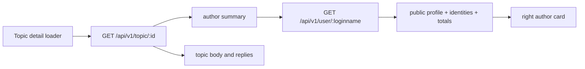
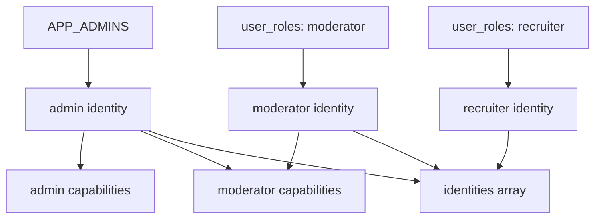

## Context

参见 `proposal.md` 的动机。当前 Web 同时注册 `/about`、`/faq`、`/getstart`、`/help` 与 legacy `/:name`，导航和 Footer 又重复暴露这些入口。用户详情 API 已读取包含公开资料与计数的 `users` 记录，但 `userDetailSchema` 未暴露 `location`、`url`、`signature` 或公开身份；话题 DTO 的共享 `authorSchema` 则有意保持为 `loginname + avatar_url`。

管理员身份由 `APP_ADMINS` 判定，`moderator` 和 `recruiter` 已由 `user_roles` 支持多角色；代码仍有两处读取未出现在环境模板和部署配置中的 `APP_MODERATORS`。用户详情 Hero 将三个治理操作平铺为高视觉权重按钮，话题右侧作者卡则只显示固定“CNode 社区成员”文案。

## Goals / Non-Goals

**Goals:**

- 让 `/about` 成为唯一社区介绍与参与指引页面，并同步所有站内入口。
- 保持 `topic.author` 轻量，通过页面级查询为话题作者卡获取公开资料。
- 为用户详情和作者卡提供一致、可多选且不由权限继承误推导的公开身份。
- 将公开资料、社区统计和治理操作分成明确视觉层级。
- 在不改变数据库的前提下完成 API contract、SSR 页面和导航调整。

**Non-Goals:**

- 不保留 `/help`、`/faq`、`/getstart` 或 `/:name` 的重定向兼容。
- 不删除或迁移 `weibo` 数据库列，不改变个人资料编辑表单。
- 不将最近创建、最近参与或最新回复放入话题作者卡。
- 不增加新的角色 key，不改变管理员、版主、猎头已有能力范围。
- 不扩展列表、回复和消息共用的 `authorSchema`。

## Decisions

### Decision: `/about` 是唯一社区说明入口

删除三个独立内容页、`/help` 聚合页和对应路由，将内容按“社区介绍 → 参与指南 → 讨论规范 → 常见问题”重写到 `/about`。页内使用 `#guide`、`#discussion`、`#faq` 稳定锚点；Header、移动端、CommandPalette、Footer 和话题讨论提示只引用 `/about` 或这些锚点。

替代方案是保留旧路径并重定向。该方案仍维护无产品价值的 URL 兼容层，与用户明确接受低频旧链接失效的边界冲突，因此不采用。`/api` 继续独立，因为 Swagger UI 与社区说明内容的任务和体量不同。

### Decision: 删除一级用户名猜测路由

删除 `route(":name", ...)` 与 legacy redirect 文件，用户主页只接受 `/user/:name`。这样未知一级路径进入标准 not-found，不再依靠 reserved slug 白名单区分页面与用户名。

替代方案是继续维护 reserved 集合。该集合会随每个一级页面变化而增长，并可能把拼错的页面路径解释成用户，故不采用。

### Decision: Footer 只保留互补且不重复的入口

Footer 左侧 CTA 使用“发布话题 / 了解社区”。右侧社区分组为关于、发布话题、用户排行、精华话题；资源为 API、RSS；开发者仅保留 GitHub。删除搜索、社区介绍重复链接和第二个 RSS 入口。

替代方案是只替换已删除 URL 而维持原分组。该方案会留下重复链接和内容稀疏分组，不能完成信息架构收束，故不采用。

### Decision: 用户详情 API 提供 additive 公开资料

`GET /api/v1/user/:loginname` 在现有 DTO 上增加 nullable `location`、`url`、`signature` 与 `identities[]`，复用已有 `githubUsername` 和统计字段。`weibo`、email、token 等不进入公开 DTO。`packages/shared` 为这些字段提供唯一 Zod/TypeScript contract。

替代方案一是新增仅供 Web 使用的 profile endpoint。现有用户详情 endpoint 已查询同一用户并被用户主页使用，新 endpoint 会复制查询和 contract，故不采用。替代方案二是扩充 `topic.author`；该摘要被话题列表、回复、消息等广泛复用，会扩大所有 payload，故不采用。

话题页面在得到轻量 author 后执行页面级用户资料查询。查询失败时作者卡回退到 topic author 摘要，不阻塞正文和回复。匿名请求可以复用现有短 TTL `user:${name}` 缓存语义；角色和资料变化允许在该短 TTL 内最终一致。

### Decision: 作者卡只承载稳定资料

话题右侧作者卡显示头像、用户名、身份 Badge、签名、所在地、网站、GitHub、积分/话题/回复统计和主页入口。空字段不渲染。签名按纯文本处理；网站只接受 `http`/`https` 安全 URL，并使用外链安全属性。

最近创建、最近参与和最新回复属于动态内容集合，即使用户详情响应已包含 recent 数据，也不在作者卡渲染。未来如需展示，必须作为作者卡之外的独立模块评估，不改变本次作者卡职责。

### Decision: 公开身份与有效权限分离

公开身份固定按 `admin`、`moderator`、`recruiter` 顺序去重输出。管理员来自 `APP_ADMINS`；版主与猎头来自有效 `user_roles`。删除所有 `APP_MODERATORS` 读取。

管理员可以继承内容治理能力，但该能力继承不产生 `moderator` Badge。替代方案是从 `is_admin/is_mod` 推导 Badge；由于 `is_mod` 对管理员也为 true，会错误表达身份，故不采用。

### Decision: 管理操作收纳而不削弱确认

用户 Hero 主要展示公开资料、身份和真实 totals。仅管理员查看他人主页时出现单一“管理”入口，菜单按用户治理和危险操作组织屏蔽、禁言、删除所有发言；删除操作继续使用 destructive 最终确认。

替代方案是降低三个按钮颜色但继续平铺。该方案仍让治理操作与用户身份争夺空间，且移动端容易换行，故不采用。

## Database Change Audit

本 change 不修改 PostgreSQL schema、Drizzle migration、索引、约束、seed、字段语义或持久化数据。所需 `users.location/url/signature/github_username`、统计列和 `user_roles` 均已存在。`weibo` 仅停止公开展示，物理列删除留给未来独立 migration change。

## Risks / Trade-offs

- [Risk] 删除旧路径使历史书签和搜索结果 404 → 这是明确接受的 breaking 行为；所有站内链接在同一 release 中清理，并验证无旧入口残留。
- [Risk] 用户详情 API 增加字段影响严格比较响应的第三方客户端 → 字段为 additive 且保留原字段语义；OpenAPI、shared schema 与 contract tests 同步更新。
- [Risk] 话题页新增一次用户资料查询增加延迟 → 保持查询失败可降级、复用短 TTL 用户缓存，且不让作者资料失败阻塞正文。
- [Risk] 管理员身份与版主能力再次混淆 → 使用独立 identity resolver 测试管理员无 moderator role、双角色和三身份组合。
- [Risk] 公开个人网站产生恶意协议或跳转 → 仅渲染合法 `http`/`https` URL，并使用 `rel="noopener noreferrer"`。
- [Trade-off] `/api/v1/user/:name` 仍返回作者卡不使用的 recent 数据 → 复用现有 endpoint 以避免重复 API；本次不引入轻量 profile endpoint。

## Migration Plan

1. 先发布 shared contract 与 API additive 字段、身份解析和 `APP_MODERATORS` 清理，并运行 API contract/role tests。
2. 发布用户 Hero 与话题作者卡，使缺少扩展字段或资料查询失败时保持轻量回退。
3. 发布 `/about` 合并内容及所有导航、Footer、CommandPalette 和讨论规范链接调整。
4. 最后删除旧页面、旧路由和 `/:name` redirect，执行全仓旧路径扫描及 Web 路由验证。
5. 回滚时可恢复 Web 旧路由与入口；API additive 字段可保留，不影响旧 Web。无数据库回滚步骤。
